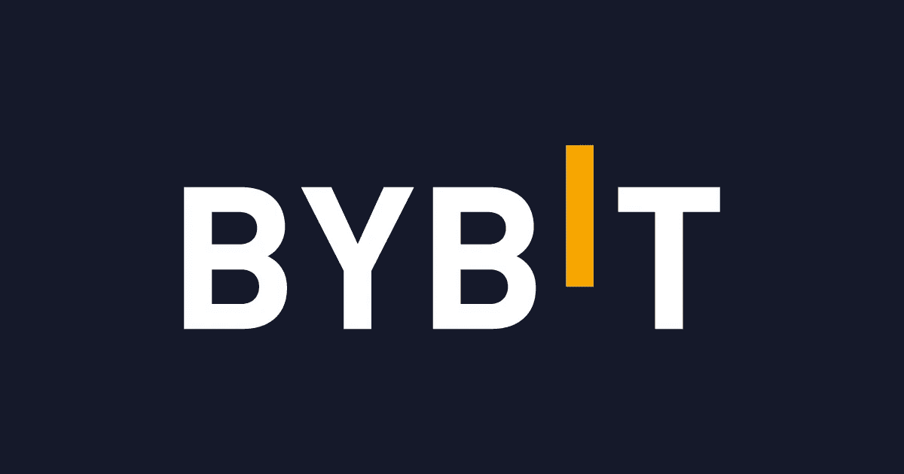

# Bybit 现在是最新一家因市场崩溃而裁员的加密交易所

> 原文：<https://medium.com/coinmonks/bybit-is-now-the-latest-crypto-exchange-to-let-off-staff-due-to-a-market-crash-dfabe57ca873?source=collection_archive---------43----------------------->

第二大加密期货交易所 Bybit 加入了对手的裁员行列，以抵御加密市场的持续低迷。

Bybit 的发言人周一告诉 Block，相关员工将“获得遣散费，并在工作转型期间获得 Bybit 的员工职业支持”。他们拒绝评论将会有多少工作岗位或目前的交易所雇佣多少人。根据其 LinkedIn 页面，Bybit 有 660 多名员工。

Bybit 是最新一家宣布裁员的加密交易所。最近几周，Crypto.com、比特币基地、双子星和比特墨西哥都进行了裁员。在过去的两个月里，至少有 1500 人在加密领域失去了工作

根据 Block 看到的首席执行官周本给员工的一封电子邮件，Bybit 在 2020 年初雇佣了“数百”人，自那以来扩张了 300%。Bybit 的发言人拒绝评论该消息是否属实。

“我们的组织规模呈指数级增长，但整体业务增长却没有同步增长，”周在邮件中表示。“在最近的员工评估中，内部效率仍然是 Bybit 目前面临的最大问题。这意味着尽管我们的规模越来越大，但我们的功能效率却越来越差。很明显，我们没有合理利用快速增长的资源。”

By bit 于 2018 年在新加坡成立，并在衍生品领域迅速走红。根据 Block 的数据仪表板，它目前是期货交易中第二大加密交易所。

这位发言人说，它的“基本面保持强劲”，在 160 多个国家拥有超过 600 万用户。

“我们致力于继续投资于战略性的 web3 项目和收购，并赞助非营利组织，因为我们根据我们的业务重点简化了我们的扩张计划，”他们补充说。

点击这里关注我们了解更多故事[。](http://t.me/etellworld)

> 加入 Coinmonks [电报频道](https://t.me/coincodecap)和 [Youtube 频道](https://www.youtube.com/c/coinmonks/videos)了解加密交易和投资

# 另外，阅读

*   [5 款最佳加密交易终端](https://coincodecap.com/crypto-trading-terminals) | [最佳 DeFi 应用](https://coincodecap.com/best-defi-apps)
*   [比特币基地 vs 瓦济克斯](https://coincodecap.com/coinbase-vs-wazirx) | [比特鲁点评](https://coincodecap.com/bitrue-review) | [波洛涅克斯 vs 比特克斯](https://coincodecap.com/poloniex-vs-bittrex)
*   [德国最佳加密交易所](https://coincodecap.com/crypto-exchanges-in-germany) | [Arbitrum:第二层解决方案](https://coincodecap.com/arbitrum)
*   [币安交易机器人](/coinmonks/binance-trading-bots-d0d57bb62c4c) | [OKEx 评论](/coinmonks/okex-review-6b369304110f) | [Atani 评论](https://coincodecap.com/atani-review)
*   [最佳加密交易信号电报](/coinmonks/best-crypto-signals-telegram-5785cdbc4b2b) | [MoonXBT 评论](/coinmonks/moonxbt-review-6e4ab26d037)
*   如何在 Bitbns 上购买柴犬(SHIB)币？ | [买弗洛基](https://coincodecap.com/buy-floki-inu-token)