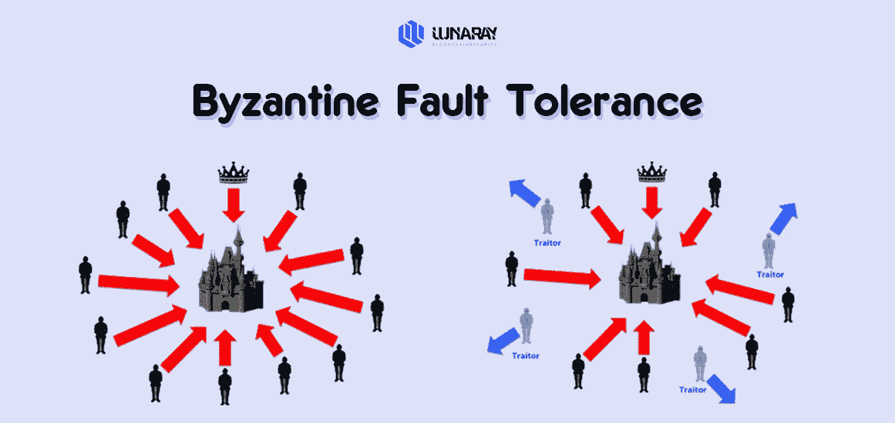
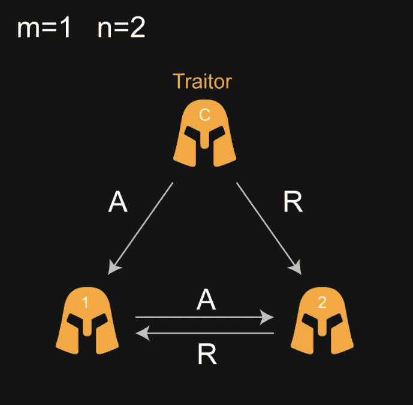
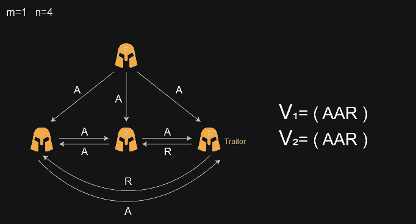
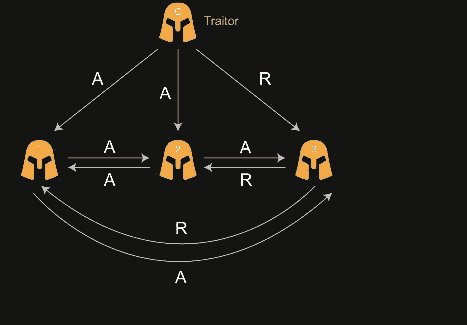
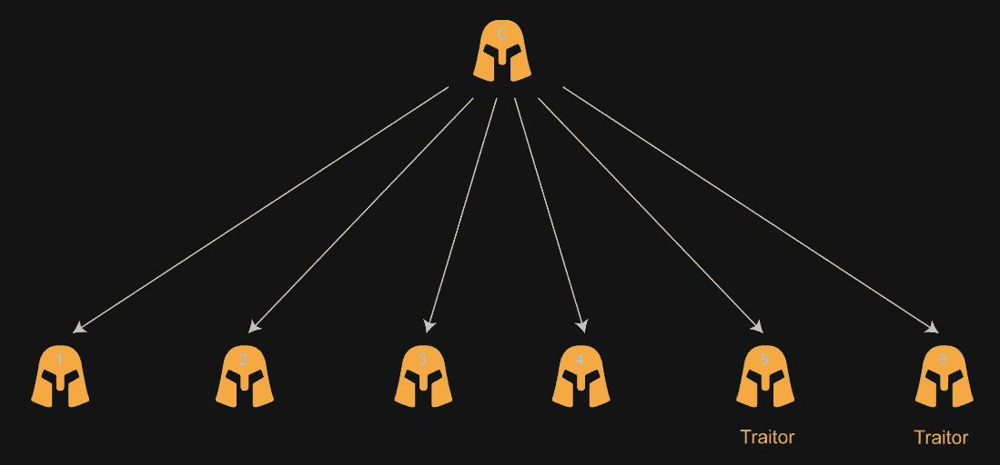
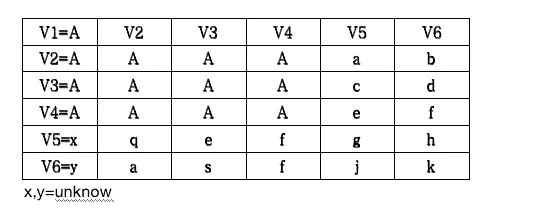

# 拜占庭容错

> 原文：<https://medium.com/coinmonks/byzantine-fault-tolerance-222a8134be7?source=collection_archive---------12----------------------->

在中本聪创造比特币之前，他需要在一个分散的网络中解决拜占庭将军的问题。现有的算法和协议都是基于集中式网络的解决方案。中本聪创造性地使用了 **POW** 共识算法来解决这个问题，那么拜占庭将军的问题是什么呢？

很久很久以前，拜占庭是东罗马帝国的首都。当时的罗马帝国疆域辽阔，出于防御目的，每支军队之间相隔很远，将军们只能依靠信使传递消息。去打仗的时候，拜占庭军队里的所有将领都要达成共识，才能更好的赢得胜利。然而，军队中可能有叛徒，扰乱将军们的决定。此时，在已知成员不可靠的情况下，剩余的忠诚将军需要在不受叛徒或间谍影响的情况下达成共识。这个“拜占庭”不是拜占庭，它与区块链有着密切的联系

**从上面**我们很容易发现 2 个问题

1.  信使的信息来源可靠吗？在计算机网络方面，可以参考我的网络通道的稳定性。
2.  军队中的所有将领是否都达到了某个目标(一致进攻或撤退)，在出现汉奸的情况下如何实现？在分布式计算机网络中，如何保证所有计算机的一致性，同时也允许节点计算机出现故障或错误。

美国计算机科学家(Leslie Lamport 在 1982 年提出拜占庭将军问题)计算机可以分布在世界各地，我们称之为分布式节点，分布式节点可能会出现故障，宕机，或者恶意节点(黑客)，那么我们如何保持**一致性**，忠实的计算机保持不变，**正确性**。

**口头协议:将军副官模式**

1:忠诚副官:遵循同一命令(**一致性**)(要么一起进攻，要么一起撤退)

2: **准确性:**如果将军是忠诚的，所有忠诚的副将都必须执行他的命令

假设 m =恶意人数(叛徒)，n =总人数(计算机节点总数)当 n>3m 这个事件可以解决，你可能会问为什么 n>3m，可以看下面的例子

**m=1 n=3**

c(指挥官)会给两个副官 1 和 2 下命令，但是 2 是叛徒，那么这个时候就会出现问题，将军会告诉 1 和 2 分别进攻，但是 1 在接到命令后不会马上进攻，因为他不确定将军是不是叛徒，所以 1 会问 2 命令是什么。由于 2 是叛徒，所以即使 2 接到进攻的命令，也会告诉 1 接到撤退的命令。所以这个时候 1 会很迷茫，因为他接到了将军进攻的命令，2 让他撤退，所以他不确定将军和 2 哪个会是叛徒。所以这个时候的 1 很迷茫，情况无解。

假设将军是叛徒

1 和 2 都是忠诚的，叛徒是将军会给两个不同的命令，告诉 1 进攻，告诉 2 撤退，这时 1 和 2 会互相交流，因为 1 和 2 收到的命令不同，所以他们会怀疑将军和其中一个会是叛徒，所以两个例子都是无解的。

**如果 n > 3m 问题可解**

假设 m=1，n=4(一个将军和 3 个副官，一个副官是叛徒)

将军告诉三名副官，命令是**攻击**，三名副官将互相交流。1 和 2 之间的通信结果是一次**攻击**。因为 3 是叛徒，所以和 1，2 沟通的时候会被告知，他们接到的命令是**撤退**。

所以我们可以得出结论，1 收到的命令是(进攻，进攻，撤退)v1=(A，A，R)所以 1 号会选择进攻。因为 2 也是忠诚的副官，所以他接到的命令(进攻，进攻，撤退)使得№2 也选择进攻。

假设将军是叛徒，三个副官是忠诚的

如果将军是叛徒，那么现在只需要满足**一致性**和忠诚的副官服从同样的命令，不管命令是不是将军下达的。举个例子，如果卖国贼将军让 1 和 2 进攻，让 3 撤退，那么他们就会交流。1 会告诉 2 他收到的命令是攻击命令，2 会告诉 1 接受。收到的命令是攻击命令，2 会告诉 3 这是攻击命令。3 会告诉 2 收到撤退命令，1 会告诉 3 收到攻击命令，3 会告诉 1 收到撤退命令。所以 1 收到的命令集合是(攻击，攻击，撤退)，2 收到的命令集合是(攻击，攻击，撤退)，3 收到的命令集合是(撤退，攻击，攻击)所以这三个辅助者都会选择攻击，于是达成协议。三名助理可以达成协议。因为将军下达的命令比较混乱，执行哪一个都无所谓，达成一致就行。

上面的例子是一个简单的例子，只有一个叛徒，但是如果叛徒的数量大于一呢？m=2，**那么我们现在该怎么办？**

由于 m=2，n 至少为 7，如果小于 7，则无解。这时候就会用到一个叫做**递归**的想法，在计算机中很常见。例:当摄像头对着你，结果你用摄像头对着电脑屏幕，这个时候你会发现一台电脑设置到另一台电脑，然后另一台电脑设置，我们可以认为是一种嵌套。

首先，一个将军会向 6 个副官发出攻击命令，因为现在有两个叛徒，我们假设将军不是叛徒，假设 5 和 6 是叛徒(下图我没有画连接线，因为看起来很乱:)

1 接到进攻的命令，他不会马上去进攻，因为他不确定将军是不是汉奸，所以他会问 2 你接到将军的命令是什么？但他也不会相信 2，因为他不确定 2 是否也是叛徒。所以它会继续问 3，4，5，6。Q2 告诉你他收到了什么订单，我们接下来将查看表格

首先副官№1 接到将军的进攻命令，所以 A 代表进攻，所以 A 会问大家收到的命令，因为№2 是忠诚的，所以他收到的命令也是进攻，副官№3 也是忠诚的，会说实话№2、№4 也是忠诚的，而№5 副官是叛徒，胡说八道，所以给出的不一定是什么所以我们在表中用 A 代替。副官№6 也是汉奸，所以也是瞎说，也不一定说什么，所以我们在表中用 b。所以№1 得到的信息会发现，副官№2 的陈述中有三个人说副官№2 得到的命令是 A，有两个人不知道他们在说什么，s **o 我们取最大值原则**，最后我们判定副官 2 收到的命令确实是攻击(取最大值原则)，我们再做同样的事情， 辅助 1、2、3、4，收到的订单是 A，辅助 5、6 收到的订单不确定。 ，所以第一列我们取最大值 A =攻击，所以最后的结果是 1，2，3，4 个辅助者会选择攻击，同时保证一致性和准确性。

以上问题没有考虑网络延迟。在实际的互联网上，存在着网络延迟，于是诞生了一种简单实用的拜占庭容错算法，叫做 **PBFT** ，在网络延迟的情况下仍然可以使用这种算法。在少数节点和故障节点存在的情况下，保证大多数忠诚节点的一致性和准确性。例如，中本聪提出了比特币。区块链的核心问题是保持一致性。如何保持一致性？我们可以将共识算法定义为区块链网络达成共识的机制。最常见的例子是工作证明( **PoW** )和利益证明( **PoS** )。与拜占庭的一般问题相比，这增加了叛徒的成本。如果你没有任何成本，网络上的恶意节点可以自由传播。比特币协议规定了系统的主要规则，工作证明共识算法描述了如何遵循这些规则达成共识(例如，在交易的验证和确认期间)。

虽然工作证明的概念早于数字货币，但中本聪修改了原始版本，并开发了一种改进的工作证明算法，可以生成比特币作为拜占庭容错系统。

请注意，这种工作验证算法并不能完全抵御拜占庭故障，但由于高成本的挖掘过程和底层加密技术，工作验证已被证明是区块链网络中最安全可靠的方法之一。从这个意义上来说，由中本聪设计的工作证明一致性算法被许多人认为是拜占庭容错的最出色的解决方案之一。

> *加入 Coinmonks* [*电报频道*](https://t.me/coincodecap) *和* [*Youtube 频道*](https://www.youtube.com/c/coinmonks/videos) *了解加密交易和投资*

# 另外，阅读

*   [有哪些交易信号？](https://coincodecap.com/trading-signal) | [Bitstamp vs 比特币基地](https://coincodecap.com/bitstamp-coinbase) | [买索拉纳](https://coincodecap.com/buy-solana)
*   [ProfitFarmers 点评](https://coincodecap.com/profitfarmers-review) | [如何使用 Cornix 交易机器人](https://coincodecap.com/cornix-trading-bot)
*   [西班牙 5 大最佳文案交易平台](https://coincodecap.com/copy-trading-spain)
*   [Pionex 双投](https://coincodecap.com/pionex-dual-investment) | [AdvCash 审核](https://coincodecap.com/advcash-review) | [支持审核](https://coincodecap.com/uphold-review)
*   [面向开发者的 8 个最佳加密货币 API](https://coincodecap.com/best-cryptocurrency-apis)
*   [十大最佳加密货币博客](https://coincodecap.com/best-cryptocurrency-blogs) | [YouHodler 评论](https://coincodecap.com/youhodler-review)