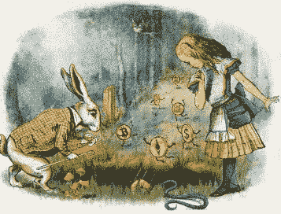
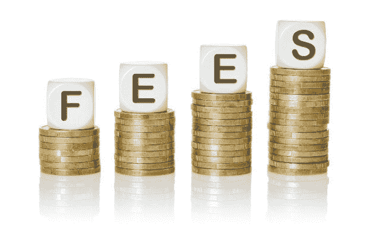
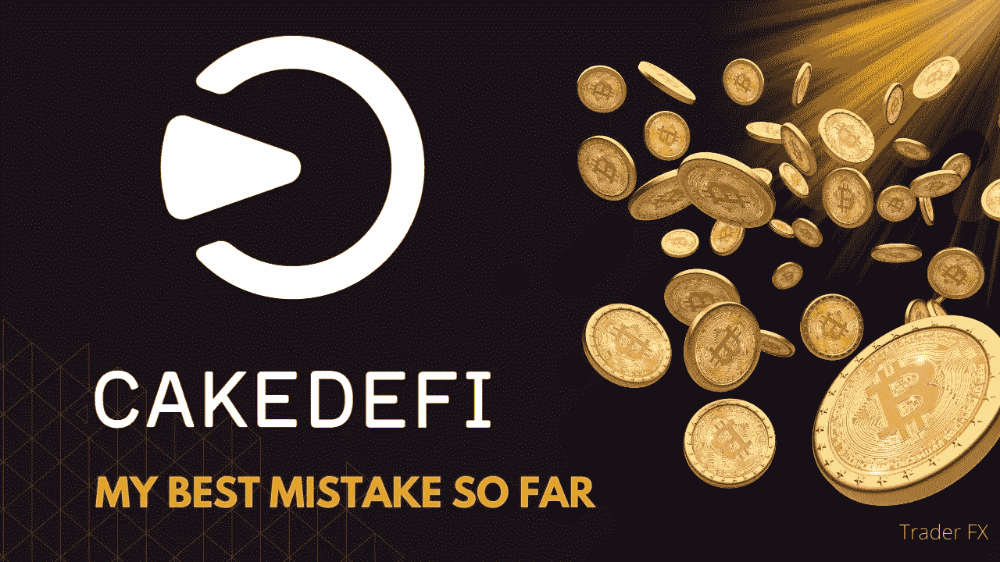
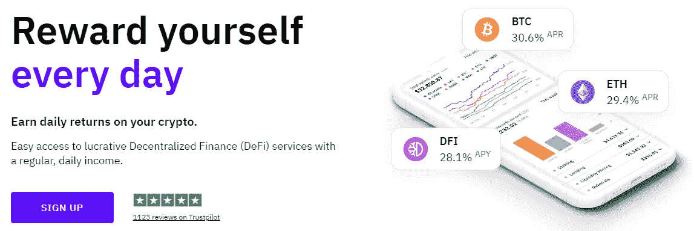
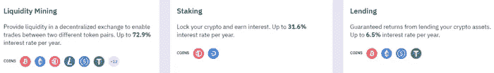
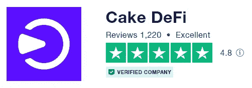
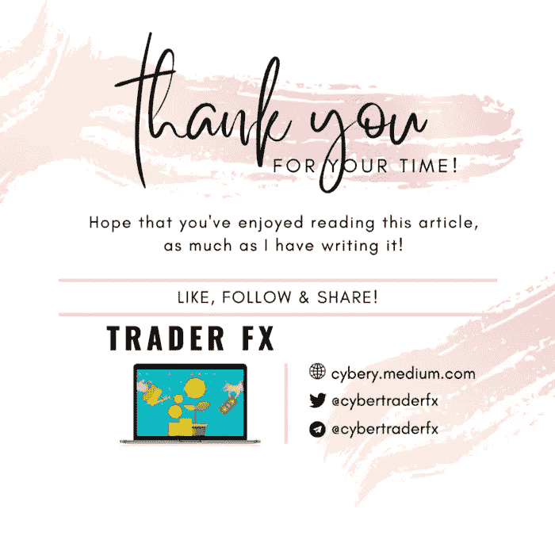

# 蛋糕 DeFi，3 年后——我迄今为止最大的错误！

> 原文：<https://medium.com/coinmonks/cake-defi-3-years-down-the-road-my-best-mistake-so-far-f751caea1637?source=collection_archive---------2----------------------->

# 我学的越多，知道的越少

Image taken from The Economist

投资世界很像是对未知领域的一次突袭，或者是一个进入未知领域的兔子洞。事实上，投资令人上瘾，因为它是一门令人着迷的学习艺术。3 年前，作为一名年轻的投资者，我很快就发现自己疯狂地搜索一系列令人眼花缭乱的加密货币平台，希望产生被动现金流，因为我已经厌倦了传统金融的微薄回报。我被分散融资的产品和潜力迷住了。因此，有一天， [**Cake DeFi**](https://cakedefi.com/?ref=677920) 会出现在一个广告上也就不足为奇了，当我在移动设备上滚动的时候，这个广告非常适合我。好家伙，我对 DeFi 声称烘焙的蛋糕的慷慨被动现金流的承诺印象深刻，当时 100%的 APYs！我从来没有放弃过任何一个好的提议，我没有多想就匆忙注册了 Cake DeFi，并因此开始了我在 DeFiChain 的投资之旅，当时只花了 0.5 美元多一点。我热情地将各种硬币存入 Cake DeFi——事实上，每种加密货币都有少量，只是为了试水。

# 遗憾

Image taken from Times Higher Education

此后不久，加密货币出现了繁荣。BTC 和替代硬币涨到了历史最高点。是时候卖掉赚点利润了！我的纸手立即坐立不安地按下了 Cake DeFi 网站上的取款按钮，但令我震惊的是，取款费用高得离谱！每种加密货币的平均取款费达到了惊人的 75 美元——鉴于我的投资规模较小，这笔费用对我来说意义重大。更糟糕的是，我的投资组合是多种不同加密货币的多样化组合——提取所有加密货币将产生图表上的全部提取费用！我心怀不满，向 telegram group 表达了我对 Cake DeFi 收取的高额费用的担忧和失望，并且对所提供的解释一点也不满意，比如当时因网络拥堵而产生的昂贵的 ETH 燃气费，以及智能合同的使用。我后悔投资了蛋糕 DeFi。毕竟，我当时加入的许多其他平台通过免费/更便宜的提现给了我很大(如果不是更好的话)的回报，比如 Mineify、Darkmine 和 MyGBit。为什么我会如此草率地决定投资 Cake DeFi？

如果你还不知道，上面提到的其他平台都是骗局，时间会证明一切。

 [## 网络的阴暗面——需要警惕的加密货币骗局

### 加密货币市场是一个有利可图的赚钱机会，因为它与诈骗有关联。每天，我们…

medium.com](/coinmonks/how-to-avoid-cryptocurrency-scams-from-my-pov-57aa57671ac2) 

# 年轻、愚蠢、破产

Image taken from Navigate

我相信，时间是一位伟大的老师，永远不会失败；她见证了许多上述“伟大”平台的陨落，如果不是全部的话。这是一个惨痛的教训——如果某件事好得不像真的，那它很可能就是真的！也许直到我们失去一些东西，我们才开始欣赏那些真正经得起时间考验的东西。我一点也不知道，那项我几乎过于仓促着手、后来后悔莫及的投资，竟然是我迄今为止所做的投资中最坚实的一块宝石。事实上，我现在最不担心 Cake DeFi 的相对较高的提款费(部分原因是费用结构的调整变得更加实惠)，因为我已经改变了我的观点，将 Cake DeFi 视为一种长期投资工具，我用它来增加我的收入，并随后以 DFI 的形式产生利息，我可以不时地以较低的成本提取这些利息，并收获我的投资成果。因此，我的简短故事以 Cake DeFi 结束——一个最初的错误变成了塞翁失马焉知非福！在我之前的文章中阅读更多关于蛋糕定义[的内容，找出我喜欢这家公司的地方！](/coinmonks/8-reasons-why-i-love-using-cake-defi-f6547b9dfc4c)

 [## 我喜欢用蛋糕 DeFi 的 8 个理由！

### Cake DeFi 是一个加密货币投资平台，从您的数字资产中产生被动收入。立即注册…

medium.com](/coinmonks/8-reasons-why-i-love-using-cake-defi-f6547b9dfc4c) 

# 蛋糕定义概述

C 在一个有抱负和敬业的团队的带领下，Cake DeFi 在数字资产行业为自己建立了稳固的声誉，赢得了像我一样的许多快乐用户的信任。

实际上，Cake DeFi 提供以下服务:

*   **跑马圈地**:配置 DFI 进入跑马圈地，赚取 30-40%不等的回报。入股/分拆资产不收取任何费用。桩是在一个灵活的条款，没有最短的合同期限。在 DFI，奖金每天发放两次，并与资本相结合。
*   **流动性挖掘**:将价值相等的 2 项资产分配到流动性挖掘池中，如比特币-DFI、以太坊-DFI、USDT-DFI 等，产生高达 100% APR 的回报(视市场情况而定)。奖励主要在 DFI 每天发放两次，并且可以自动下注以产生更多的复利。最近推出的[分散资产](/coinmonks/invest-in-tesla-google-apple-easily-with-decentralized-assets-cdfe4e58330b)代表了分散金融的一场革命，使投资者能够在投资股票/ETF/贵金属的两个世界中获得最佳收益，同时获得加密货币的高收益！
*   **贷款**:通过贷款，资产(比特币/以太坊/ USDT/ USDC)被锁定 1 个月的期限，有保证的基础年利率和潜在回报，如果资产价格超过某个目标，在期限到期时。
*   **冻结**:冻结可以比作忠诚计划，投资者将他们的资金锁定在流动性挖掘/投资中，期限从每月到 10 年不等，以换取更高的回报。
*   **借入**:用 DFI 作为抵押，以可承受的年利率 5%借入资产。将你借来的资金投资到 Cake DeFi 提供的任何高收益产品中，轻松抵消贷款利息！

# 蛋糕 DeFi 转 3！

C [ake DeFi](https://cakedefi.com/?ref=677920) 最近已经三岁了，为了庆祝它的周年纪念日，它正在举办一场促销活动，活动将持续到 2022 年 6 月 30 日！促销活动总结如下

*   **冰柜奖金**

a)立即在您的蛋糕 DeFi 钱包中获得 5.00%的奖金，因为您将 DFI 放入冰柜 5 年

b)立即在您的蛋糕 DeFi 钱包中获得 7.50%的奖金，因为您将 DFI 放入冰柜 10 年

*   **注册，获得验证，投资 50 美元，就有机会赢得 3333 美元！**

一名幸运的随机抽取的新用户在注册、KYC 验证成功并向[借贷](https://app.cakedefi.com/lending)、[赌注冰柜](https://app.cakedefi.com/staking)或[流动性挖掘冰柜](https://app.cakedefi.com/liquidity-mining)服务投资 50 美元或以上 28 天或以上后，将获得价值 3333 美元的一次性奖励。另外，当你这样做的时候，通过注册我的独家邀请链接[这里](https://cakedefi.com/?ref=677920)获得 50 美元的免费奖励！想了解更多关于如何获得注册奖金的信息，请点击这里查看我以前的文章！

# 最后的想法

C [ake DeFi](https://cakedefi.com/?ref=677920) 是一个健康透明的加密货币投资平台，在保证您的资产安全的同时，从您的闲置加密货币中产生被动现金流。如果你是 Cake DeFi 的新手，现在是报名参加并投资的最佳时机！**点击** [**这里**](https://cakedefi.com/?ref=677920) **开始你今天的被动收入之旅！**

想了解更多关于蛋糕定义的信息，请点击这里查看我以前的文章[。](https://cybery.medium.com/list/cake-defi-0acb0c90a3ab)

 [## 如何从蛋糕定义获得免费的 50 美元注册奖金:教程

### Cake DeFi 是一个金融科技平台，可以从你的加密货币中获得被动现金流。了解如何获得 50 美元奖金…

medium.com](/predict/how-to-get-a-50-signup-bonus-from-cake-defi-bad80cc5aa87)  [## 如何赚取蛋糕 DeFi 被动收入:教程

### 沃伦·巴菲特曾经说过“如果你在睡觉的时候没有找到赚钱的方法，你会一直工作到死。”这是…

medium.com](/coinmonks/how-to-earn-passive-income-with-cake-defi-a-tutorial-64abe4a01bec)  [## 我喜欢用蛋糕 DeFi 的 8 个理由！

### Cake DeFi 是一个加密货币投资平台，从您的数字资产中产生被动收入。立即注册…

medium.com](/coinmonks/8-reasons-why-i-love-using-cake-defi-f6547b9dfc4c)  [## 用分散的资产轻松投资特斯拉、谷歌和苹果！

### 概述

medium.com](/coinmonks/invest-in-tesla-google-apple-easily-with-decentralized-assets-cdfe4e58330b)  [## 用蛋糕 DeFi 赚取美味的被动现金流！

### 沃伦·巴菲特曾经说过‘如果你在睡觉的时候没有找到赚钱的方法，你会一直工作到死。“的确……

medium.com](/coinmonks/earn-delicious-passive-cash-flow-with-cake-defi-f01fce47e4c6) 

和往常一样，这不是财务建议！而只是我投资过的，觉得值得分享的投资平台。在投资前做好自己的研究，不要存你输不起的钱。下面有什么问题可以随时问我。

*如果你喜欢这篇文章，* [*跟着&订阅*](/@cybery) *！*

*查看以下值得信赖的平台！*

*🎁*[*honey gain*](https://r.honeygain.me/CYBER577DD)*一款被动收入 app，从你未使用的互联网带宽中赚钱。* [*免费获得 5 美元*](https://r.honeygain.me/CYBER577DD) *，无需投资。*

*🎁* [*蛋糕 Defi*](https://cakedefi.com/?ref=677920) *一站式投资平台，以高达 100%的年利率烘焙被动现金流！* [*在 DFI 用 50 美元存款获得 50 美元奖金*](https://cakedefi.com/?ref=677920) *。*

*🎁*[*Nexo*](https://nexo.io/ref/hce5cfdt5o?src=web-link)*一家先进、受监管的数字资产机构，提供即时加密贷款，资产年利率高达 36%，是一家交易所，在 200 多个司法管辖区提供 40 多种法定货币的服务。* [*用 100 美元存款获得 25 美元*](https://nexo.io/ref/hce5cfdt5o?src=web-link) 奖金*。*

*🎁*[*Hodlnaut*](https://www.hodlnaut.com/join/RTbHxuJMX)*一个强大的加密借贷平台，从你闲置的加密货币中产生被动现金流，年利率高达 9.4%。* [*在 USDC 存款 1000 美元可获得 30 美元*](https://www.hodlnaut.com/join/RTbHxuJMX) *奖金，存款 1500 美元可获得 50 美元。*

*🎁*[*Kucoin*](https://www.kucoin.com/r/af/rJH29LZ)*一个庞大的加密货币交易所，提供有趣的产品，如赌注、自由交易机器人和比特币云挖掘服务。*

*🎁* [*火币*](https://www.huobi.com/en-us/topic/double-invite/register/?invite_code=5t5jb) *一个加密货币交易所，提供多样化的产品、免费空投和交易机器人。*

*🎁*[*MEXC*](https://www.mexc.com/en-US/register?inviteCode=mexc-1NAJC)*一家持有 MX 代币的加密货币交易所，有着有趣的列表和频繁的空投。*

*🎁*[*Crypto.com*](https://read.cash/@TraderFX/10-tips-to-maximize-earnings-on-honeygain-an-effortless-free-passive-income-app-68535728#bad-link)*一家位于新加坡的加密货币交易所。* [*得到 25 美元*](https://crypto.com/app/fcbsjmf5pb) *在 CRO 赌赢一张红宝石牌。*

*🎁*[*Pionex*](https://www.pionex.com/en-US/sign/ref/mWhH4v29)*一个免费的多功能套利交易机器人，自动化低买高卖的过程，全天候。*

***针对马来西亚投资者***

*🎁*[*Luno*](https://www.luno.com/invite/EDXG2X)*在 BTC 用 100 令吉购买 BTC 获得 25 令吉奖金！*

*🎁* [*斯塔沙威*](https://www.stashaway.my/referrals/kenleel9jx) *免费投资 6 个月！*

*🎁Wahed code 'KENLIE1' RM10 注册奖金*

*🎁Capbay P2P 代码' 8879c6' RM100 注册奖金*

*🎁* [*亦然*](https://download.versa.com.my/1bAf/referral?deep_link_value=QF218MMB) *用 100 令吉存款获得 10 令吉奖金！*

*🎁*[*KDI*](https://app.digitalinvesting.com.my/registration/signup?referral_code=103433)*用 250 令吉存款获得 10 令吉奖金！*

***接我*** [***中***](https://cybery.medium.com/)***|***[***read . cash***](https://read.cash/r/TraderFX)***|***[***Youtube***](https://www.youtube.com/c/SmartInvestingChannel)***|***[***推特***](https://twitter.com/cybertraderfx)

> 加入 Coinmonks [电报频道](https://t.me/coincodecap)和 [Youtube 频道](https://www.youtube.com/c/coinmonks/videos)了解加密交易和投资

# 另外，阅读

*   [如何在 FTX 交易所交易期货](https://coincodecap.com/ftx-futures-trading) | [OKEx vs 币安](https://coincodecap.com/okex-vs-binance)
*   [CoinLoan 评论](https://coincodecap.com/coinloan-review) | [YouHodler 评论](/coinmonks/youhodler-4-easy-ways-to-make-money-98969b9689f2) | [BlockFi 评论](https://coincodecap.com/blockfi-review)
*   [XT.COM 评论](https://coincodecap.com/profittradingapp-for-binance)币安评论
*   [SmithBot 评论](https://coincodecap.com/smithbot-review) | [4 款最佳免费开源交易机器人](https://coincodecap.com/free-open-source-trading-bots)
*   [比特币基地僵尸程序](/coinmonks/coinbase-bots-ac6359e897f3) | [AscendEX 审查](/coinmonks/ascendex-review-53e829cf75fa) | [OKEx 交易僵尸程序](/coinmonks/okex-trading-bots-234920f61e60)
*   [如何在印度购买比特币？](/coinmonks/buy-bitcoin-in-india-feb50ddfef94) | [瓦济克斯评论](/coinmonks/wazirx-review-5c811b074f5b)