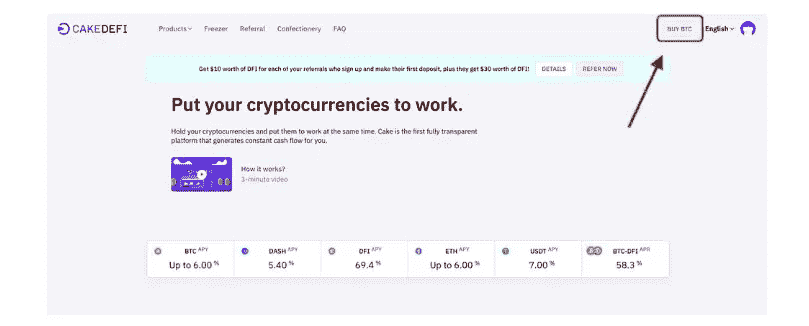
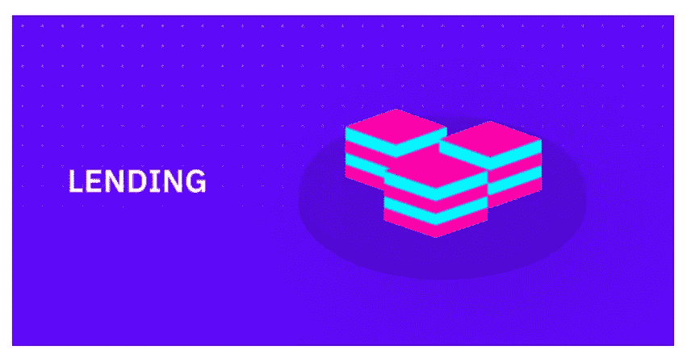

# 蛋糕 DeFi 回顾:2022 年赚取被动收入

> 原文：<https://medium.com/coinmonks/cake-defi-review-earn-passive-income-in-2022-aa3ca22cd78c?source=collection_archive---------3----------------------->

借贷、流动性挖掘、借贷和赌注是 Cake DeFi 提供的四项主要服务。

# 什么是蛋糕 Defi？

[Cake DeFi](https://cakedefi.com/?ref=335951) 是一个在新加坡建立的赌注、借贷和流动性池平台，允许用户存入大量代币并收取利息。

尽管有“DeFi”的绰号， [Cake DeFi](https://cakedefi.com/?ref=335951) 是一个托管平台，拥有一套以多种 DeFi 解决方案为核心的功能。

[Cake DeFi](https://cakedefi.com/?ref=335951) 提供四种核心产品:借贷、流动性挖掘、借入和押注，每种产品都有不同的收益率和一系列限制。用户可以通过出借 BTC、USDC 和 ETH 等数字资产获得大约 6.5%的收益，或者通过流动性挖掘获得高达 80%的收益。

# 什么是 DFI 代币？

Cake DeFi 的许多服务都基于 DeFiChain (DFI)加密货币。

[DeFiChain](https://cakedefi.com/?ref=335951) 是一个非图灵完全区块链，试图让比特币更加去中心化。DeFiChain 基于利害关系共识方法，其最新的 Merkle 根与比特币区块链相关联。

DFI 于 2020 年 8 月开始活跃，其价格于 2022 年 4 月见顶，市值为 23.4 亿美元。

该倡议由新加坡的 DeFi 基金会运营，由 Cake 联合创始人 Julian Hosp 博士(主席)和 U-zyn Chua(首席技术官)指导。

# 蛋糕 DeFi 的服务简单解释

> [Cake DeFi](https://cakedefi.com/?ref=335951) 专注于提供简单的用户体验，同时也为用户提供可观的回报。他们一直在改进和增加新功能，目标是有一天成为管理你所有金融资产的真正一站式商店。

**本文将帮助您快速了解他们的服务，并向您展示如何从中受益。**

# 用欧元或美元购买比特币、以太坊或 DeFiChain。

蛋糕定义现在接受 BTC、瑞士联邦理工学院和 DFI 的购买。所有交易都由我们信任的合作伙伴 BANXA 和 Transak 处理，当您利用他们的服务进行购买时，加密货币会自动存入您的 [Cake DeFi](https://cakedefi.com/?ref=335951) 账户。

这意味着你可以使用 SEPA 或信用卡轻松购买比特币、以太坊或 DeFiChain。只需遵循这些简单的说明:

点击“购买”按钮后，您可以选择您最喜欢的硬币、合作伙伴和支付方式(当然会透露所有条件和费用)。

程序的每一步都已经清楚地为你指出，并有详细的说明来帮助你。购买后，您的 BTC/ETH/DFI 将被立即存入您的蛋糕定义帐户。

您的加密货币可在您的余额页面上找到:

现在，您的帐户中有一些加密货币，如 BTC、瑞士联邦理工学院或 DFI，您可以开始使用 Cake DeFi 的其他产品，这将使您轻松获得可观的回报和奖励。

# 借贷服务

您可以通过出借您的比特币、以太币、美元系链币和美元币来获得被动收入(现金流)。你的资本和利润是完全无风险的，还有分红的可能。(奖金是保证收益之外的额外收益。)

1.  每周提供 BTC/联邦理工学院/USDT/USDC 贷款。
2.  每批 batch 联邦理工学院/USDT/USDC 贷款持续 28 天，于周五开始和结束。
3.  BTC /联邦理工学院/ USDT / USDC 贷款的基本回报是有保证的(见下文)。如果 BTC / ETH 的现货价格落在特定的价格范围内，可能会有潜在的额外回报。
4.  不同批次之间，预计的 APY(年百分比产量)可能不同。在您加入一批之前，我们会在网站上向您展示预测的 APY。
5.  您可以选择参加任何数量的 BTC、瑞士联邦理工学院、USDT 或 USDC。
6.  如果您选择参与，您的 BTC/瑞士联邦理工学院/USDT/USDC 期权合约将在未来四周内锁定。
7.  您可以选择自动进入下一批(以产生自动复利)，提取您的回报，或提取您的全部本金，并在该批完成其 4 周的持续时间后返回到您的帐户。
8.  用户通过借贷不收取任何费用。代销商佣金直接发送给 [Cake DeFi。](https://cakedefi.com/?ref=335951)

以下是如何进入批处理的快速概要:

1.  访问 [CakeDefi](https://cakedefi.com/?ref=335951) → Lending 获取更多信息。
2.  向下滚动，直到找到想要的批次(BTC /瑞士联邦理工学院/ USDT / USDC)。
3.  "输入"

4.现在你所要做的就是输入你想要的贡献，然后你就完成了。

> 让加密货币为您服务。保证回报将每四周存入你的账户。默认设置是将您的贡献和回报自动添加到下一批。因此，当你的比特币为你工作时，你可以坐下来享受你的蛋糕。

除了比特币、以太坊、USDT 和 USDC 借贷之外，还提供各种加密货币的赌注服务。

# 打桩服务

达成共识有许多不同的方式，因此也有许多不同的共识过程。工作证明(PoW)和利益证明(PoS)是在分散式区块链网络上实现共识的两种最广泛使用和最著名的方法。当采用利害关系证明共识过程时，这需要将钱或代币存入所谓的“节点”中，以验证加密货币的交易。提供这种服务的人可以获得利益。从这个意义上说，不同货币的激励机制是不同的。

Cake DeFi 目前支持以下硬币的赌注:

*   破折号
*   DeFiChain (DFI)

参与标桩有两种方法:

1.  直接将您选择的硬币存入您的 [Cake DeFi](https://cakedefi.com/?ref=335951) 账户。
2.  用你新获得的 BTC/联邦理工学院/DFI 交换你选择的硬币。为此，请转到左上角的“产品”,选择“赌注”,点击您选择的货币旁边的“赌注”,选择任何可用的硬币来购买您的赌注股份。

## 如何将您的赌注硬币直接发送到 Cake DeFi

1.  在您个人资料的右上角，点击“余额”
2.  在您要存入的硬币旁边，单击“存款”

3.此时，您可以将您的比特币发送到这个地址。(重要:只把你选的硬币寄到这个地址，其他的都不要！)

重要提示:赌注没有最短期限。您可以随时加入，并随时从赌注服务中提取您的硬币。根据硬币的不同，您的奖励将每天存入两次。您的默认选项与借出相同，因为默认情况下会选择“锁定”。

# 流动性挖掘

你为那些希望在分散式交易所通过流动性挖掘交易加密货币的用户提供流动性。与其他项目不同，流动性挖掘是一种更复杂的商品，无法用几句话很好地描述。

只需几个步骤，你就可以加入流动性挖掘:

1)进入 CAKE DEFI 并登录。

2)从顶部菜单的“产品”部分选择“流动性挖掘”，或转到此链接。

3)您现在可以访问许多流动性池，参与流动性挖掘:

BTC—DFI
ETH—DFI
USDT—DFI
USDC—DFI
LTC—DFI
BCH—DFI
DOGE—DFI

4)一旦决定了流动性池，只需点击“添加流动性”

5)现在你可以输入你想要的金额了。计数器对的数量会自动调整，以便它们成比例。

决定好您的金额后，点击“添加”按钮。

之后，会出现一个安全警告。请在点击确认按钮之前仔细阅读所有内容，以确保您理解所有内容。

# 蛋糕定义:借

同样，不想出售其加密资产，而是想借钱支持其生活方式或产生现金流的加密投资者可以使用 [Cake DeFi 的](https://cakedefi.com/?ref=335951)“借款”服务。

## 他们会拿出什么样的数字资产作为担保？

借款人可以使用 DFI 作为抵押品，或将其与其他加密货币混合使用，如比特币(BTC)、以太网(ETH)、系绳(USDT)和美元硬币(USDC)(只要 50%的抵押品是 DFI)。作为交换，借款人将获得稳定的 DUSD 币，该币目前在备受关注的加密货币价格跟踪网站 CoinMarketCap 上进行评级，并在 [DeFiChain](https://cakedefi.com/?ref=335951) DEX 上发布。

## 借用 DUSD 有什么好处？

DUSD 像任何其他稳定的硬币一样，可以用来买东西，或者更好地参与其他投资机会。实际上，参与 Cake DeFi 的贷款、赌注和/或流动性挖掘，无论是直接参与还是将 DUSD 兑换成其他硬币，都是投资 DUSD 借款的可行方式。

## Cake DeFi 用户通常是如何用他们借来的 DUSD 赚钱的？

尽管下面提供的信息或想法都不构成财务建议，但有三种众所周知的方法或策略是 [Cake DeFi](https://cakedefi.com/?ref=335951) “借用”服务用户在充分利用他们借用的 DUSD 时通常会采用的。

> **策略一**
> 第一个也是最明显的方法是通过首选的加密交易所，收回 DUSD，出售或将其转换为菲亚特或其他数字资产。然后，用户可以使用菲亚特购买更多创收资产或投资于其他机会。他们也可以用他们把 DUSD 变成的数字资产做同样的事情——当然，这取决于它们是什么。
> 
> **策略二**
> 第二种选择是将借入的 DUSD 并入现有担保品，再投资于“借入”服务。这不仅允许客户获得额外的 DUSD，还减少了他们的抵押品被清算的机会。
> 
> **策略三**
> 最后，如前所述，第三种方法是将借来的 DUSD 投资于 Cake DeFi 的借贷、赌注和/或流动性挖掘，直接投资或通过将 DUSD 兑换成其他硬币。

# 它是安全的，正版的，值得你花时间吗？

与 crypto yield 服务相比，Cake DeFi 是一个非常不寻常的服务。Cake DeFi 和 BlockFi、Celsius 一样，是一家集权化的公司；通过使用该服务，您相信他们会在许多收益生成操作中保护您的资产安全。它确实做出了某些承诺，但没有任何实质性的东西来支持这些承诺，这些承诺就像营销术语一样。

然而，就提供的机会而言，它确实不同。与大多数加密利息账户不同，Cake 允许用户通过流动性挖掘和下注获得更大的收益——这些活动通常是为精通 DeFi 的人群保留的。

# 蛋糕怎么能给出 80%的 APY 呢？

与大多数其他流动性挖掘和赌注选项一样，股息在 DFI 支付，由 Cake DeFi 团队控制。因此，你获得的实际“收益”取决于 DFI 维持其价格的能力以及你出售它的能力(其最受欢迎的交易所在库币和币安，其他地方的支持有限)。

从长远来看，这些象征性的经济政策并不会对 DFI 有利，因此将 DFI 锁起来十年的“冷冻”产品似乎是一个危险的提议。

TenX 的问题不应该被忽视，尽管它似乎不是恶意的产品。该公司总部设在新加坡，与在美国成立的公司相比，新加坡拥有不同的监管机构。

尽管对保证回报的可疑保证和缺乏商业回应来解释，但该产品似乎不是欺诈性的。令人惊讶的是，近年来代币的价值一直保持良好。

*本信息无意作为财务建议或推荐。数字资产是有风险的，持有你的资产的平台会带来额外的风险。*

# 如何加入蛋糕迪菲？

**分步说明:**
1 .创建一个[蛋糕 Defi 账户](https://cakedefi.com/?ref=335951)。
2。验证您的电子邮件后登录。
3。完成你的 KYC 验证。
4。以任何支持的货币存入 50 美元到贷款、赌注或流动性挖掘冰柜。
5。要符合资格，资金必须被冻结至少 28 天。
6。你会收到 30 美元的 DFI 硬币。
7。此外，每推荐一个人，你将在 DFI 获得 10 美元。

**通过学习和赢取计划获得 10 美元的 Defi(KYC 必需)**

> 糖果计划奖品将锁定 180 天，但在此期间您将自动获得 34.5%的利息。
> 除了德国居民，推荐计划对任何确认的 Cake DeFi 客户开放。

# 想感谢我吗？[请我喝杯咖啡](https://buymeacoffee.com/dhirajdixit) :-)

> 加入 Coinmonks [电报频道](https://t.me/coincodecap)和 [Youtube 频道](https://www.youtube.com/c/coinmonks/videos)了解加密交易和投资

# 另外，阅读

 [## CakeDeFi 评论:赚取每日加密回报 2022 年

### CakeDeFi 在加密货币领域越来越受欢迎。它使任何人都可以下注他们的加密货币，并开始…

coincodecap.com](https://coincodecap.com/cakedefi-review) 

*   [加拿大最佳加密交易机器人](https://coincodecap.com/5-best-crypto-trading-bots-in-canada) | [Bybit vs 币安](https://coincodecap.com/bybit-binance-moonxbt)
*   [阿联酋 5 大最佳加密交易所](https://coincodecap.com/best-crypto-exchanges-in-uae) | [SimpleSwap 评论](https://coincodecap.com/simpleswap-review)
*   [购买 Dogecoin 的 7 种最佳方式](https://coincodecap.com/ways-to-buy-dogecoin) | [ZebPay 评论](https://coincodecap.com/zebpay-review)
*   [最佳期货交易信号](https://coincodecap.com/futures-trading-signals) | [流动性交易所评论](https://coincodecap.com/liquid-exchange-review)
*   [火币的加密交易信号](https://coincodecap.com/huobi-crypto-trading-signals) | [Swapzone 审查](/coinmonks/swapzone-review-crypto-exchange-data-aggregator-e0ad78e55ed7)