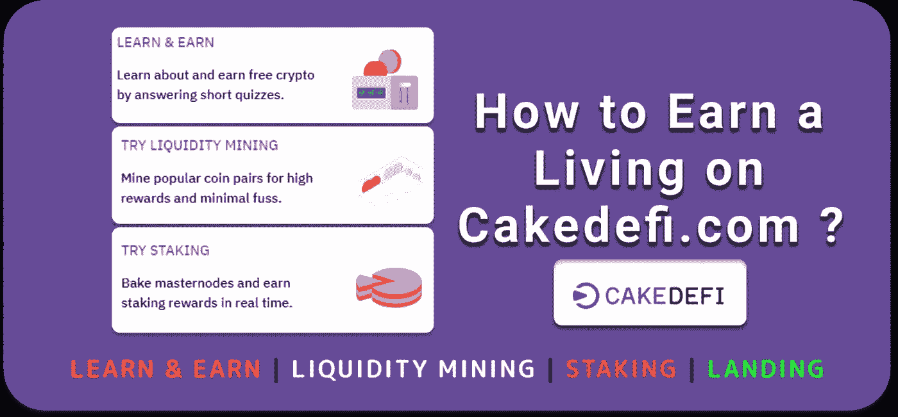
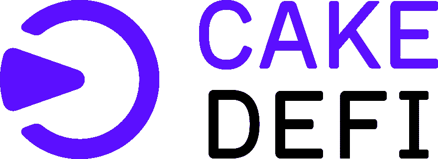
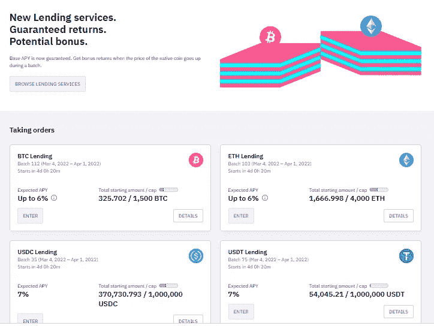
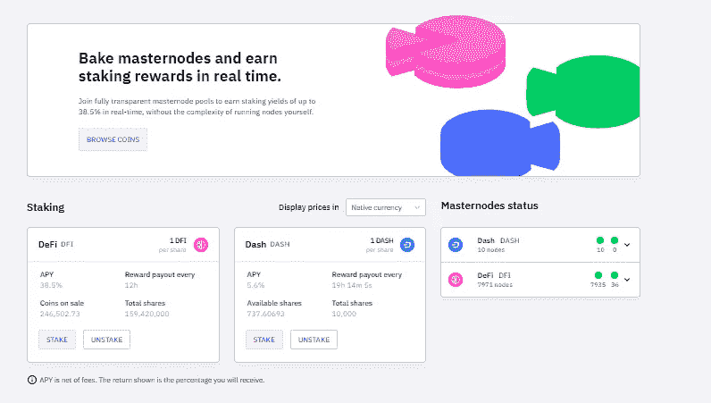
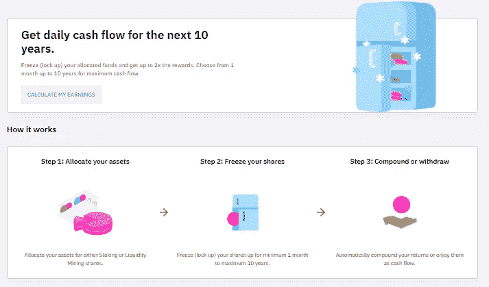
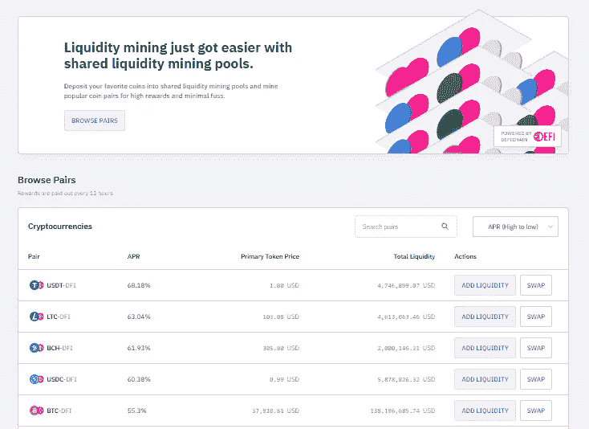
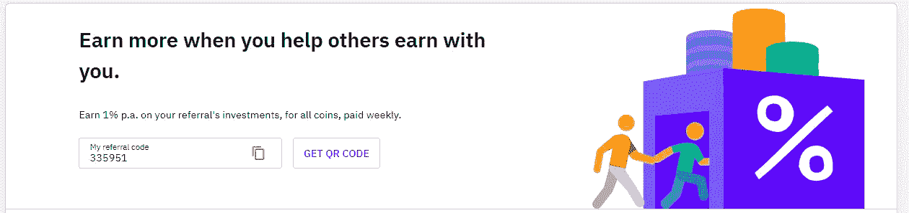
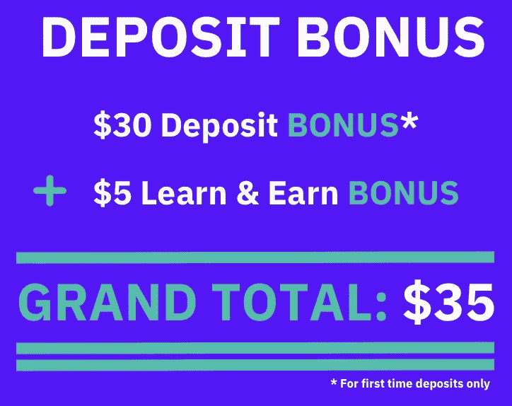

# cakedefi——睡觉时获取密码

> 原文：<https://medium.com/coinmonks/cakedefi-earn-crypto-while-you-sleep-998512988242?source=collection_archive---------10----------------------->

## 学习和赚取|流动性挖掘|赌注|登陆

他的文章会教你所有关于 T2 蛋糕的知识。目的是向您概述该平台的功能和产品，以及我的[蛋糕定义](https://cakedefi.com/?ref=335951)体验。总的来说，在本指南的帮助下，你应该能够投资 [Cake DeFi](https://cakedefi.com/?ref=335951) 并了解你的钱或加密货币会发生什么。但是，请记住，您应该对处理加密货币相当放心。只有了解平台上的情况，才投资。

> Julian Hosp 和 U-Zyn Chua 于 2019 年 6 月在新加坡创立了 [Cake DeFi](https://cakedefi.com/?ref=335951) 。

他宣称的目标是让去中心化的金融服务和加密货币为所有人所用。它还打算产生现金流。尤其是朱利安·霍斯普(Julian Hosp)，他在德语国家是一个著名的密码影响者，在那里已经活跃了多年。
蛋糕是建立在 [DeFi 链](https://cakedefi.com/?ref=335951)区块链上的，DFI 是相关的硬币。因此，支付蛋糕奖励(你的回报)的“基础货币”几乎总是 DFI。

与大多数其他加密平台一样，Cake DeFi 有一个引导注册流程，因为它是一个受监管的平台。注册过程简单快捷。提交必要的文件后，你通常可以在几个小时内开始投资，最多 1-2 天。
需要有效身份证件，以及本人近照。整个程序旨在满足 KYC(了解你的客户)的要求，并防止洗钱。只需按照步骤操作，直到完成。然后你可以立即开始。

[注册并存款 50 美元或以上，即可获得价值 30 美元的 DFI！](https://cakedefi.com/?ref=335951)

# 蛋糕定义支付交易

当然，在你投资 [Cake DeFi](https://cakedefi.com/?ref=335951) 之前，你必须先将加密货币存入你的钱包。你有三个选择:
用法定货币(例如欧元)购买加密货币。
硬币兑换/交换
利用区块链技术将资金转入钱包。

# 凯德菲手术

在蛋糕上，可以投资以下几个选项或产品。

 [## CakeDeFi 评论:赚取每日加密回报 2022 年

### CakeDeFi 在加密货币领域越来越受欢迎。它使任何人都可以下注他们的加密货币，并开始…

coincodecap.com](https://coincodecap.com/cakedefi-review) 

# 1)加密着陆

rypto Lending 使您能够将您的加密货币借给其他人，以换取固定的利率。在这种情况下，蛋糕会照顾其他一切。只需将您的硬币转移到蛋糕上，然后“存入”银行进行借贷。

如果钱包中还没有可以借出的加密货币，请继续上面的存款或购买部分。如果有，可以马上开始。我以前的贷款经历有一个小小的不同:贷款总是分批进行的。这意味着加密货币在被借出之前会被持有一段时间。只要积累还在运行，存款还是可以调整的。
在 Cake 网站上的产品下选择借出，然后选择与您想要借出的硬币对应的相应批次。

利率因你希望借出的加密货币而异。一些加密货币还根据货币的未来价格划分利率等级。这里有一个来自比特币世界的例子。
当您点击“加入”时，将出现一个对话框，您可以在其中输入您想要借出多少加密货币。选择你想借多少加密货币，你就可以开始了。
注意下一个对话框中自动再投资设置的选择选项。批次到期后，您可以选择。

## *1)完全不自动再投资，*
*2)只自动再投资初始投资金额，或者*
*3)批量结束，自动再投资你的初始投资加上应计利息。*

最后一步将为您提供设置和条件的摘要。选中复选框以确认您接受条款，然后再次单击“加入”。您已经完成了租赁流程。开始日期一到，您就可以开始工作了。
您可以选择更改设置，直到批处理最终开始。对于配置，选择适当的批次。

[注册并存款 50 美元或以上，即可获得价值 30 美元的 DFI！](https://cakedefi.com/?ref=335951)

# 2)打桩

S taking 是另一种投资蛋糕并以现金流形式产生回报的有趣方式。使用您的加密货币，您可以加入可下注的主节点池。作为向 Masternode 池贡献硬币的奖励，您将获得一部分赌注奖励。扣除加工费后，蛋糕将直接保留，您的奖励将作为利息每天支付给您两次。

在蛋糕网站的“产品”下，选择“赌注”和相应的加密货币。应该选择木桩。
你在下面的对话中选择你想购买的股份数量。基本公式如下:1 DFI 等于 1 份额的池。所以，如果你想存 100 DFI，在“我买”输入 100，100 DFI 会在右边自动计算出来。

我的蛋糕定义体验的新内容是，你现在可以用其他受支持的加密货币购买 DFI 赌注股份。为此，使用右边的下拉菜单选择您想要使用的货币。在左边加上你想买多少股，它会自动计算出你要花多少钱。
请注意以下事项:在此过程中，所选的加密货币会自动兑换成(比如说)DFI，从而“被消费”如果你不想这样做，你应该以另一种方式获得赌注货币。当您单击“标桩”时，该过程就完成了，您已经成功地完成了标桩。

蛋糕定义的另一个重要特征也隐藏在赌注页面上。这是自动基础上的赌注回报的再投资。如果您启用了“自动复利”功能，您将只能实现规定的利率。

显示的利率是所谓的 APY(年收益率)，即利息加上复利。理论上，没有理由不使用自动再投资；否则，获得的利息将“无用地”放在你的钱包里。除非您使用冰柜，否则您可以随时从您的下注帐户中提取硬币。但我们稍后会谈到这一点。
要设置复利功能，请在下注页面的上部区域(绿色框)找到“自动复利”功能，然后单击右侧的向下箭头(绿色箭头)。您可以随时打开和关闭复利功能。
如果你愿意，你可以随时从赌注中取出你的硬币。当然，你会因此获得更少的奖励。也可以随时添加更多的硬币。

[注册并存款 50 美元或以上，即可获得价值 30 美元的 DFI！](https://cakedefi.com/?ref=335951)

# 3)用于 DFI 的冰柜

你可以用冰箱把你的 DFI 冷冻一段时间。这样做的好处是，你可以节省费用，从而增加你的利息和现金流，这取决于你的冷冻时间。
如前所述，Cake 保留一小部分您的赌注硬币奖励，作为处理和提供 Masternodes 的“服务费”。冰箱保存的时间越长，省的钱就越多。缺点是你的 DFI 已经被冻结了一段时间，在任何情况下都不能撤回或交换。
另一件要记住的事情是，即使你把 DFI 放在冰箱里，用于锁定的 APY 也是动态的，不是固定的。
在冷冻页面上还有一个很好的工具，你可以在这里试验不同的 DFI 量和时间段。您可以随意试验各种参数，看看最终结果如何(绿色框)。
工具底部有一个“标桩 DFI”按钮。这是针对之前描述的“正常”定位。再往右，你会看到“立即冻结”按钮(绿色箭头)。注意:您在上面的工具中设置的冷冻机设置将在下面的对话框中被覆盖。因此，在点按“冻结”之前，请仔细检查您的设置

现在我们到了最后一个也是最令人兴奋的产品，你可以用在蛋糕上。这被称为流动性挖掘(LM)。如果你对流动性挖掘不熟悉，可以在加密借贷教程(下载)中了解更多。
Cake 目前为以下加密货币对提供 LM:

BTC-DFI
ETH-DFI
UST-DFI
LTC-DFI
BCH-DFI
DOGE-DFI

当然，在加入 LM 之前，你的钱包里必须有足够的加密货币来满足你的需求。放入货币池的两种货币的价值必须始终相等，单位为 LM。
Cake 最近更新了 LM 界面，默认为“一键投资”，带有“简单模式”。这意味着当你把你的货币输入 LM 时，其中的一半会自动转换成 DFI。如果你的钱包里有 100 USDT，把它加到 LM 里，50 USDT 会被兑换成 DFI 来平衡你的钱包。

这样既有好处也有坏处:
**好处:**你不用担心购买价格相当的 DFI。
**弊端:**你的初始币有一半卖出去了，蛋糕的价格很可能不是最便宜的。

通过选择“产品”和“流动性挖掘”，您将被引导至 LM 页面。在那里寻找你想加入的一对。然后选择“增加流动性”简单模式对我没有吸引力。在添加流动性页面上，使用左下角的开关禁用简单模式，以显示“经典”对话框。

在您选择了 LM 对、打开了对话并关闭了简单模式之后，下一步是决定将多少加密货币放入 LM 池。通过选择“最大”，您将选择所有可用的内容。
再次重申，LM 中的线对在价值上必须始终保持完美平衡。因此，如果您在一侧输入一个值，另一侧的对应值将自动计算出来。因此，你钱包里的货币变少也是限制你存款的一个因素。
DEX 市场价格稳定棒线显示了目前 LM 池的均衡程度。更高的百分比是优选的。
点击“添加”将再次显示所有详细信息，您必须在继续操作前确认。

[获得价值 30 美元的 DFI 硬币+10 美元的学习奖励](https://cakedefi.com/?ref=335951)

# 蛋糕德菲如何赚钱？

到目前为止，我的蛋糕 Defi 经验告诉我，该公司的商业模式基本上建立在两个支柱上:
加密货币聚合。
流动性挖掘和赌注费用
Cake 将客户借出的加密货币聚合成更大的块，并在集合中的固定期限内进行经纪交易。关于这一点的细节可以在 crypto 教程(下载)中找到。
如前所述，Cake 从您的赌注和流动性挖掘奖励中扣除少量服务费。这些是蛋糕的第二个收入来源。

# 蛋糕是赚钱的生意吗？

Cake DeFi 是一家相对较新的公司。但是根据它自己的数据，已经很赚钱了。

确实有。使用我的链接注册 Cake DeFi，并在 DFI 获得 35 美元作为奖金。主页上只写着 30 美元，但你总共得到 35 美元。注册的话也可以推荐朋友熟人。为此，请访问 Cake 网站，并在推荐部分下查找您的个人推荐链接。该网页还详细描述了转介方案的运作方式。

如果您注册了 CakeDeFi，使用此推荐代码 335951 在 DFI 领取 30 美元作为注册奖金+5 美元学习和赚取
此外，如果您存款 50 美元，您将额外领取 20 美元作为首次存款奖金。点击此处注册。

[获得价值 30 美元的 DFI 硬币+10 美元的学习和赢取奖励](https://cakedefi.com/?ref=335951)

***1。创建一个*** [***账户！***](https://cakedefi.com/?ref=335951)

***2。验证您的邮件并登录。***

***3。完成您的 KYC 验证。***

***4。现在存款价值 50 美元的任何支持的货币。***

***5。你将获得价值 30 美元的 DFI 硬币+10 美元的学习和收入，如果你已经注册使用上述推荐链接，否则你将只获得价值 20 美元的 DFI 硬币。***

***6。每推荐一个人还可以获得价值 10 美元的 DFI。***

奖励将在糖果计划中锁定 180 天，但在此期间您将自动获得 37%的利息。

[获得价值 30 美元的 DFI 硬币+10 美元的学习和赢取奖励](https://cakedefi.com/?ref=335951)

*原载于*[*https://www.metaverse-india.com*](https://www.metaverse-india.com/Home/Blog/7-cakedefi---earn-crypto-while-you-sleep)*。*

> 加入 Coinmonks [电报频道](https://t.me/coincodecap)和 [Youtube 频道](https://www.youtube.com/c/coinmonks/videos)了解加密交易和投资

# 另外，阅读

*   [8 大加密附属计划](https://coincodecap.com/crypto-affiliate-programs) | [eToro vs 比特币基地](https://coincodecap.com/etoro-vs-coinbase)
*   [最佳以太坊钱包](https://coincodecap.com/best-ethereum-wallets) | [电报上的加密货币机器人](https://coincodecap.com/telegram-crypto-bots)
*   [交易杠杆代币的最佳交易所](https://coincodecap.com/leveraged-token-exchanges) | [购买弗洛基](https://coincodecap.com/buy-floki-inu-token)
*   [3Commas 对 Pionex 对 Cryptohopper](https://coincodecap.com/3commas-vs-pionex-vs-cryptohopper) | [Bingbon 评论](https://coincodecap.com/bingbon-review)
*   [加密复制交易平台](/coinmonks/top-10-crypto-copy-trading-platforms-for-beginners-d0c37c7d698c) | [如何在 WazirX 上购买比特币](/coinmonks/buy-bitcoin-on-wazirx-2d12b7989af1)