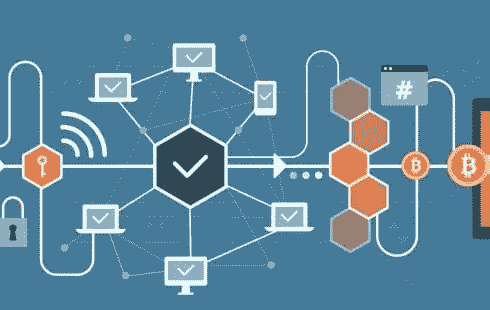
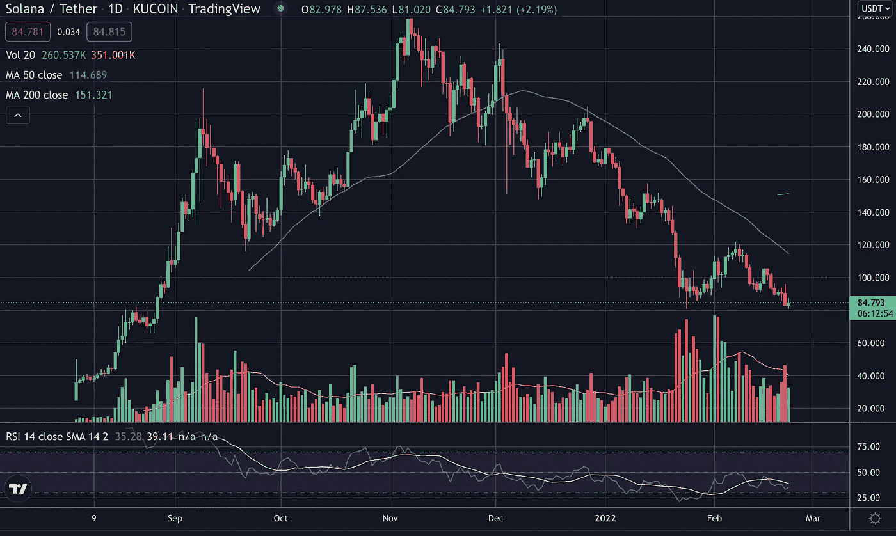
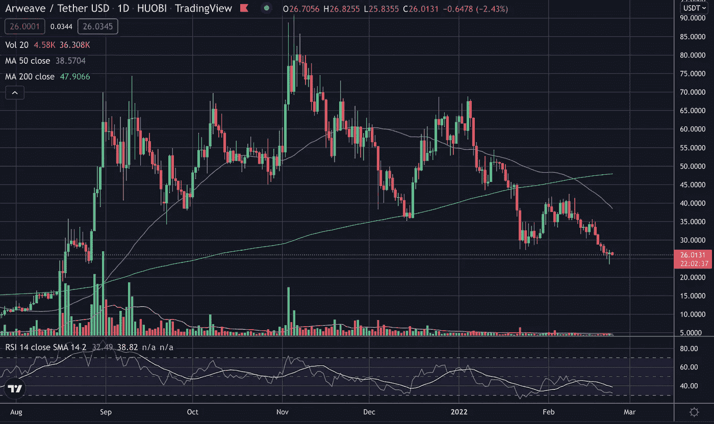
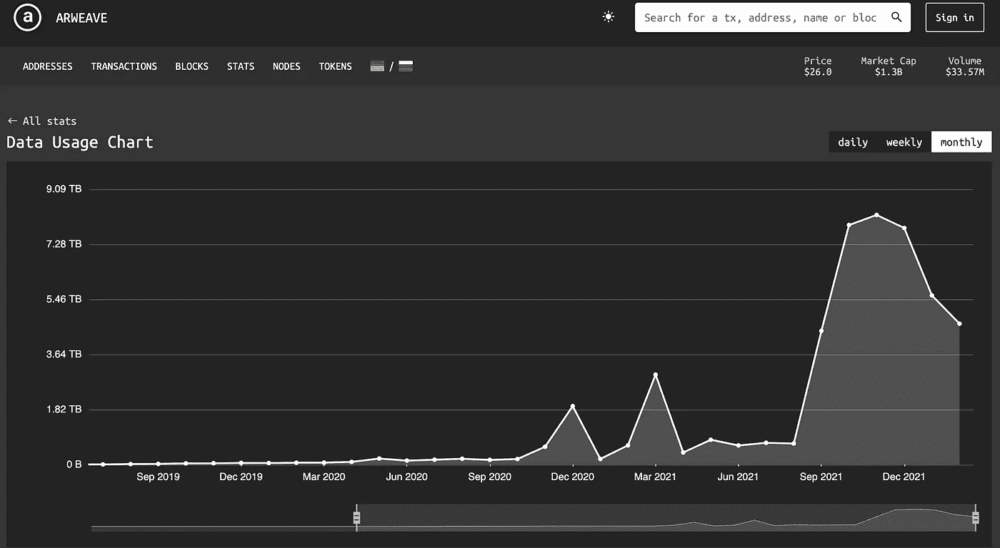

# 对加密货币基础设施的精心押注——一种更安全的投资方式？

> 原文：<https://medium.com/coinmonks/calculated-bets-on-cryptocurrency-infrastructure-a-safer-way-to-invest-73aa2f96c7f9?source=collection_archive---------54----------------------->

免责声明:本帖中表达的想法或发现并不意味着构成财务建议。我拥有比特币、以太坊和索拉纳。

## 介绍

由于最近的宏观经济和地缘政治条件，加密货币市场变得过于波动，我后退了一步。在此期间，我一直在思考维持和扩大区块链所需的基础设施。大多数人都认为某些东西是加密货币发展的必要条件，例如，可扩展性、分散性、安全性(也称为区块链三难困境)、存储机制、网络效应等。因此，如果您能够正确识别连锁企业的基础设施需求，并找到满足这些需求的解决方案，就有可能在降低风险的同时获得丰厚的投资回报。

## 了解现有玩家的需求

这个过程的第一步是决定你认为谁是游戏中的既定玩家。对我来说，答案很明显，是比特币和以太坊。我以前多次提到过，但它们是唯一经过战斗考验的加密货币。所以我们现在要确定他们的需求，让我们以以太坊为例。以太坊是安全和分散的，但是它目前令人失望的一个地方是可伸缩性。太多建在以太坊上的 dApps 导致了一个永久拥挤的网络，结果天然气费用高得离谱。这使得用户从以太坊转向更实惠的连锁店，如 BSC。以太坊的可伸缩性正在被积极地开发，其中一个突出的解决方案是 rollups。汇总可以采取多种形式(乐观、zk 汇总)，但最重要的是， [Vitalik](https://vitalik.ca/general/2021/01/05/rollup.html) 本人表示，它们“有望成为以太坊在短期和中期未来(也可能是长期)扩展的基石。”因此，汇总是我们可以投资/押注的一项基础设施。这是早期的累积，因为没有多少有代币或我们可以投资，但这是值得关注的事情。其中之一是 ZkSync，它今天在以太坊的测试网上发布了第一个 EVM 兼容的 ZK 汇总。如果你想看看这个，点击[这里](https://matterlabs.medium.com/zksync-2-0-public-testnet-is-live-de870ba9632a)。总之，模块化与整体连锁之战正在获得牵引力，许多人认为它将催生下一个故事，所以如果你正在寻找一个存放一些资本的地方，上卷可能是你的选择。

另一个押注基础设施的例子是 Solana 和 Arweave。透明:我不拥有任何 Arweave。对于那些不知道 Arweave 的人来说，它提供了数据永久性，即无限期保存数据。这是相关的，因为 Solana 和 Arweave 合作提供分类帐数据的分散式永久数据存储解决方案。因此，本质上，基于 Solana 开发的应用越多，对 Arweave 上数据存储的需求就越大，而且你猜对了，价格也是相关的。索拉纳生态系统从 9 月到 11 月初飞速发展，下面看看索拉纳和 Arweave 的价格以及 Arweave 在此期间的数据使用情况。

Figure 1\. SOL/USDT (Daily)

Figure 2\. Arweave/USDT (Daily)

Figure 3\. Arweave Data Usage by month

正如你所看到的，SOL 和 Arweave 有很好的相关性，现在很明显 Arweave 是 Solana 生态系统的关键基础设施。从图 3 中，您可以看到数据使用量大幅下降，这可能是由于 Arweave 在 Solana 生态系统衰退后的价格。最近接二连三的 SOL NFTs 地毯拉/骗局可能也没有帮助，SOL NFT 的需求一直在减少。需要澄清的是，我**不是**让你买 Arweave，我只是想说明我押注基础设施的观点。

这种思维方式可以应用到任何你想沉迷的生态系统或链中，在某些方面，这比押注一个新的第 1 层协议更安全。

## 生态系统叙事

我想谈的最后一种基础设施赌注是生态系统。在最近的周期中，随着生态系统的发展，出现了许多第 1 层协议(FTM、AVAX、SOL、ATOM、LUNA)。正如在另一篇[帖子](/@ahahmed_17244/altcoins-major-haemorrhage-protocol-and-denomination-b66cc3ffa85e)中提到的，交易新兴叙事可能相当有利可图，由此产生了一种策略，我在下面概述了这种策略:
1)购买第 1 层令牌
2)在生态系统内空投第 1 层令牌
3)在 apy 很高的时候生产农场
4)利润
5)退出并进入下一层

这是有风险的，因为你依赖于第 1 层协议起飞，并为其他市场参与者 FOMO。我不打算深入讨论这个，因为我个人不练习这些步骤，但这是一个流行的策略，尤其是在最近的牛市中。

## 结论

如果我们缩小范围，整体式与模块化的区块链之争才刚刚开始，如果你能搞清楚正在出现的故事，将会有很多领先零售的机会。作为一个概念，我认为区块链的基础设施必须不断发展，以满足现在摆在我们面前的可扩展性需求。我怀疑一家连锁店是否有可能做所有的事情，随着时间的推移，我们将会看到在非常特殊的领域内经营的超级专业化连锁店的发展(关于这个主题的文章即将发表)。

我希望我已经能够展示您如何从基础设施的角度分析区块链，以及如何将这些信息用于投资/交易目的。

> 加入 Coinmonks [电报频道](https://t.me/coincodecap)和 [Youtube 频道](https://www.youtube.com/c/coinmonks/videos)了解密码交易和投资

# 此外，请阅读

*   [最佳比特币保证金交易](/coinmonks/bitcoin-margin-trading-exchange-bcbfcbf7b8e3) | [洛莉点评](/coinmonks/lolli-review-e6ddc7895ad8) | [比特币保证金交易](https://coincodecap.com/bityard-margin-trading)
*   [创建并出售您的第一个 NFT](https://coincodecap.com/create-nft) | [密码交易机器人](https://coincodecap.com/best-crypto-trading-bots)
*   [如何在硬币兑换中心购买柴犬(SHIB)硬币？](https://coincodecap.com/buy-shiba-coindcx)
*   [CBET 评论](https://coincodecap.com/cbet-casino-review) | [库科宁 vs 比特币基地](https://coincodecap.com/kucoin-vs-coinbase)
*   [Fold App Review](https://coincodecap.com/fold-app-review)|[localbit 币 review](/coinmonks/localbitcoins-review-6cc001c6ed56) | [Bybit vs 币安](https://coincodecap.com/bybit-binance-moonxbt)
*   [加密融资融券交易所](/coinmonks/crypto-margin-trading-exchanges-428b1f7ad108) | [赚取比特币](/coinmonks/earn-bitcoin-6e8bd3c592d9) | [Mudrex 投资](https://coincodecap.com/mudrex-invest-review-the-best-way-to-invest-in-crypto)
*   [waz rix vs coin dcx vs Bitbns](/coinmonks/wazirx-vs-coindcx-vs-bitbns-149f4f19a2f1)|[BlockFi vs coin loan vs Nexo](/coinmonks/blockfi-vs-coinloan-vs-nexo-cb624635230d)
*   [Bitsler Review](https://coincodecap.com/bitsler-review)|[WazirX vs coin switch vs coin dcx](https://coincodecap.com/wazirx-vs-coinswitch-vs-coindcx)
*   [7 大副本交易平台](https://coincodecap.com/copy-trading-platforms) | [买币点评](https://coincodecap.com/buycoins-review)