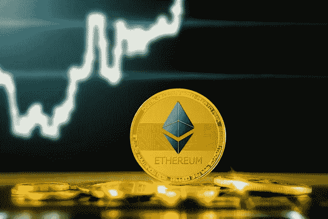
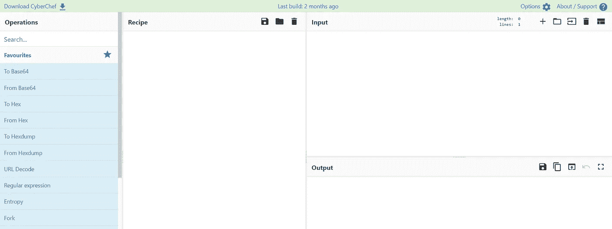

# 以太坊钱包地址背后的计算

> 原文：<https://medium.com/coinmonks/calculation-behind-ethereum-wallet-address-d2aa43ee1e37?source=collection_archive---------8----------------------->

Image credits: [Etfstream](https://www.etfstream.com/media/24341/ethereum-2.jpg?anchor=center&mode=crop&width=660&rnd=132731753120000000)

在我之前关于区块链的博客中，我已经讨论了从私钥生成比特币钱包地址背后的计算，以及比特币区块链中的块哈希是如何计算的。要查阅我所有的博客，你可以参考 https://medium.com/@the_harvester 的网站和 https://cybergeeks.website/的网站

在这篇博客中，我将讨论区块链以太坊的钱包地址是如何由私钥生成的。私钥是 256 个随机位。以**0101001100100101000100010101010000101010101011110101010000101010000101000010100000001010100000010101010001 为例这 256 位被转换成十六进制格式(0x)，所以现在我得到 256/4= > 64 个十六进制字符。十六进制值是 4 位的组合，因此，2 个十六进制值计算 8 位，因此 1 个字节。**

上述私钥(256 位长)的十六进制值为**53288 a 950 Abd 5d 4295409555 f 512242 aafa 96 ab 549 b 2 aaaaaa 9128 bad 0003 EB 56**

和比特币一样，以太坊也使用 **secp256k1** 椭圆曲线密码。公钥是从私钥生成的。***Public Key = Private Key * G***是从私钥中找到公钥的表达式。g 是生成点。你可以从[https://www.secg.org/sec2-v2.pdf](https://www.secg.org/sec2-v2.pdf)找到 secp256k1 ECC 的所有标准值。我写了一个 python 代码，使用 64 个十六进制值计算公钥。公钥长 512 位。

上面的代码会给出公钥为**04 a4 a4c 5160 DFA 830 e 9 D5 fad 6 DBA 5248 E7 a9 c 783 c 30974 a 3382247 dce5a 815 DBA a4 CB 31812 FD 016561 de 57 a5 53 ef 527499031705 be 824016842688 b498 f 61 FDE 7**

这是未压缩的公钥，因为它有前缀 **04** 。未压缩的公钥意味着公钥中同时包含 X 轴和 Y 轴坐标。上述公钥中 x 轴坐标为**a4a 4c 5160 DFA 830 e 9 D5 fad 6 DBA 5248 E7 a9 c 783 c 30974 a 3382247 DCE 5a 815 dbaa**，因此剩余部分为 Y 轴坐标。问题是**为什么会产生 X & Y 轴坐标？**这是因为， **G** ，我上面在公钥计算中讨论的是一个点，我用它乘以私钥值，因此我会得到 X 和 Y 轴。该乘法不是常规乘法，而是不同于常规乘法的 ECC 乘法。

与比特币公钥不同，从未压缩的公钥中移除 **04** 前缀，并对 128 个十六进制值应用字节方式的 **keccak256** 哈希。记住**字节方式的**散列，而不是**字符方式的**散列。

128 个十六进制字符的字节哈希是**035 aa 4a 9 a 4657 a2 faec 812 f 23 b 75 ea 5c 82 e 96d 9489 ed 740d 455 da 4900 f 152 f 95**，但是这个哈希的最后 20 个字节，即**0x 3b 75 ea 5c 82 e 96d 9489 ed 740d 455 da 4900 f 152 f 99 就像[以前的博客](/@the_harvester/whats-my-wallet-address-a8c25c8e32b1#:~:text=the%20above%20code%2C-,code,-for%20the%20same)中的 python 代码一样，类似地，在这个博客中使用公钥来获得散列，否则使用 [CyberChef](https://gchq.github.io/CyberChef/#recipe=From_Hex('Auto')Keccak('256')&input=QTRBNEM1MTYwREZBODMwRTlENUZBRDZEQkE1MjQ4RTdBOUM3ODNDMzA5NzRBMzM4MjI0N0RDRTVBODE1REJBQTRDQjMxODEyRkQwMTY1NjFERTU3QTVBNTNFRjUyNzQ5OTAzMTcwNUJFODI0MDE2ODQyNjg4QjQ5OEY2MUZERTc) 。**

[Cyber Chef](https://gchq.github.io/CyberChef/#recipe=From_Hex('Auto')Keccak('256')&input=QTRBNEM1MTYwREZBODMwRTlENUZBRDZEQkE1MjQ4RTdBOUM3ODNDMzA5NzRBMzM4MjI0N0RDRTVBODE1REJBQTRDQjMxODEyRkQwMTY1NjFERTU3QTVBNTNFRjUyNzQ5OTAzMTcwNUJFODI0MDE2ODQyNjg4QjQ5OEY2MUZERTc)

> **社交媒体链接:**[LinkedIn](https://www.linkedin.com/in/ansh-vaid/)|[GitHub](https://github.com/AnshVaid4)|[insta gram](https://www.instagram.com/being_optimist/)|[Twitter](https://twitter.com/anshvaid4)
> 
> ***我的网站:****[*https://cybergeeks.website/*](https://cybergeeks.website/)*

> *加入 Coinmonks [电报频道](https://t.me/coincodecap)和 [Youtube 频道](https://www.youtube.com/c/coinmonks/videos)了解加密交易和投资*

## *也阅读*

* [## 杠杆代币[多头代币]终极指南

### 杠杆化令牌是具有杠杆化风险敞口的 ERC20 令牌，不考虑保证金、要求、管理…

medium.com](/coinmonks/leveraged-token-3f5257808b22)  [## 最佳加密交易所| 2022 年十大加密货币交易所| CoinCodeCap

### 哪一个是最好的加密交换？在本文中，我们将根据多种加密货币列出 10 大加密货币交易所

coincodecap.com](https://coincodecap.com/crypto-exchange)  [## 2022 年最佳加密交换平台| CoinCodeCap

### 随着时间的推移，我们大多数人将转向 dex 以获得更好的安全性和隐私。因此。在这里，我们将讨论…

coincodecap.com](https://coincodecap.com/best-swap-platforms)  [## 2022 年最佳加密和比特币赌场(美国批准，存款奖励)

### 接收、支付和赚取加密货币| |有各种各样的最佳在线赌场可供选择，有可能…

coincodecap.com](https://coincodecap.com/best-online-casinos)  [## 2021 年最佳加密借贷平台| 6 大比特币借贷平台

### 获得比特币和其他加密货币的最佳贷款利率

medium.com](/coinmonks/top-5-crypto-lending-platforms-in-2020-that-you-need-to-know-a1b675cec3fa)  [## 2021 年 6 大最佳硬件钱包|顶级加密硬件钱包[更新]

### 最好的加密货币硬件钱包是绝对必要的。我们将在 NGRAVE、Ledger Nano X 和…

medium.com](/coinmonks/the-best-cryptocurrency-hardware-wallets-of-2020-e28b1c124069)  [## 加密交易机器人——19 款最佳免费加密交易机器人

### 2022 年币安、比特币基地、库币和其他密码交易所的最佳密码交易机器人。四进制，位间隙…

medium.com](/coinmonks/crypto-trading-bot-c2ffce8acb2a)  [## 最佳 4 个加密交易信号电报通道

### 这是乏味的找到正确的加密交易信号提供商。因此，在本文中，我们将讨论最好的…

medium.com](/coinmonks/best-crypto-signals-telegram-5785cdbc4b2b)*