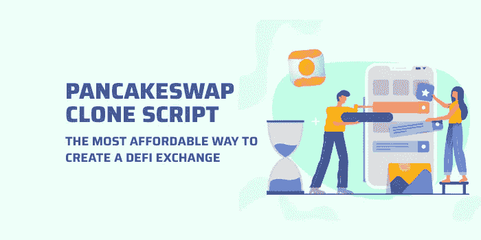

# 建立一个 DeFi 交易所的成本？

> 原文：<https://medium.com/coinmonks/can-a-cryptoprenuer-start-a-defi-business-with-just-999-yes-4f6f04fd86c?source=collection_archive---------20----------------------->

DeFi exchange 是加密领域的一个趋势性 DeFi 商业模式，创建一个像 Pancakeswap 这样的交易所是一个理想的选择，可以以无风险的方式产生大量的收入。对于打算立即在币安智能链上开始 DeFi 交换业务的加密初创公司来说，获得 pancakeswap 克隆脚本将是最佳解决方案。这是由于它惊人的津贴。

这是一个随时可以推出的 DeFi exchange 软件，使初创公司能够在几天之内在 BSC 网络上开发和部署用户友好的 DeFi exchange。它包括所有的技术特征和先进的安全机制，以长期运行 DeFi 交换机。

使用高级 pancakeswap 克隆脚本，您可以构建一个引人注目的 DeFi exchange，100%类似于具有尖端属性的 Pancakeswap。例如收益农业、流动性池、赌注、BEP20 令牌交换机制等。这些语句可以被认为是 pancakeswap 克隆脚本的基本定义。如果你要购买这个脚本，那么你需要了解它的开发成本，好处，以及为什么选择这个脚本为您的 DeFi 交换业务。

了解 pancakeswap 克隆软件的成本将有助于你清楚地了解你的投资和其他方面。在本文中，我将讨论使用 Pancakeswap 克隆脚本启动 DeFi 交换的成本。然而，在了解该软件的开发成本之前，我想解开…

# 为什么 Pancakeswap 克隆脚本有利于加密初创公司？

当您手中有一个没有 bug 的白色标签 pancakeswap 克隆脚本时，开发一个 DeFi exchange 并不是一个乏味的过程或一项艰巨的任务。选择超现代 pancakeswap 克隆脚本作为其主要 DeFi exchange 开发方法的创业公司和企业家可以产生一些商业利益。

1.  与其他开发方法相比，使用 pancakeswap 克隆软件创建 DeFi 交换平台被认为是目前最明智的解决方案。因为当你从基地开发一个 DeFi 交易所时，你需要大量的高科技资源，这类似于在漫长的旅程中走一条壮丽的路线。
2.  从头开始开发一个成熟的 DeFi 交易所需要大约一年的时间来完成这个项目。但是如果你有一个 pancakeswap 克隆脚本，你可以在你想要的时间内启动它们。
3.  您可以获得几个可定制的选项，因此您可以根据自己的需求轻松修改 DeFi exchange 架构、后端、前端设计、关键功能和其他附加模块。
4.  pancakeswap 克隆脚本是用防篡改安全模块精心制作的。
5.  这个 DeFi 交流克隆脚本是完全开发，设计与先进的用户界面/UX，多重测试的区块链专家，并准备推出。
6.  这个克隆脚本附带了一个惊人的管理门户，可以帮助您以一种轻松的方式管理或控制核心功能、钱包交易、汽油费等。此外，它配备了所有突出的投资回报率模块，所以你可以产生一个庞大的收入数额，你从来没有想象过。

当你可以得到这么多好处的时候，你会忽略这种类型的克隆脚本吗？？我希望没有人会否认 pancakeswap 克隆脚本。这就是为什么它被认为是新兴加密初创公司和企业家的福音。即使从头开发一个 DeFi exchange 也有很多好处，但为什么所有萌芽中的初创公司都喜欢 pancakeswap 克隆脚本而不是从头开发是互联网上最常见的问题。答案很简单 pancakeswap 克隆脚本是预算友好的。

因此，作为一名加密企业家，使用超现代的 pancakeswap 克隆脚本将有助于您经济高效地推出像 PancakeSwap 这样功能丰富的 DeFi exchange。

# **选择 PancakeSwap 克隆脚本如何成为一种经济高效的方式？**

一些创业公司更喜欢从零开始开发 DeFi exchange，因为他们有潜在的资金和足够的时间来建立它。然而，所有新兴的创业公司和企业家都负担不起从基础发展 DeFi 交易所的费用，他们也没有太多的时间用于发展过程。除此之外，scratch 方法涉及到独特的编码和大量的团队工作。所以，DeFi 交易所的开发成本将会比你预计的高得多。

从最初阶段建立一个 DeFi 交换平台将会遇到许多技术故障和困难。最终，你将面临一个无法忍受的失败，导致你放弃你的项目。所以这完全是一个冒险的方法。根据前面的陈述和当前的市场趋势，从零开始开发 DeFi 交易所对于想要像明星一样闪耀并品尝区块链行业成功的多汁性的年轻创业公司来说不是最好的主意。

在这个现代时代，新奇的技术进步使得创业公司采取多样化的方法来创建 DeFi 交流平台。在这方面，通过使用先进的 **PancakeSwap 克隆脚本**开始 DeFi 交换业务将是目前最好的解决方案。我这样说是因为，即使在出色的设计实施、关键功能优化、多重测试和启用所有重要的 ROI 模块之后，使用 pancakeswap 克隆脚本构建 DeFi 交换所涉及的费用与从基础进行开发相比也将显著减少。

现在，你可能很想知道…

# **Pancakeswap 克隆脚本的费用是多少？**

让我来揭示 pancakeswap 克隆脚本的创建成本和从头创建 DeFi 交换平台的开发成本。以便您在开展 DeFi exchange 业务之前，对开发成本有一个清晰的了解。从头开始制作一个基于 DeFi 的交易平台将花费你大约 6 万到 10 万美元。

OMG！！！听起来很贵…对吗？？？但是你不会用这种方法，所以冷静下来。

另一方面，使用一个没有错误的 [**白标 pancakeswap 克隆脚本**](https://www.coinsclone.com/pancakeswap-clone-script/?utm_source=wlpc&utm_medium=cryptohandbook&utm_campaign=sinu) 创建一个 DeFi 交换将花费你大约**$ 6K-$ 12k**。然而，我在这里提到的成本并不是固定的。开发成本将根据您想要使用的技术、您启用的特性和您集成的附加模块而有所不同，并且它主要取决于您的业务概念。

因此，这些因素清楚地表明，Pancakeswap 克隆脚本是按照您的预算计划开始蓬勃发展的 DeFi exchange 业务的划算方式。所以…

# **如何入门 PancakeSwap 克隆脚本？**

我希望你对使用 pancakeswap 克隆软件开发 DeFi exchange 的成本有所了解。现在，我想告诉你一个秘密，关于你如何在 DeFi 世界品尝成功。您的 DeFi exchange 业务的成功将基于您的发展标准。这里的术语“标准”指的是参与 DeFi exchange 项目的熟练开发人员团队。

由于加密市场充斥着许多容易上当受骗的脚本提供商，你不能盲目地将你的梦想 DeFi 项目交给一些等待利用既定机会赚钱的伪造者。此外，与这样一个剧本提供者握手会使你的项目成为一场灾难，粉碎你为开始你梦想的 DeFi exchange 业务而辛苦赚来的所有资金。

要忽略所有这些复杂性，你必须从全球加密领域中值得信赖的[**PancakeSwap 克隆脚本提供商**](https://www.coinsclone.com/pancakeswap-clone-script/?utm_source=pcsp&utm_medium=cryptohandbook&utm_campaign=sinu) 中雇佣一支训练有素、经验丰富的区块链开发人员团队。拥有一个专门的专业团队来处理您的 DeFi exchange 项目将让您在加密领域成为一个不可战胜的初创公司。除此之外，在使用可定制的白标 pancakeswap 克隆软件开发 DeFi 交换时，拥有正版脚本提供商的完美指导将帮助您克服所有复杂的技术障碍。

> 加入 Coinmonks [电报频道](https://t.me/coincodecap)和 [Youtube 频道](https://www.youtube.com/c/coinmonks/videos)了解加密交易和投资

# 另外，阅读

*   [3 商业评论](/coinmonks/3commas-review-an-excellent-crypto-trading-bot-2020-1313a58bec92) | [Pionex 评论](https://coincodecap.com/pionex-review-exchange-with-crypto-trading-bot) | [Coinrule 评论](/coinmonks/coinrule-review-2021-a-beginner-friendly-crypto-trading-bot-daf0504848ba)
*   [莱杰 vs Ngrave](/coinmonks/ledger-vs-ngrave-zero-7e40f0c1d694) | [莱杰 nano s vs x](/coinmonks/ledger-nano-s-vs-x-battery-hardware-price-storage-59a6663fe3b0) | [币安评论](/coinmonks/binance-review-ee10d3bf3b6e)
*   [Bybit Exchange 审查](/coinmonks/bybit-exchange-review-dbd570019b71) | [Bityard 审查](https://coincodecap.com/bityard-reivew) | [Jet-Bot 审查](https://coincodecap.com/jet-bot-review)
*   [3 commas vs crypto hopper](/coinmonks/3commas-vs-pionex-vs-cryptohopper-best-crypto-bot-6a98d2baa203)|[赚取加密利息](/coinmonks/earn-crypto-interest-b10b810fdda3)
*   最好的比特币[硬件钱包](/coinmonks/hardware-wallets-dfa1211730c6) | [BitBox02 回顾](/coinmonks/bitbox02-review-your-swiss-bitcoin-hardware-wallet-c36c88fff29)
*   [BlockFi vs Celsius](/coinmonks/blockfi-vs-celsius-vs-hodlnaut-8a1cc8c26630)|[Hodlnaut 点评](/coinmonks/hodlnaut-review-best-way-to-hodl-is-to-earn-interest-on-your-bitcoin-6658a8c19edf) | [KuCoin 点评](https://coincodecap.com/kucoin-review)