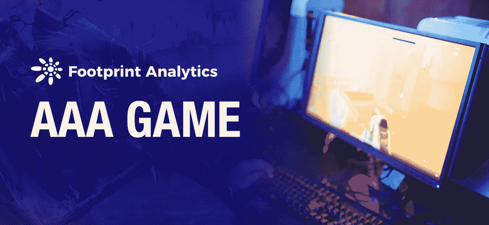
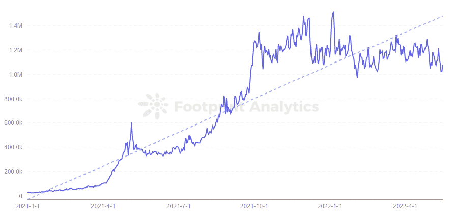
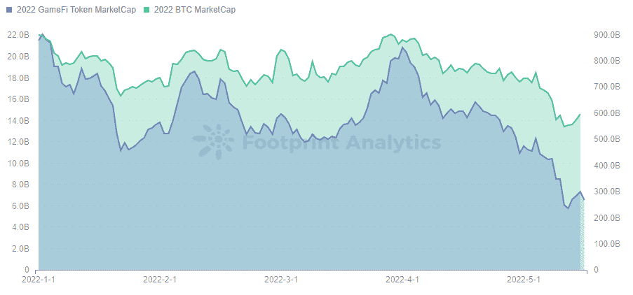
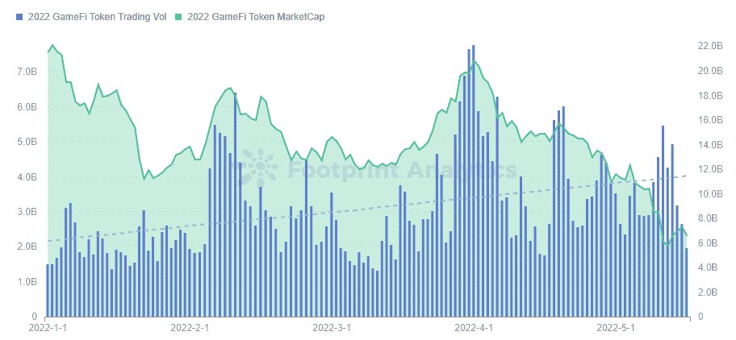
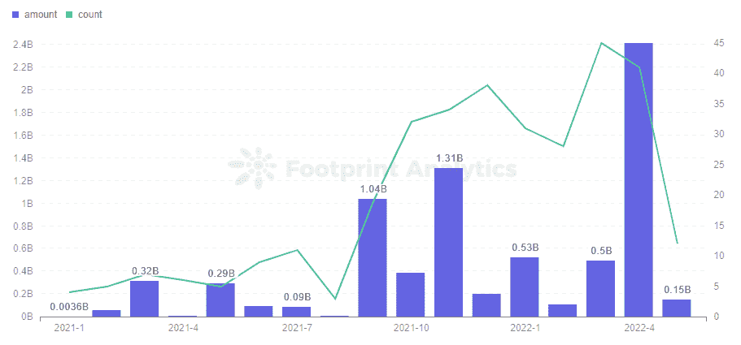
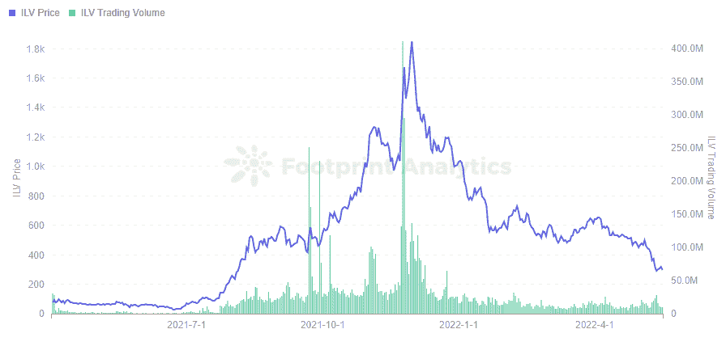
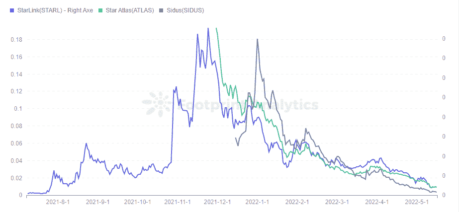

# AAA 游戏能拯救 GameFi 吗？

> 原文：<https://medium.com/coinmonks/can-aaa-games-save-gamefi-43fda3caf923?source=collection_archive---------51----------------------->

2022 年 5 月

数据来源:[足迹分析 3A 游戏仪表盘](https://www.footprint.network/@DamonSalvatore/3A-Game?channel=ENG-256)

无聊和无利可图是用户现在与 [GameFi](https://www.footprint.network/guest/dashboard/dashboard-for-game-fi-industry-fp-f7d88ee8-9341-49ae-b497-088bee7ec038?date=past60days&channel=ENG-256#secret=2E95108712AF5CB1949BCFBB804F139C) 联系在一起的两种感觉，这比任何事情都更导致玩家失去乐趣，同时赚不到以前那么多。

虽然项目已经尝试了各种方法来振兴他们的游戏经济，但许多项目继续陷入死亡螺旋。例如， [StarSharks](https://www.footprint.network/guest/dashboard/Tokenomics-of-(Token)-fp-aa971726-d7a8-4963-8001-a83a4222741e?token_address=0x26193c7fa4354ae49ec53ea2cebc513dc39a10aa&channel=ENG-256) ，它仍在试图提高其代币价格，但在没有之前利润的情况下，无法再留住用户。

# GameFi 是否过饱和？

根据足迹分析，GameFi 用户数量在 12 月达到顶峰，并在 2022 年略有下降，显示出增长乏力。整体用户数保持在 120 万左右。

*Footprint Analytics — GameFi Users Trend*

GameFi 的代币市值自 2021 年见顶以来，一直与 BTC 呈正相关。市值在 4 月初开始下降，尽管受到 BTC 的影响，但我们可以看到 GameFi 令牌的市值在 5 月初之后下降得更快。

*Footprint Analytics — 2022 GameFi Token MC vs BTC MC*

BTC 在 5 月初暴跌，与年初相比市值下降了 38%，而 GameFi token 的市值下降了 73%。当熊市来袭时，当用户察觉缺乏投机机会时，GameFi 代币会被迅速抛售。

GameFi token 的市值和交易量一般是正相关的，但在 5 月初市场整体下跌的时候是负相关的。交易量大幅增加，用户纷纷逃离这种动荡的游戏经济模式。

*Footprint Analytics — 2022 GameFi Token Trading Vol vs MC*

GameFi 行业在 2022 年初看起来很受欢迎，GameFi 利用了牛市期间的上涨，用户甚至可以通过无意识的投资获利。但当熊市来袭时，用户更喜欢寻找具有内在价值的投资。

# AAA 级比赛会是 P2E 的出路吗？

在传统游戏中，AAA 游戏是指开发成本高、开发周期长的游戏。这类游戏因精美的画面、丰富的可玩性和吸引人的叙事获得大量高留存用户。

尽管经历了艰难的一年，GameFi 仍继续受到风投的关注。根据足迹分析公司(Footprint Analytics)在游戏领域的投资数据，与去年同期相比，投资的金额和数量都有显著增长，尤其是在 4 月份，共进行了 41 项投资，总额为 24.1 亿美元。其中有一些风投开始投资 3A GameFi 游戏。

*Footprint Analytics — GameFi Investment Trend*

最著名的 AAA 级区块链游戏之一是 Illuvium，它已经开发了一年，目前仍处于私人测试阶段。公开测试版计划在第二季度推出。

自第一部预告片发布以来，Illuvium 吸引了很多关注，令牌的价格也在攀升，在 11 月达到了 1800 美元的峰值。然后就跌了，尤其是 1 月初 Illuvium 合约因为一个 bug 被攻击，攻击者转了 1 亿 sILV。

截至 5 月 18 日，ILV 仍在 300 美元左右，交易量明显低于去年年底。尽管该项目通过私募和 IDO 筹集了 4300 万美元，但漫长的周期正在让用户的期望消退。

*Footprint Analytics — ILV Token Price vs Trading Volume*

今年可能正式上线的这几款 AAA 游戏分别是《Illuvium》、《大时代》和《幻影星系》。其他的，像最近流行的 Ultiverse，至少要到明年。

AAA 游戏将有更丰富的玩法、叙事和令牌组学。真正的 AAA 游戏对用户的吸引力会更大，对其他 GameFi 项目也会有影响。

然而，这种类型的游戏面临着很长的准备时间，这在加密领域是有问题的，在加密领域，把握市场时机和保持势头是至关重要的。

因此，为了解决资金问题，项目通常首先提供代币或 NFT 来筹集资金，筹集的资金数量取决于项目的叙述。然而，由于游戏尚未上线，代币或 NFT 缺乏足够的效用，用户抱着赌博的心态持有它们。过多的发行或随着时间的推移，也会对其价值产生负面影响。

正如在[足迹分析](https://www.footprint.network/?channel=ENG-256)中看到的，在迄今为止为 3A 游戏问题收集的代币中，除了 Illuvium 的价格较高之外，StarLink、Star Atlas 和 Sidus 等游戏的代币价格都低于 0.01 美元。而且都有类似的价格走势，价格在去年年底概念火热的时候达到高点，然后一路下跌。

*Footprint Analytics — 3A Game Token*

# 摘要

虽然风投在不断投资 AAA 游戏，但至今还没有一个项目上马。

但是，尽管存在这些问题，这种新型游戏(至少在区块链地区)可能会将可玩性重新纳入“玩即赚”的范畴。

AAA 游戏也将把我们进一步推向元宇宙的世界。从短期来看，GameFi 可能看起来像一个泡沫，但从长期来看，更具内在价值的游戏将是前进的方向。

这篇文章由[足迹分析](https://www.footprint.network/?channel=ENG-256)社区提供。

Footprint 社区是一个世界各地的数据和加密爱好者相互帮助了解和获得关于 Web3、元宇宙、DeFi、GameFi 或区块链新兴世界任何其他领域的见解的地方。在这里，你会发现活跃的、不同的声音相互支持，推动着社区向前发展。

> 加入 Coinmonks [电报频道](https://t.me/coincodecap)和 [Youtube 频道](https://www.youtube.com/c/coinmonks/videos)了解加密交易和投资

# 另外，阅读

*   [折叠 App 回顾](https://coincodecap.com/fold-app-review) | [本地比特币回顾](/coinmonks/localbitcoins-review-6cc001c6ed56) | [Bybit vs 币安](https://coincodecap.com/bybit-binance-moonxbt)
*   [加密保证金交易交易所](/coinmonks/crypto-margin-trading-exchanges-428b1f7ad108) | [赚取比特币](/coinmonks/earn-bitcoin-6e8bd3c592d9) | [Mudrex 投资](https://coincodecap.com/mudrex-invest-review-the-best-way-to-invest-in-crypto)
*   [WazirX vs coin dcx vs bit bns](/coinmonks/wazirx-vs-coindcx-vs-bitbns-149f4f19a2f1)|[block fi vs coin loan vs Nexo](/coinmonks/blockfi-vs-coinloan-vs-nexo-cb624635230d)
*   [比斯勒评论](https://coincodecap.com/bitsler-review)|[WazirX vs coin switch vs coin dcx](https://coincodecap.com/wazirx-vs-coinswitch-vs-coindcx)
*   [7 大副本交易平台](https://coincodecap.com/copy-trading-platforms) | [BuyCoins 点评](https://coincodecap.com/buycoins-review)
*   [XT.COM 评论](https://coincodecap.com/profittradingapp-for-binance) | [币安评论](https://coincodecap.com/xt-com-review)