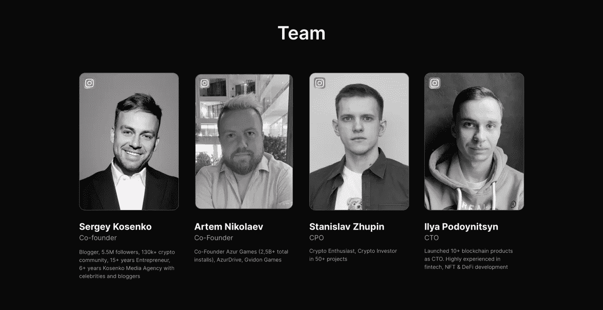

# AMAZY 能成为 StepN 的有力竞争对手吗？

> 原文：<https://medium.com/coinmonks/can-amazy-be-a-serious-competitor-to-stepn-73572de81454?source=collection_archive---------6----------------------->

多年来，有各种各样的应用程序和小工具鼓励我们走路和跑步，但对许多人来说，没有什么激励可能像赚钱一样有吸引力，正是 StepN 的项目，由于区块链的技术，使人们熟悉了术语 move2earn。

随着 StepN 的成功，这一领域出现了一种新的趋势，许多项目希望提供一个 StepN 的副本或类似产品，并瞄准那些错过了 StepN 初始利润的用户，但到目前为止他们还没有成功，但这并不意味着 StepN 永远不会有一个强有力的竞争对手，尤其是现在由于我在以前的文章中提到的问题*，StepN 已经变得越来越弱。(【StepN 会复活吗？)*

AMAZY 项目是我认为有可能扰乱秩序的项目之一，在这篇文章中，在这篇文章中，我想向你介绍这个项目，并写一点关于它的重要观点。

## **什么是 AMAZY？**

在 AMAZY 项目中，有四种类型的运动鞋 NFT，你可以购买或租赁，然后获得一个 AMT 代币，每天进行一定量的步行或慢跑，这个代币可以出售，或者你可以升级运动鞋，或者你可以修理运动鞋。

**为什么有人要为我走路付钱？**

你一定问了为什么要有人出钱让我走路？我来回答你的问题，如果设计了精准的玩法和双赢，有可能一个周期所有利益相关者都受益。当然，设计这样的代币经济是非常困难的，但这是可能的，我们在很多项目中都看到了成功的例子。其中一个是斯戴普。

我需要提醒你，AMAZY 项目团队的收入来自买卖 NFT 和宝石，以及铸造和出租运动鞋

**AMAZY 团队:**
据 AMAZY 网站消息，主要团队由四人组成，下面我简单介绍一下:

🌟Artem Nikolaev，AZUR GAMES 的创始人，该公司在游戏应用程序下载数量方面排名世界第三，2021 年下载量超过 15 亿次(Google Play 以 24 亿次下载量排名第一)

🌟Sergey Kosenko，Instagram 上的 550 万粉丝，crypto channel 上的 13 万多个社区，以及与独联体名人和博客作者合作了 6 年的媒体机构 Kosenko Media。

🌟斯坦尼斯拉夫.朱平。加密爱好者，50 多个项目的加密投资者

🌟首席技术官 Ilya Podoynitsyn。作为首席技术官，推出了 10 多种区块链产品。在金融科技、NFT 和 DeFi 开发方面经验丰富。

项目团队有两点:
首先是 Artem Nikolaev 的存在，考虑到 Azur games 的联合创始人是最好的游戏发行公司之一，他可以非常有效地向目标客户介绍这个项目。当然，我没有看到他谈论这个项目合作的地方，为此，我在 Instagram 上问他，他们是否也是 AMAZY 项目的创始人？如果他回答了，我会在这篇文章下面给你留言。

第二个是谢尔盖·科先科(Sergey Kosenko)的存在，他在 Instagram 上有 550 万粉丝，可以与他有影响力的同事很好地协调，并显著提高品牌知名度。

总的来说，他们在技术上和与社区沟通方面似乎有一个很好的团队，但我希望他们的大名和繁忙的日程不会妨碍他们专注于这个项目，并希望他们能尽最大努力使这个项目取得成功。

**大启动:** 嗯，从团队的介绍中可以看到，这个项目已经涉及到了一个非常大的社区，*根据我之前写的一篇文章(*[StepN 的华人风暴！](/coinmonks/the-chinese-storm-in-stepn-56d57abdb94d?source=your_stories_page-------------------------------------))，我们发现大多数 StepN 的用户都来自俄罗斯，俄罗斯人民对 move2earn 非常感兴趣，而 AMAZY 是一个俄罗斯的项目，如果我们把这些事实放在一起，我们发现在项目的早期，非常多的用户很可能渴望使用它。这给技术团队带来了很大的责任，他们必须尽最大努力让最初的项目没有 bug，但他们已经在新闻中宣布他们正在测试应用程序，并将识别和修复可能的 bug。

除了大量等待推出项目的用户之外，团队还向 StepN 做出了许多承诺，比如可以租运动鞋，可以分组行走。当然，这些功能也在 StepN 路线图中，但它们将面临各种尚未实现的问题，这是我对这个项目最担心的事情。

代币经济是 move2arn 项目最重要的部分。这部分最小的错误都可能是最后的错误，意味着项目的死亡。不管你已经做了多少计算，在启动和大量用户涌入期间，你的项目可能会有 bug，这是非常危险的。因此，我害怕这个项目的大启动，我建议它以应用程序的低功能启动，并在达到稳定状态时逐步实现下一个功能。当然，我知道他们有激活码之类的机制，但我认为这还不够，他们应该有更多的计划来控制代币经济的供需和健康。

结论:
这个项目的巨大优势在于它看起来像一个热切的社区和一个知道如何与社区沟通的团队，而团队最重要的挑战是管理发布后的令牌经济，我希望它会成功，我们将有另一个强大的 move2earn 项目。

[https://amazy.io/](https://amazy.io/)

> 加入 Coinmonks [电报频道](https://t.me/coincodecap)和 [Youtube 频道](https://www.youtube.com/c/coinmonks/videos)了解加密交易和投资

# 另外，阅读

*   [OKEx vs KuCoin](https://coincodecap.com/okex-kucoin) | [摄氏替代品](https://coincodecap.com/celsius-alternatives) | [如何购买 VeChain](https://coincodecap.com/buy-vechain)
*   [币安期货交易](https://coincodecap.com/binance-futures-trading)|[3 comas vs Mudrex vs eToro](https://coincodecap.com/mudrex-3commas-etoro)
*   [如何购买 Monero](https://coincodecap.com/buy-monero) | [IDEX 评论](https://coincodecap.com/idex-review) | [BitKan 交易机器人](https://coincodecap.com/bitkan-trading-bot)
*   [CoinDCX 评论](/coinmonks/coindcx-review-8444db3621a2) | [加密保证金交易交易所](https://coincodecap.com/crypto-margin-trading-exchanges)
*   [红狗赌场评论](https://coincodecap.com/red-dog-casino-review) | [Swyftx 评论](https://coincodecap.com/swyftx-review) | [造币厂评论](https://coincodecap.com/coingate-review)
*   [Bookmap 评论](https://coincodecap.com/bookmap-review-2021-best-trading-software) | [美国 5 大最佳加密交易所](https://coincodecap.com/crypto-exchange-usa)