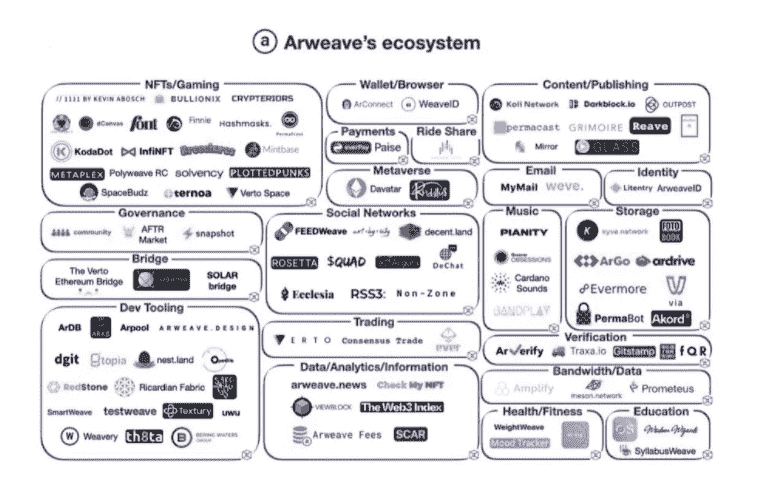

# Arweave 能为区块链重新发明数据存储吗？

> 原文：<https://medium.com/coinmonks/can-arweave-re-invent-data-storage-for-the-blockchain-a4fd869f5bcd?source=collection_archive---------55----------------------->

Arweave 的永久存储概念能否成为赢得市场的有效竞争策略？

2022 年 1 月，sabrina@footprint.network

数据来源: [Arweave 仪表盘](https://www.footprint.network/guest/dashboard/arweave-fp-4c9dff09-7213-4022-9fe2-df0c0eccb88a?channel=u-apcVFj#secret=8CE7F8DAE34B576D1113542854CF8D07)

在之前的一篇文章中， [*分散存储协议会赶超云存储市场吗？*](https://cryptoslate.com/will-decentralized-storage-protocols-overtake-the-cloud-storage-market/) ，我们比较了四种主要的分散存储协议。

在本文中，我们将看到 Arweave 的永久存储概念是否可以成为赢得市场的有效竞争策略。

Arweave 的 permaweb 不是私有的，所有数据都是永久公开的，可以直接访问。因此，它不适合存储个人或敏感数据。其 40 多年的前期存储成本比现有解决方案昂贵得多。

例如为了能够在 Arweave 上存储文件，开发者创建一个交易，支付一定数量的 AR 令牌作为网络费用(目前为 0.01 美元/MB)来永久存储数据。同时，亚马逊 S3 的低端套餐每月收费 0.000023 美元/MB。每个 Arweave 用户需要 40 年才能达到收支平衡。这意味着 Arweave 用户要为永久存储支付额外费用。

那么，谁会使用这种解决方案呢？Arweave 适用于需要数据的组织和公司:

*   公开提供
*   储存超过 40 年
*   抵制审查

# Arweave 的潜在应用场景

链上数据的存储层

大多数公共链的最大问题是它们不能在它们的链上存储大量的超媒体数据。区块链是记账的账本，不是数据存储。作为链上数据的存储层，Arweave 有着广阔的市场。

NFTs 的存储层

对长期的、不可变的和公开可用的存储有明显需求的 NFTs，将可能成为像 Arweave 这样的项目的主要细分市场之一。

公开但敏感的内容的存储

在传统的集中存储中，公司或中央机构可以轻松删除内容。例如，像维基解密这样的活动家，或者类似于维基百科的更大的组织，将是分散存储的主要候选人。

# Arweave 的生态系统扩张路径

回顾 Arwearve 自 2021 年以来的技术发展和市场扩张轨迹，很明显 Arweave 团队对其应用场景和市场策略有着清晰而独特的愿景。

与 Web 3.0 基础设施的合作

Arweave 已经与 Cosmos、Polkadot、Avalanche、NEAR 和 Solana 合作。区块链索引协议 Graph 也支持 Arweave，允许用户更有效地访问存档的区块链数据。

与 DeFi 项目的合作

越来越多的项目使用 Arweave 来存储与密码行业相关的数据。在 DeFi 领域有一些重要的使用案例:Uniswap 和 Compound 已经在 Arweave 上托管了他们的整个前端应用程序。

Arweave 生态系统的扩展

*   NFTs: Arweave 有一个 NFT 标准，称为原子 NFT，它使得在链上和永久保存资产文件和元数据文件成为可能，而其他解决方案只提供一次性 NFT，元数据文件存储在链外。
*   DApps: Arweave 有自己的 ERC-20 令牌格式，称为利润分享令牌(PST)。在部署智能合同时，开发商可以设置相应的 PST 通行证，并同意 PST 的持有者将获得合同产生的未来天然气费用的比例份额。因此，部署在 Arweave 上的智能合约使用得越多，其 PST 令牌的内在价值就越高。这激励了开发者。

**总之**

Web 3.0 存储基础设施 Arweave 是一个分散的云存储解决方案，解决了随着时间的推移永久存储数据的问题。其网络和应用架构从整体上支持开发和数据存储，使数据从时间和空间上的完整性成为可能。

许多智能合约，尤其是 GameFi，非常重视用户前端行为数据，迫切需要连接链上和链下的数据..

随着生态系统的日益丰富，Arweave 有潜力建立一个坚实的基础来解决上述问题，并有极好的机会成为顶级连锁店..

**什么是足迹**

足迹分析是一个一体化的分析平台，用于可视化区块链数据和发现见解。它清理和整合链上数据，因此任何经验水平的用户都可以快速开始研究令牌，项目和协议。凭借一千多个仪表板模板和一个拖放界面，任何人都可以在几分钟内构建自己的定制图表。发掘区块链数据，利用足迹进行更明智的投资。

*足迹网址:*[*https://www . Footprint . network/*](https://www.footprint.network/)

*不和:*[*https://discord.gg/3HYaR6USM7*](https://discord.gg/3HYaR6USM7)

*推特:*[*https://twitter.com/Footprint_DeFi*](https://twitter.com/Footprint_DeFi)

*Youtube:*[*https://www.youtube.com/channel/UCKwZbKyuhWveetGhZcNtSTg*](https://www.youtube.com/channel/UCKwZbKyuhWveetGhZcNtSTg)

> 加入 Coinmonks [电报频道](https://t.me/coincodecap)和 [Youtube 频道](https://www.youtube.com/c/coinmonks/videos)了解加密交易和投资

## 也阅读

 [## 杠杆代币[多头代币]终极指南

### 杠杆化令牌是具有杠杆化风险敞口的 ERC20 令牌，不考虑保证金、要求、管理…

medium.com](/coinmonks/leveraged-token-3f5257808b22) 

[https://coincodecap.com/crypto-exchange](https://coincodecap.com/crypto-exchange)

 [## 2022 年最佳加密交换平台| CoinCodeCap

### 随着时间的推移，我们大多数人将转向 dex 以获得更好的安全性和隐私。因此。在这里，我们将讨论…

coincodecap.com](https://coincodecap.com/best-swap-platforms)  [## 2022 年最佳加密和比特币赌场(美国批准，存款奖励)

### 接收、支付和赚取加密货币| |有各种各样的最佳在线赌场可供选择，有可能…

coincodecap.com](https://coincodecap.com/best-online-casinos)  [## 2021 年最佳加密借贷平台| 6 大比特币借贷平台

### 获得比特币和其他加密货币的最佳贷款利率

medium.com](/coinmonks/top-5-crypto-lending-platforms-in-2020-that-you-need-to-know-a1b675cec3fa)  [## 2021 年 6 大最佳硬件钱包|顶级加密硬件钱包[更新]

### 最好的加密货币硬件钱包是绝对必要的。我们将在 NGRAVE、Ledger Nano X 和…

medium.com](/coinmonks/the-best-cryptocurrency-hardware-wallets-of-2020-e28b1c124069)  [## 加密交易机器人——19 款最佳免费加密交易机器人

### 2022 年币安、比特币基地、库币和其他密码交易所的最佳密码交易机器人。四进制，位间隙…

medium.com](/coinmonks/crypto-trading-bot-c2ffce8acb2a)  [## 最佳 4 个加密交易信号电报通道

### 这是乏味的找到正确的加密交易信号提供商。因此，在本文中，我们将讨论最好的…

medium.com](/coinmonks/best-crypto-signals-telegram-5785cdbc4b2b)