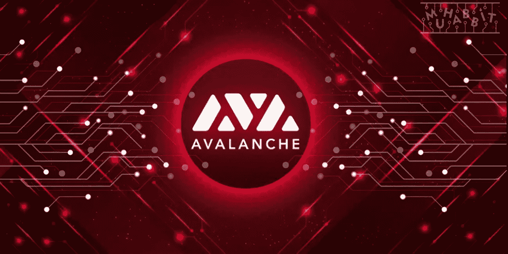

# 2022 年 Avax 能达到 500 美元吗？

> 原文：<https://medium.com/coinmonks/can-avax-reach-500-in-2022-ef6a0b2e0840?source=collection_archive---------23----------------------->

Source photo [avax cryptocurrency — Bing images](https://www.bing.com/images/search?view=detailV2&ccid=FywT24Kz&id=894F5364CFF10EB4F8940ACBF8ADBCA6C8EFAB81&thid=OIP.FywT24KzDODaw17Gu95SDQHaDt&mediaurl=https%3a%2f%2fwww.somagnews.com%2fwp-content%2fuploads%2f2021%2f03%2fAvalanche-AVAX-KuCoin-e1614967884442.jpg&cdnurl=https%3a%2f%2fth.bing.com%2fth%2fid%2fR.172c13db82b30ce0dac35ec6bbde520d%3frik%3dgavvyKa8rfjLCg%26pid%3dImgRaw%26r%3d0%26sres%3d1%26sresct%3d1%26srh%3d651%26srw%3d1300&exph=390&expw=778&q=avax+cryptocurrency&simid=608020460046740330&FORM=IRPRST&ck=31F6C9C8268602063C31985657E9D5F9&selectedIndex=4&ajaxhist=0&ajaxserp=0)

虽然比特币仍然是加密生态系统的超级大国，但其他几个因素加剧了竞争。对于加密投资者来说，加密货币仍然是最有利可图、最受欢迎和最有吸引力的数字资产。以太坊、莱特币等加密货币也对比特币的霸主地位构成了挑战。然而，以太坊是最接近的，因为它是大量 DeFi 协议和倡议的家园…