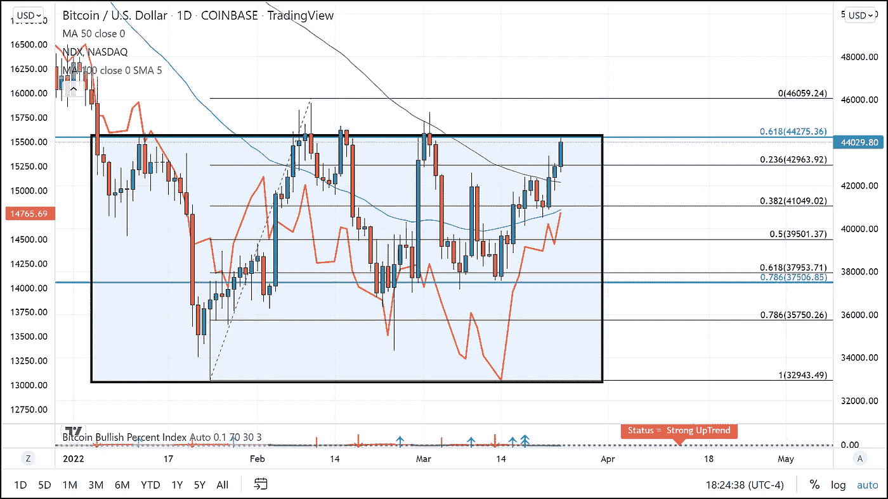
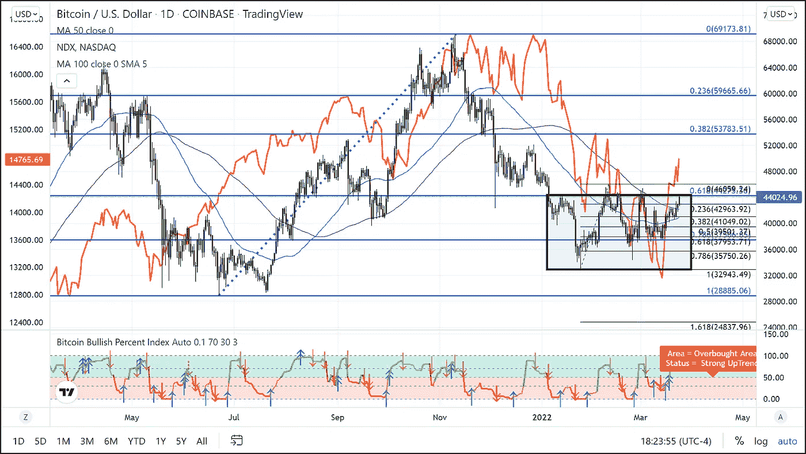
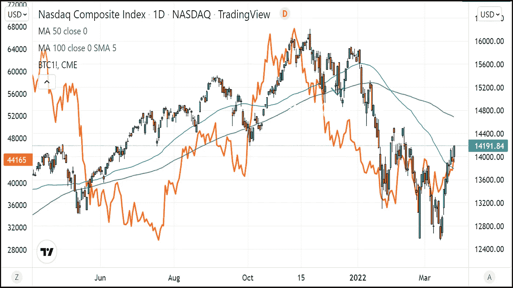

# 比特币最终能否突破区间？

> 原文：<https://medium.com/coinmonks/can-bitcoin-finally-break-out-of-its-range-67f97eb1b29a?source=collection_archive---------76----------------------->

过去 75 天，比特币一直被困在 33，000 美元至 44，500 美元的交易区间内。截至美国东部时间下午 4 点 45 分，比特币的交易价格约为 44，000 美元。大约四个小时前，它触及 44，500 美元左右的关键阻力位，这一区域抑制了过去两次反弹的走势。第三次能成为魅力吗？

我认为，关键是比特币交易到目前为止的情况，以及它与 2 月 10 日和 3 月 2 日两次失败的尝试有何不同。BTC 这次达到 44000 美元的路径是独特的，因为它在两周内沿着一个明确的上升通道上升，而在前两次反弹中，大部分价格上涨都发生在一天内。这种更稳定的价格上涨更可持续，当然也比一天的奇迹更乐观。支持看涨情景的另一个技术方面是，不仅 BTC 从 50 天移动平均线反弹，而且在 2022 年首次从 100 天移动平均线反弹。

价格进一步上涨可能更有说服力的事实是，与前两次不同，这一次纳斯达克交易价格也在上涨。大多数交易员都知道科技股指数和比特币之间的相关性。在比特币两次升至 60，000 美元以上的过程中，正相关性一直很强。

纳斯达克和 BTC 都在 2021 年底创下历史新高，直到最近都在下降。就像这些市场的顶部一样，BTC 先于纳斯达克触顶，BTC 也首先触底。纳斯达克指数最近刚刚从 2 月 24 日和上周 3 月 14 日触及的 12，570 点附近的双底中走出来。这给最近的上涨带来了一个全新的基本面看涨的基调，这是过去两年所没有的。

这是否足以让比特币最终突破其交易区间？只有时间能证明一切，但在最近的这次反弹中，它肯定比之前的上涨更有道理。

对于任何有兴趣阅读我更多文章的人，只需点击这个[链接](https://www.thegoldforecast.com/bitcoin)。

> 加入 Coinmonks [电报频道](https://t.me/coincodecap)和 [Youtube 频道](https://www.youtube.com/c/coinmonks/videos)了解加密交易和投资

# 另外，阅读

*   [NFT 十大市场造币集锦](https://coincodecap.com/nft-marketplaces)
*   [AscendEx Staking](https://coincodecap.com/ascendex-staking)|[Bot Ocean Review](https://coincodecap.com/bot-ocean-review)|[最佳比特币钱包](https://coincodecap.com/bitcoin-wallets-india)
*   [Bitget 回顾](https://coincodecap.com/bitget-review)|[Gemini vs block fi](https://coincodecap.com/gemini-vs-blockfi)|[OKEx 期货交易](https://coincodecap.com/okex-futures-trading)
*   [美国最佳加密交易机器人](https://coincodecap.com/crypto-trading-bots-in-the-us) | [不断回顾](https://coincodecap.com/changelly-review)
*   [在印度利用加密套利赚取被动收入](https://coincodecap.com/crypto-arbitrage-in-india)
*   [霍比评论](https://coincodecap.com/huobi-review) | [OKEx 保证金交易](https://coincodecap.com/okex-margin-trading) | [期货交易](https://coincodecap.com/futures-trading)