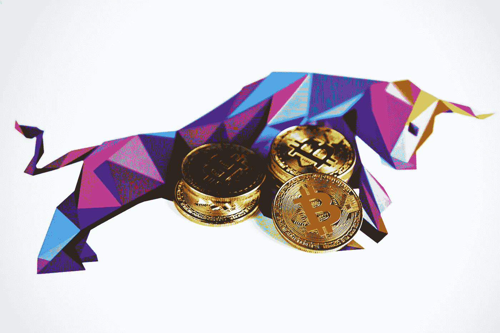

# 未来一年比特币能否达到 10 万美元？

> 原文：<https://medium.com/coinmonks/can-bitcoin-reach-100-000-in-the-next-year-621e9a78e131?source=collection_archive---------39----------------------->

Source photo Unsplash.com

据 Nexo 首席执行官兼联合创始人 Antoni Trenchev 称，一年后，比特币(BTC)的价格可能会升至 10 万美元。著名的比特币价格预测者特伦奇夫(Trenchev)也警告投资者，要预计到短期内的进一步波动。

# 为什么 Nexo 的 CEO 认为比特币可以超过 10 万美元