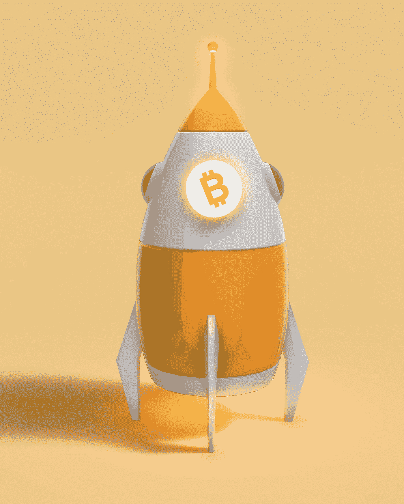

# 未来几年比特币能否达到 250.000 美元？

> 原文：<https://medium.com/coinmonks/can-bitcoin-reach-at-250-000-in-the-next-years-f11157cefc37?source=collection_archive---------51----------------------->

Source photo Unsplash.com

在整个二十世纪，比特币与互联网的发展联系越来越紧密。同样，市场领导者也一直跟随股票市场和黄金价格。BTC 和标准普尔 500 的“90 天相关性”刚刚达到“17 个月高点”。新的投资者和收养者蜂拥而至，发展相关性。