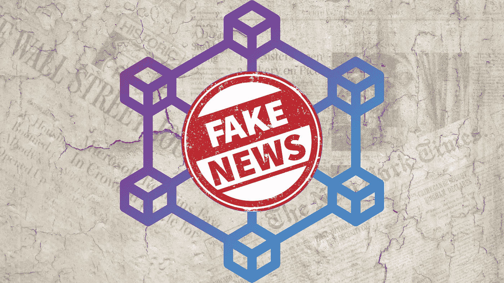

# 区块链能终结‘假新闻’吗？针对媒体的 Web3 提案

> 原文：<https://medium.com/coinmonks/can-blockchain-end-fake-news-a-web3-proposal-for-the-media-960ba557e7e5?source=collection_archive---------3----------------------->

## 这篇论文是我在麻省理工学院斯隆管理学院“区块链技术:商业创新和应用”课程的期末作业。

## 行动纲要