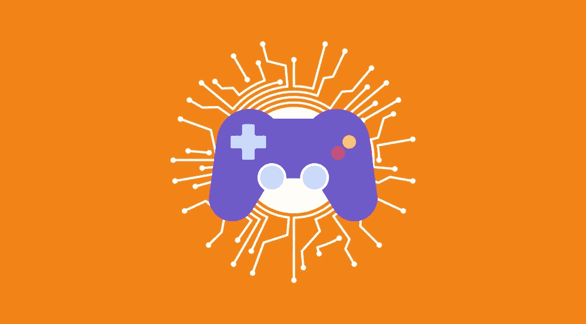

# 区块链游戏能推动加密货币的采用吗？

> 原文：<https://medium.com/coinmonks/can-blockchain-gaming-drive-cryptocurrency-adoption-cdd229b3b17c?source=collection_archive---------68----------------------->

全球约有 25 亿游戏玩家的游戏产业是一个利润丰厚的目标，也是区块链自身的一个巨大应用领域。毫无疑问，比特币和其他加密货币可以极大地推动这项技术成为主流。这并不新鲜，因为在娱乐领域建立加密货币的努力已经取得了很大进展，并取得了不同程度的成功。在新的 [StealthEX](https://stealthex.io/) 文章中阅读更多关于加密货币的采用和区块链游戏的信息。

因此，让我们来看看游戏如何促进[加密货币的采用](https://stealthex.io/blog/2020/07/07/bitcoins-mainstream-adoption/)，以何种方式，以及将区块链科技暴露给世界三分之一人口的用户群是否会在很大程度上帮助推动这一运动的车轮，并最终导致游戏行业本身的结构性转变。

# 一点历史

随着比特币在 2008 年末启动，其第一笔交易于 2009 年 1 月初在区块链进行，或者说实际上开始了，直到这种加密货币涉足在线赌博，已经过了两年多的时间。是现已倒闭的移动扑克平台 Switchpoker，一家在线扑克室的开发商，开始接受比特币作为存款和支付选项。你仍然可以在 Bitcointalk.org 上找到一个关于这条新闻的话题，时间可以追溯到 2011 年 11 月 23 日。

2012 年 4 月，美国企业家埃里克·沃尔希斯(Erik Voorhees)是比特币的早期采用者，他创立了 Satoshi Dice，这可以说是该街区最古老的在线加密赌场，尽管沃尔希斯在一年后卖掉了它，但它今天仍然存在。真正吸引人的是，在最初几年，赌场产生了比特币网络上一半的交易。简而言之，在线赌博在比特币的幼年时期至关重要，因为它有助于促进加密货币的意识，从而导致未来的增长和向其他领域的扩张。

后来，更多的在线赌博网站出现，这些网站开始接受 BTC 和其他加密货币。其中有比特先生，BitStarz，扑克锦标赛点火，红狗等。

一些人肯定会说赌博和游戏不是一回事。普遍接受的观点是，游戏是基于技巧，而赌博纯粹是基于运气。这一点我们不争论。然而，每个扑克玩家都知道，扑克游戏的结果不仅取决于运气，还取决于技巧和专业知识。简单来说就是有很大的灰色地带和重叠。总的来说，如果不对赌博以及它如何帮助比特币的采用给予应有的认可，我们的论述将错过一大块重要的历史。

现在，在线赌博已经不再是我们的话题，我们可以放心地转向游戏业，看看它是如何帮助区块链空间的。据我们所知，比特币在一款大型游戏中的首次使用始于 2014 年 BitQuest 的推出，这是一款《我的世界》服务器，使用比特币进行游戏内交易。在游戏环境中，你可以用所谓的比特(比特币的一小部分)从其他用户那里购买有价值的游戏内物品，并通过完成游戏内任务或挑战(如杀死当地怪物)来获得它们。

BitQuest 在 2019 年夏天关闭了服务器，它的品牌名称现在属于一个与游戏无关的不同实体，但它仍然产生了影响。从本质上来说，这一努力成功地展示了一种加密货币，在这种情况下是比特币，可以用来代替玩家可以赚取、购买和消费以及提取的本地游戏货币。这有两个重要原因。首先，比特币不同于任何其他纯粹的游戏内货币，它可以在游戏及其生态系统之外使用，其次，它的供应不能由游戏开发商操纵，这使得游戏更加公平合理。

不用说，BitQuest 树立的榜样鼓励了其他市场参与者将比特币作为游戏内货币的替代选择。另一个受欢迎的《我的世界》服务器 PlayMC 也在 2015 年将比特币引入其世界，但仅两年后就停止了运营。还有一些其他服务器在试验替代硬币，更具体地说，是 Dogecoin，但他们中的大多数在此后不久就从现场消失了，未能吸引足够多的铁杆《我的世界》粉丝。

# 有什么变化？

随着以太坊、EOS 和 TRON 等支持智能合约的区块链的出现，“区块链游戏”一词有了更直接的含义，因为这些区块链允许完全在链上设计和玩游戏，就像在分散的交易所进行交易一样。虽然 TRON 代表“实时操作系统 Nucleus”，但它显然是指一款曾经流行的街机游戏，该游戏基于一部名为 1982 年的科幻电影，最终获得了狂热的追随者。

CryptoKitties 可能是以太坊生态系统中最受欢迎的游戏，也可能是迄今为止整个加密领域中最受欢迎的游戏。它的测试版本于 2017 年 10 月 19 日推出，并立即获得了成功。截至 2017 年底，超过 20 万人注册了这款游戏，在以太网上花费了超过 2000 万美元。我们不会深究它的“游戏性”，因为这超出了本文的范围，而且无论如何，您肯定非常熟悉它。但我们绝对应该写的是它所产生的影响和反响。

可以说，CryptoKitties 之于区块链以太坊，就像 Satoshi Dice 之于早期密码学中的比特币一样。据报道，在最受欢迎的时候，这款游戏占据了以太坊全部流量的 20-25 %,堵塞了整个以太坊网络，交易费用飙升。难怪许多人对事态的转变感到恼火。然而，尽管所有的愤怒和愤怒，CryptoKitties 充分证明了成功在区块链游戏领域意味着什么，以及它在实践中的外观和感觉。

很难估计加密猫对加密货币的采用有多大贡献。但考虑到仅这款游戏就有几十万人参与，而更多人参与了它衍生的几十款区块链游戏，如以太机器人、被解放的神、六条龙等，无论从哪种定义或标准来看，这一无可争议的胜利无疑都是一项巨大的贡献。此外，它还揭示了当代区块链解决方案的弱点，以及应该如何克服这些弱点。

进化从来不是线性的。事实上，它通常也不会走曲线、圆圈或之字形。它总是沿着非常不同的路线、方向和整个维度移动，像植物和动物、病毒和细菌，还有恐龙和哺乳动物。密码领域的游戏发展也不例外。ryptoKitties 和其他游戏在本质上共享相同的技术——在以太坊等一些高级通用区块链上构建游戏。但这不是加密游戏发展的唯一领域，也不是将游戏引入加密货币的唯一方式，反之亦然。

最近的一种方法是基于设计一种独立的加密货币或智能合约支持的区块链上的令牌，以便在许多支持它作为游戏内货币的游戏中使用。因此，游戏玩家可以真正拥有他们的游戏内资产(所谓的不可替换令牌，或 NFT)，游戏外的安全物品交易，以及跨游戏兼容性。金恩、游戏信用、分散土地等项目已经走上了这条道路，它们各自的加密货币推动了一系列游戏的发展。

Funfair 和 Lucid Sight 走了一条有些不同的道路，它们提供了可以构建区块链游戏的平台。因此，Lucid Sight 的稀缺引擎更专注于游戏创作者，而不是最终用户，也就是说，游戏玩家，允许开发者将区块链集成到他们的游戏中。它旨在消除区块链游戏和传统游戏平台之间的差异。另一方面，Funfair 更倾向于创建定制的区块链赌场，将其 FUN token 作为赌场的“筹码”。别再赌博了，哈。

如果我们不提及另一次利用《我的世界》向游戏公众介绍加密货币的尝试，我们对事件的描述将是不完整的。这一次，一个名为 SatoshiQuest 的新《我的世界》模式出现了。为了参与其中，游戏玩家需要支付 1 美元的比特币，并获得一次游戏生命。汇集的硬币构成了战利品，挑战在于找到最少 400 个密钥片段，将包含奖品的比特币钱包的密钥分成这些密钥片段。谁说进化不会循环？

# 挑战和未来前景

ryptoKitties 的惊人人气清楚地表明了区块链游戏可能引发的加密货币大规模采用的规模。正如游戏开发商自己所说，他们的“目标是推动主流采用区块链技术”。他们认为“这项技术对消费者有巨大的好处，但要实现这些好处，需要体验才能理解”。更广泛地说，随着越来越多的人开始使用加密货币进行游戏，他们最终可能会对使用他们的硬币进行游戏以外的用途感兴趣。

话虽如此，但现在很明显，在实现这一目标的道路上有两个主要障碍。第一个是区块链科技本身的局限性，它本质上将区块链游戏限制在非功能性桌面游戏、游戏内货币、简化支付和类似的东西上。无论如何，这主要是一个技术挑战，我们可以现实地期待它迟早会被解决。另一个问题适用于整个博彩业。除了技术问题，大多数人只会玩真正吸引人和身临其境的游戏。

因此，底线是，我们需要这两个向量的融合，使区块链成为游戏行业的主导力量。首先，区块链理工大学应该有能力运行大型视频游戏开发商如暴雪、Valve 和育碧生产的多人游戏，这里没有权衡。然后，我们实际上需要像《魔兽争霸》、《反恐精英》或《孤岛惊魂》这样可以在区块链上玩的游戏，让它变得有意义。只有在我们实现这一目标后，游戏行业才有可能成为加密货币采用背后的主要驱动力。

你对游戏如何促进加密货币的采用有什么看法？请在下面的评论中告诉我们你的想法。

记住:如果你需要兑换你的硬币，x 就在这里。我们提供 400 多种硬币供选择，并不断更新列表，以便我们的客户找到合适的选择。我们的服务不需要注册，并允许您保持匿名。你为什么不去看看？只需进入[stealth x](https://stealthex.io/)并遵循这些简单的步骤:

1.  选择兑换的货币对和金额。例如 BTC 联邦理工学院。
2.  按下“开始交换”按钮。
3.  提供硬币将被转移到的收件人地址。
4.  移动你的加密货币进行交易。
5.  接受你的联邦理工学院硬币！

确保在[媒体](https://stealthex-io.medium.com/)、[推特](https://twitter.com/Stealthex_io)、[电报](https://t.me/StealthEX)、 [YouTube](https://www.youtube.com/channel/UCeES_XBesX76ge7xf1meuSw) 和 [Reddit](https://www.reddit.com/user/Stealthex_io) 上关注我们，获取 [StealthEX.io](https://stealthex.io/) 更新和关于加密世界的最新消息。如果你需要帮助，请发邮件至 support@stealthex.io。

*此处表达的观点和意见仅代表作者个人。请确保在投资前研究任何加密货币并评估风险。*

*原载于 2022 年 5 月 24 日*[*https://stealthex . io*](https://stealthex.io/blog/2020/09/22/can-blockchain-gaming-drive-cryptocurrency-adoption/)*。*

> 加入 Coinmonks [电报频道](https://t.me/coincodecap)和 [Youtube 频道](https://www.youtube.com/c/coinmonks/videos)了解加密交易和投资

# 另外，阅读

*   [Bookmap 评论](https://coincodecap.com/bookmap-review-2021-best-trading-software) | [美国 5 大最佳加密交易所](https://coincodecap.com/crypto-exchange-usa)
*   最佳加密[硬件钱包](/coinmonks/hardware-wallets-dfa1211730c6) | [Bitbns 评论](/coinmonks/bitbns-review-38256a07e161)
*   [新加坡十大最佳加密交易所](https://coincodecap.com/crypto-exchange-in-singapore) | [购买 AXS](https://coincodecap.com/buy-axs-token)
*   [红狗赌场评论](https://coincodecap.com/red-dog-casino-review) | [Swyftx 评论](https://coincodecap.com/swyftx-review) | [CoinGate 评论](https://coincodecap.com/coingate-review)
*   [投资印度的最佳密码](https://coincodecap.com/best-crypto-to-invest-in-india-in-2021)|[WazirX P2P](https://coincodecap.com/wazirx-p2p)|[Hi Dollar Review](https://coincodecap.com/hi-dollar-review)