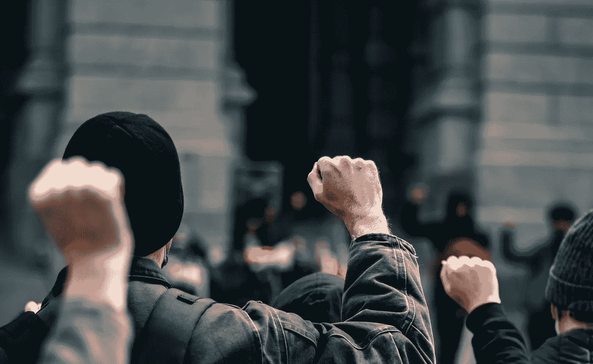

# 加密货币能成为未来的货币吗？它的批评者说不。

> 原文：<https://medium.com/coinmonks/can-cryptocurrency-be-the-currency-of-the-future-its-detractors-say-no-93857ae60073?source=collection_archive---------34----------------------->

“比特币是反抗的货币。”金融分析师兼广播员马克斯·凯瑟如是说。这无疑是一种有趣的看待事物的方式。但他是对的吗？比特币，以及更广泛的加密货币，是我们有过的最公平、最透明的货币吗？还是说这只不过是一个巨大的庞氏骗局？

首先，让我们看看一些专家对加密货币的利弊有何看法。通过这种方式，你可以自己决定加密货币是否会成为未来的货币，尽管一些批评者声称。

# **加密货币是世界上最大的骗局吗？**

获奖作家兼纪录片导演[杰瑞德·a·布洛克](/@jaredabrock/hi-im-jared-24a4129c6170)当然这么认为。在他为 Medium 撰写的一篇思考文章中，布洛克谴责了公众对比特币的迷恋。他指出比特币:

*   没有内在价值。
*   没有任何有价值的贡献。
*   没有任何值支持。

嗯，听起来他看不到比特币的价值！更重要的是，布洛克急于将比特币比作复杂的庞氏骗局。他对此的主要主张是。从你持有的比特币中获利的唯一方法是以高于你支付的价格出售给其他人。坚持住。这听起来像是投资的全部历史。我不确定整个世界经济体系是一个庞氏骗局。此外，这是一个建立在贸易基础上的体系。当然，投机也是这个系统的一部分，但这不一定是件坏事。

# **我来解释一下。**

货币作为一个概念，演变为代表可交易商品和服务的价值。我做鞋子。比尔有奶牛。英格丽德烤面包。我想买一头奶牛和一些面包。那要花我多少钱？可能一双鞋(或者更少！)换一条面包。但是一头牛呢？那可能值很多鞋子。人类发明了货币来代表鞋子、奶牛和面包之间的对比价值。因此，货币是鞋子、奶牛和面包的替代品。这不是它所代表的实际事物。

世界上最早的货币形式之一(今天仍以某种形式使用)是贝壳。交易贝壳很快让位于交易硬币。在此之前，我们都是在 21 世纪谈论交易数字(即非实物)货币。回到我之前的观点，买卖比特币仍然是一种交易形式。有些人可能认为比特币是真正有价值的东西。但这是错误的。这就是比特币和一般加密技术的价值所在。加密货币象征着一种革命性的技术形式，称为区块链，它将让我们人类像过去一样自由地购买、出售和交易:以点对点的方式，不受第三方干预。有些人会猜测这是一件好事，这是人之常情。他们将会看到它在未来到处流行。这些投机者会在早期买入提供这种自由的货币，或对大银行的阻力，当他们的信心水平相应上升时，他们会将其出售给其他人。这不是一个庞氏骗局，因为没有一个核心人物引入新的投资者，并用他们的现金偿还早期投资者。没有人控制整个盒子和骰子。加密货币使货币的获取变得大众化。这在现代世界是前所未有的，因为我们的钱是在世界主要金融机构的赞助下。

# **密码的价值**

保守派政治评论家兼律师本·夏皮罗在一系列问题上毫不犹豫地提出自己的观点。从[与名人的推特战争](https://www.youtube.com/watch?v=FkevH42sEl4&t=88s)到他的病毒式“对 TikToks 系列的反应”，再到他对乌克兰目前发生的事情的解释，夏皮罗当然知道如何在他的内容上吸引眼球。所以，他最近加入比特币的话题也就不足为奇了。他最近的视频[比特币:金融的未来还是傻瓜的黄金？已经积累了超过 160 万的浏览量。似乎只要本有话要说，人们都会听。但是他说的值得听吗？](https://www.youtube.com/watch?v=2pR2gfogsk4&t=313s)

在简要解释了货币的历史后，夏皮罗开始对比特币作为一种基本上不受大银行和大政府控制的货币系统的价值提出一系列关键主张。这里的要点是，由于所有的世界货币失去了黄金支持的标准，政府可以自由地简单地印更多的钱来消除他们的债务，任意决定他们美元的价值。另一方面，比特币根据用户的决定增值。如果足够多的人相信比特币作为一种可行的货币具有实际价值，那么它的隐含价值将会增加。如果他们不这样做，那么它的价值就会降低。我们已经看到比特币[最近大幅贬值。这与](https://www.fxstreet.com/cryptocurrencies/news/bitcoin-dumps-to-hit-six-month-lows-near-38k-202201210624)[美国政府针对比特币采取严厉监管措施](https://www.investopedia.com/biden-preparing-executive-order-on-cryptocurrencies-5216814)有很大关系。俗话说，如果你想要城里最高的摩天大楼，你可以自己建，也可以把别人的都拆了。看起来美国政府希望它的美元成为镇上唯一的摩天大楼。

# **最终想法**

过去，比特币的价格一直较低。低了很多。事实上，在 2010 年 5 月 22 日，一名比特币用户支付了惊人的 10，000 BTC 购买了两个披萨，这在今天被认为是现实世界产品的第一笔比特币交易。交易额相当于今天的 4 亿美元！也就是说，比特币作为区块链的原始货币，将会升值。前提是有足够多的人决定摆脱法币支持的世界货币体系，该体系一直因通胀而贬值。但是，对许多人来说，离开他们从小到大一直信任的系统是一个巨大的呼吁。

我会让你决定什么对你的未来是正确的。

 [## 你准备好迎接加密经济了吗？加密派

### 每次你打开新闻，阅读报纸，或者浏览你的推特，你很可能会看到一些故事…

www.thecryptopie.com](https://www.thecryptopie.com/) 

> *加入 Coinmonks* [*电报频道*](https://t.me/coincodecap) *和* [*Youtube 频道*](https://www.youtube.com/c/coinmonks/videos) *了解加密交易和投资*

# 也阅读

[https://medium.com/coinmonks/leveraged-token-3f5257808b22](/coinmonks/leveraged-token-3f5257808b22)

[https://coincodecap.com/crypto-exchange](https://coincodecap.com/crypto-exchange)

[https://coincodecap.com/best-swap-platforms](https://coincodecap.com/best-swap-platforms)

[https://coincodecap.com/best-online-casinos](https://coincodecap.com/best-online-casinos)

[https://medium . com/coin monks/top-5-crypto-lending-platforms-in-2020-that-you-need-to-know-a 1b 675 CEC 3 fa](/coinmonks/top-5-crypto-lending-platforms-in-2020-that-you-need-to-know-a1b675cec3fa)

[https://medium . com/coin monks/the-best-cryptocurrency-hardware-wallets-of-2020-e28 B1 c 124069](/coinmonks/the-best-cryptocurrency-hardware-wallets-of-2020-e28b1c124069)