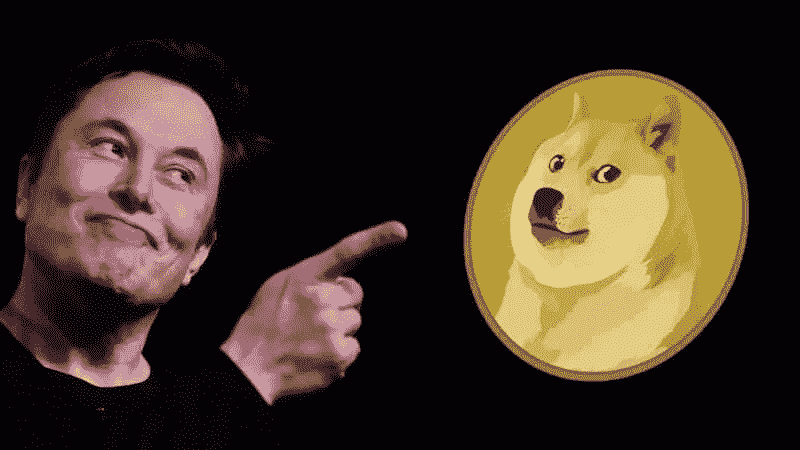

# Dogecoin (DOGE)今年能达到 1 美元吗？

> 原文：<https://medium.com/coinmonks/can-dogecoin-doge-reach-1-this-year-50e9ae845e96?source=collection_archive---------3----------------------->

Dogecoin (DOGE)，原创的“meme”(*通过模仿网络流行语和行为*创作的照片或视频)，可能会超过去年 5 月创下的 **$0.74** 的纪录，超过 **$1** 。

Can Dogecoin (DOGE) reach $1 this year?

Dogecoin (DOGE，**市值第 12th】)是一种以**柴犬**为吉祥物的硬币，截止到 11 日**下午 4:40**(韩国时间)，其硬币市值为**0.1446**美元。DOGE 在过去七天下跌了 16%…**