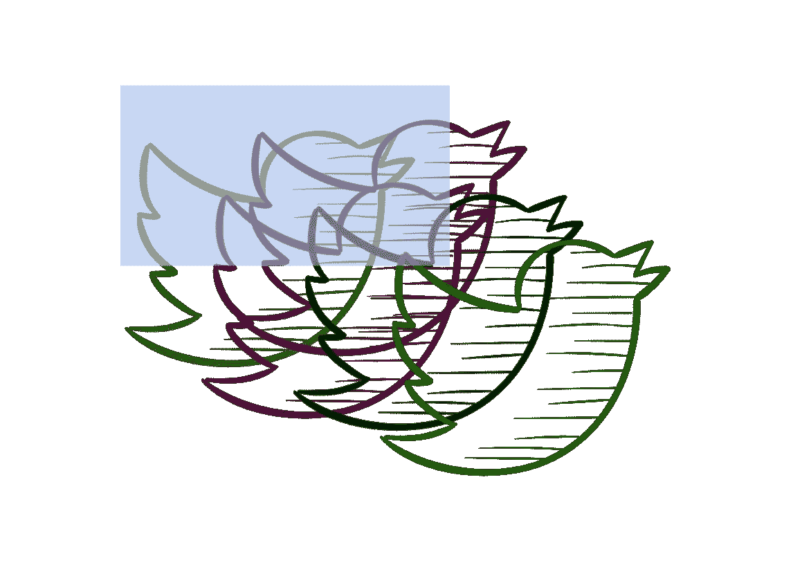

# 埃隆能让一个去中心化的 Twitter 运转起来吗？

> 原文：<https://medium.com/coinmonks/can-elon-make-a-decentralized-twitter-work-e766f816e77?source=collection_archive---------21----------------------->

source: flaticon with edits.

## 具有全球意义的第一刀？

并不是说我不想写埃隆对 Twitter 的敌意收购。我是那种带着兴奋和喜悦阅读《门口的野蛮人》的人，现在发生的金融和法律机制令人激动。除此之外，是的，Twitter 的管理层实际上已经决定使用毒丸计划(向市场注入新股或允许现有股东折价购买)，这是一种法律策略，最初设计于 20 世纪 80 年代，正是因为有趣而可怕的野蛮人交易，如《门口的野蛮人》中的交易，是当时的一种时尚。

但也有人写过这个话题。在未来的日子里，他们会一次又一次地这样做。另一个有趣的、在金融界非常奇怪和新颖的想法是，埃隆这样做并不是为了经济利益，他说 Twitter [应该是](https://www.nytimes.com/2022/04/15/business/dealbook/twitter-poison-pill-elon-musk.html)“*可信和广泛包容的，*”以及 Twitter 算法“*应该公开供用户审计时，他是认真的。*

问题是，就盈利和用户增长而言，你不能用 Twitter 做那么多。其他人也试过。杰克·多西是埃隆的朋友和支持者，在多年的努力后，他选择了退出。在许多方面，我觉得多尔西和 Ev Williams 对我们的星球来说绝对是伟大的，为喜欢思考的人创造了平台。但是，你不能像对待一个令人向往的图片(例如 Instagram)一样，将一个想法货币化。

2016 年，我为福布斯写了一篇[文章，认为 Twitter 应该成为一项公益事业:](https://www.forbes.com/sites/currentaccounts/2016/07/18/twitter-should-charge-membership-fee/)

> 据报道，2015 年底，Twitter 的月活跃用户达到了 3.2 亿，从用户增长的角度来看，Twitter 可能已经到了拐点。如果所有受过教育的富裕用户都已经在 Twitter 上了，那会怎么样？[……]如果 Twitter 能够成为一种公益——一种由用户群资助的交流媒介，会怎么样？

2019 年，Twitter 在 Q1 的月活跃用户为 3.3 亿，之后该公司停止了对他们的报告。2021 年第四季度，Twitter 的每日活跃用户数为 2.17 亿。

当时，我和著名风险投资家、Twitter 的首批投资者之一弗雷德·威尔逊(Fred Wilson)交换了电子邮件，向他询问我这个伟大的想法。他不喜欢。一点也不。他认为广告收入和用户增长仍然是 Twitter 的最佳发展方向。

嗯，看来他改变了主意:

其他人认为权力下放是个好主意。这是最大的可编程区块链之一 Cardano 的创始人 Charles Hoskinson:

我们很容易忽略这一点，除非我们了解埃隆，那就是他不在乎钱(他睡在办公室或他朋友的豪宅里，他 T2 看不起财产，他喜欢工程挑战)。创建一个去中心化的 Twitter——某种形式的去中心化自治组织(DAO)运行在一个可编程的区块链上，由用户拥有的令牌提供动力——就其本身而言是一个工程挑战；也许不是一个火箭和电池的挑战，但仍然是一个问题的宇宙，将受益于工程问题的解决。

我发现这一点很有趣的另一个原因是[我们最近](/thatmeaning/why-the-detachment-of-defi-from-real-economy-limits-token-values-to-zero-fc95857d8be5)谈到了这样一个想法，即所有可编程区块链、代币和基于它们构建的去中心化应用(dapp)的估值可能会长期为零，因为它们脱离了经济现实，即它们不(也不能)代表真实的现金流和资产。

事情是这样的:如果我们接受可编程区块链本质上是分散网络化企业的新管道，它们就像 TCP/IP 对于 web2 一样，那么为它们提供动力的令牌的价值(在某种意义上，区块链是一个分散的数据库，必须通过某种形式的共识机制来维护，令牌是对矿工提供处理能力、能量等的激励。维持这种共识)等于矿工的计算资源成本。换句话说，不会有利润。令牌将由用户持有，直到他们需要使用去中心化的 Twitter 他们不会积累它们，因为分散系统没有摩擦，传输效率更高，这意味着任何人都可以及时买到它们。

我的文章基于 2017 年 John pfe ffer 的一篇[高被引论文:](/john-pfeffer/an-institutional-investors-take-on-cryptoassets-690421158904)

> 分散的协议挑战者对传统网络业务的破坏，将意味着对用户的巨大效用转移和对市场价值的巨大破坏。对用户、经济和社会都有好处；对投资者不利。

这对 Twitter 用户来说是个好结果。但还可以更好。自然，作者当时不可能考虑到，在后 Covid 时代，人们可以为区块链唱片支付数百万美元，即作为社会地位象征的代币(NFTs)。

Twitter 上最值钱的商品是什么？注意。早在 Twitter 宣布允许用户通过直接连接钱包来炫耀他们的 NFT 之前，用户就已经在他们的个人资料图片中放上了他们无聊的猿类图片。你可以看到 Twitter 如何成为某种 NFT 市场，在用户之间分配利润。当然，你只能将 NFT 作为个人资料图片向用户出售一次，但还有其他广阔的可能性:表情符号、字体、声音、meme、视频 NFT。此外，在去中心化的 Twitter 上，所有权可能变得非常真实，即不再有 ctrl c、ctrl v。

所以，当然，好吧。但是，去中心化的 Twitter(以人类控制之外的数字组织的形式)难道不会容易被钓鱼、骚扰和服务上的机器人账户的扩散吗？

弗雷德·威尔森也有[博客](https://avc.com/)。非常好的一个。几十年来。在他最后的一篇文章中，他深入探讨了去中心化 Twitter 的主题。最初，Twitter 有非常免费的 API 模型，任何人都可以构建第三方客户端。人们从无人控制的不同界面使用 Twitter，因此出现了很多坏人。现在，为了内容适度，仇恨言论控制等。，Twitter 已经变得完全集中化，所有内容都由 8K+员工控制。一个分散的 Twitter 可以作为一个全球公共广场，各种其他 dapp 可以连接到这个广场，这些 dapp 的用户和创建者在维护 Twitter 方面有共同的利益，因为他们也是它的令牌的所有者。事实上，你可以想象 NFT 社会地位的象征是如何被不良用户夺走的。

> 加入 Coinmonks [电报频道](https://t.me/coincodecap)和 [Youtube 频道](https://www.youtube.com/c/coinmonks/videos)了解加密交易和投资

# 另外，阅读

*   [OKEx vs KuCoin](https://coincodecap.com/okex-kucoin) | [摄氏替代品](https://coincodecap.com/celsius-alternatives) | [如何购买 VeChain](https://coincodecap.com/buy-vechain)
*   [币安期货交易](https://coincodecap.com/binance-futures-trading)|[3 commas vs Mudrex vs eToro](https://coincodecap.com/mudrex-3commas-etoro)
*   [在印度利用加密套利赚取被动收入](https://coincodecap.com/crypto-arbitrage-in-india)
*   [德国最佳加密交易所](https://coincodecap.com/crypto-exchanges-in-germany) | [WazirX P2P](https://coincodecap.com/wazirx-p2p)
*   [如何购买 Monero](https://coincodecap.com/buy-monero) | [IDEX 评论](https://coincodecap.com/idex-review) | [BitKan 交易机器人](https://coincodecap.com/bitkan-trading-bot)