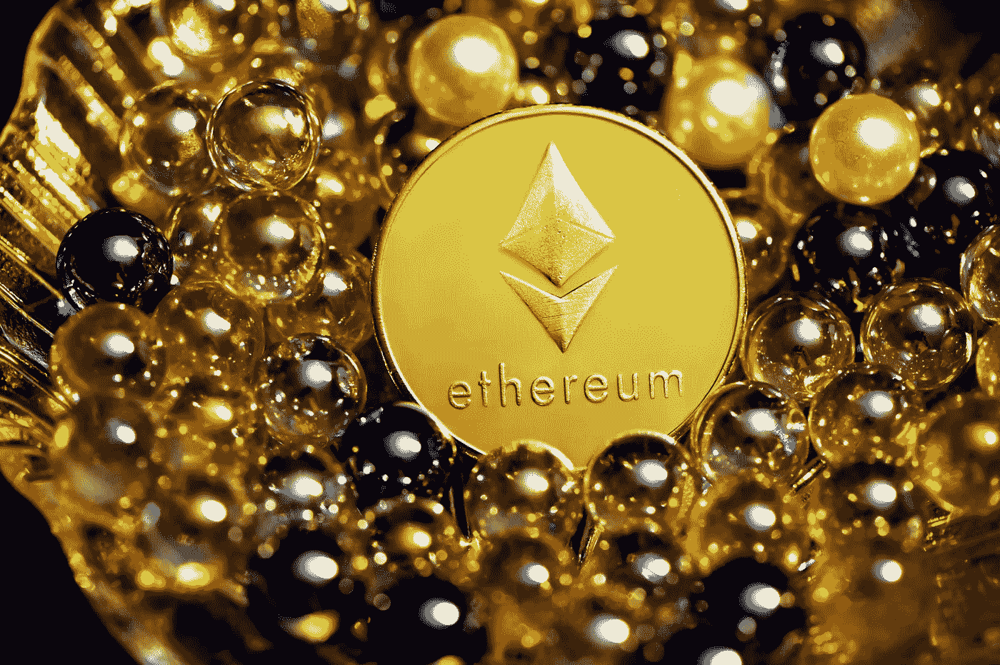

# 以太坊能打到 100k 吗？

> 原文：<https://medium.com/coinmonks/can-ethereum-hit-100k-107f60061705?source=collection_archive---------4----------------------->

虽然一些人认为以太坊的价格将在 10 年内超过 10 万美元，但其他人指出，如果以太坊能够达到至少 5000 至 7000 美元，他们会很高兴。牛市中的好机会。10 年 10 万美元似乎是可能的。

仅次于比特币的第二大加密货币以太坊(Ethereum)在最近几个月飙升。现在，一个专家小组预测，到 2025 年，以太坊将飙升至近 20，000 美元，比目前的价格上涨 400%，以太坊网络的“重大升级”可能会推高价格。

以太坊与比特币、莱特币甚至 Ripple 等其他加密货币有着天壤之别。以太坊是智能合约的区块链协议，以太也称为 ETH，是为以太坊区块链提供动力的本地加密货币。

以太坊在它所谓的以太坊虚拟机上运行智能合约，以太坊虚拟机实际上是一台建立在区块链上的超级计算机。由于其独特的结构，并且是同类产品中的第一个，以太坊的价格预测可能会非常高，因此许多投资者和行业专家相信以太坊的长期增长。

以太坊作为一个网络的预计增长也很高，因为区块链不仅用于智能合同和交易，而且实际的加密资产通常建立在以太坊的区块链上，这给了它附加值，因为围绕加密市场未来的猜测是积极的。

# **结论**

以太坊是一个好的投资吗？它值多少钱？

不可否认，以太坊是一项非常特殊的技术，随着越来越多的技术建立在智能合约协议之上，它可能会彻底改变世界。因此，专家和分析师都预计以太坊的预计增长将达到极高水平。目前的交易价格约为 2000 美元，略低于 2021 年创下的新高。

> 加入 Coinmonks [电报频道](https://t.me/coincodecap)和 [Youtube 频道](https://www.youtube.com/c/coinmonks/videos)了解加密交易和投资

# 另外，阅读

*   [Bookmap 评论](https://coincodecap.com/bookmap-review-2021-best-trading-software) | [美国 5 大最佳加密交易所](https://coincodecap.com/crypto-exchange-usa)
*   最佳加密[硬件钱包](/coinmonks/hardware-wallets-dfa1211730c6) | [Bitbns 评论](/coinmonks/bitbns-review-38256a07e161)
*   [新加坡十大最佳加密交易所](https://coincodecap.com/crypto-exchange-in-singapore) | [购买 AXS](https://coincodecap.com/buy-axs-token)
*   [红狗赌场评论](https://coincodecap.com/red-dog-casino-review) | [Swyftx 评论](https://coincodecap.com/swyftx-review) | [造币厂评论](https://coincodecap.com/coingate-review)
*   [投资印度的最佳密码](https://coincodecap.com/best-crypto-to-invest-in-india-in-2021)|[WazirX P2P](https://coincodecap.com/wazirx-p2p)|[Hi Dollar Review](https://coincodecap.com/hi-dollar-review)
*   [加拿大最佳加密交易机器人](https://coincodecap.com/5-best-crypto-trading-bots-in-canada) | [库币评论](https://coincodecap.com/kucoin-review)