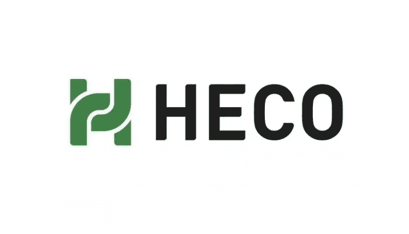
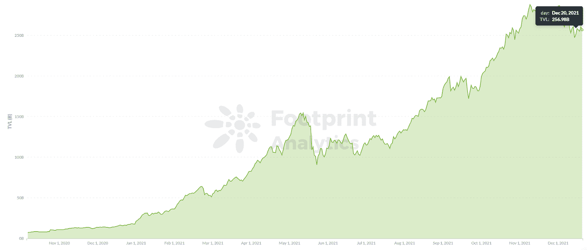
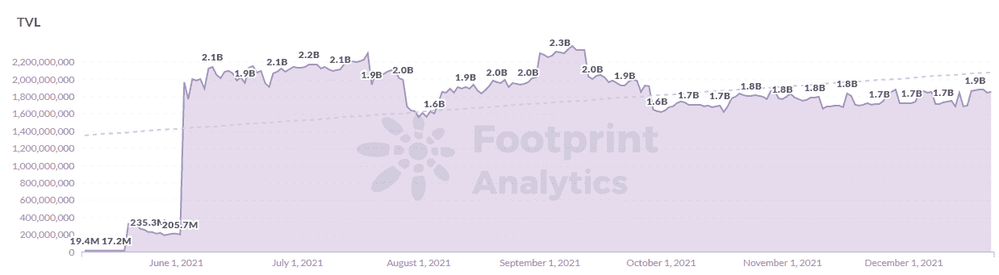
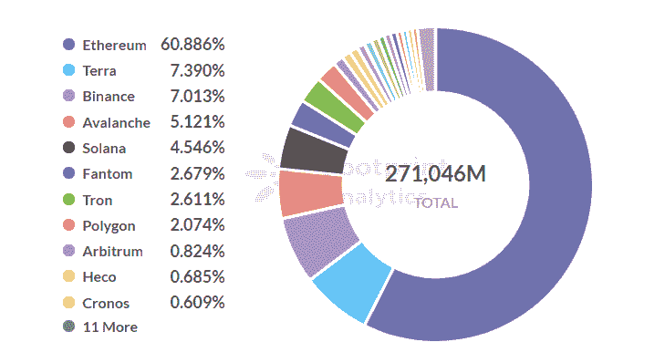
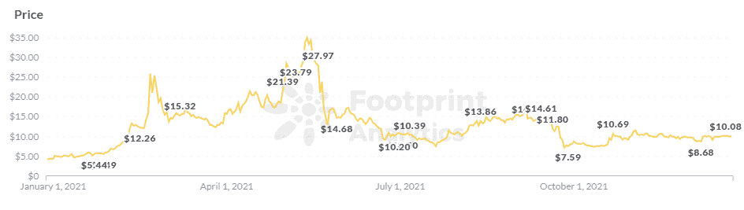
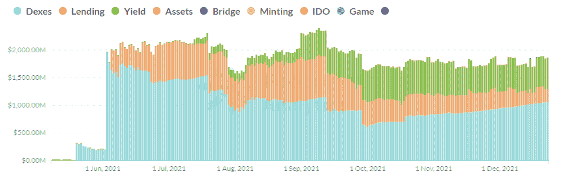
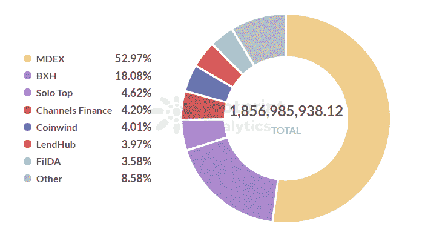
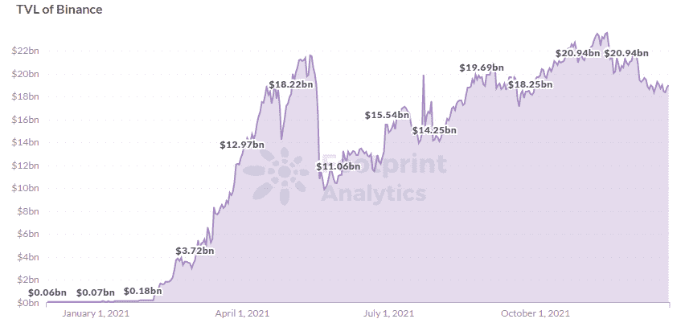

# HECO 能东山再起吗？

> 原文：<https://medium.com/coinmonks/can-heco-make-a-comeback-70705645df45?source=collection_archive---------12----------------------->

在 crypto 的淘金热氛围中，人们很容易忘记失败者，HECO 看起来会加入这个行列。火币的分散链，生态系统已经远远落后于币安智能链，这是高度相似的，在 TVL 和一些项目。

然而，HECO 并没有不战而降，最近推出了它的建筑大师计划来吸引有才华的开发人员。

虽然 HECO 的前景并不乐观，但这个有几个合法好处的连锁店能东山再起吗？

*Footprint Analytics：* [*DeFi TVL*](https://www.footprint.network/guest/chart/de-fi-total-tvl-fp-8075e996-b94a-4a20-a637-61819844bee0?channel=u-DBc983)

## **什么是 HECO？**

HECO 被称为 Huobi 生态链，于 2020 年 12 月 21 日上线。其特点是:

*   EVM 兼容性，开发人员的迁移成本更低，用户体验相似。
*   TPS 高达 500，这意味着比以太坊更低的燃气费。
*   HT 代币作为原生代币，用于支付燃气费。
*   HECO 使用 HPoS 共识机制，其中每个验证者节点需要下注 HT 以获得奖励，并且由于节点的奖励也是 HT，所以这是提高 HT 令牌价格的一个好方法。当前的节点数是 21。

## **HECO 生态系统状况**

## **增长速度缓慢**

根据 [Footprint Analytics](https://footprint.cool/6yOK) ，截至 12 月 23 日，HECO 的整体 TVL 为 18.6 亿美元，仅占所有连锁店的 0.68%，排名第 14 位。

*Footprint Analytics：* [*Heco TVL*](https://www.footprint.network/guest/chart/tvl-by-chain-fp-344e4348-2810-4ee5-a894-68419fa161f4?channel=u-DBc983)

*Footprint Analytics：* [*TVL Share by Chains*](https://www.footprint.network/guest/chart/tvl-of-chains-chain-temp-fp-7e024206-eaa9-45c9-a1fd-61f4b6741f88?channel=u-DBc983)

在 verifier node 战役之后，HT 价格从 35 美元的高点，在 519 事件之后跌到了不到 10 美元，之后一直相对平静。

*Footprint Analytics：* [*Price of HT*](https://www.footprint.network/guest/chart/price-of-chains-chains-temp-fp-8f0ad8a2-aa9d-428e-9c26-baaf3d178e99?channel=u-DBc983)

## **缺乏多样性**

HECO 主要有 DEX、lending、yield 项目；从其 TVL 的构成可以看出，DEX 为 57%，收益率为 30%，lending 为 13%。

*Footprint Analytics： Heco TVL by Category*

就项目而言，发展行动计划的总数为 33 个。MDEX 占 HECO TVL 的 53%，为 9.8 亿美元；BXH，一个收益聚合器项目，有 3.3 亿美元 TVL，占 18%。

*Footprint Analytics：Heco TVL by Project*

[BSC(币安智能链)](https://www.footprint.network/guest/dashboard/binance-dashboard-fp-01e51da5-394d-4f63-a89b-f16375a8d62f?date=2020-12-01~)同样依靠集中交易所，几乎与 HECO 同时起步，TVL 190 亿美元，原生 token(BNB)527 美元，dapp 232 个。

*Footprint Analytics： BSC TVL*

## **Heco 的历史**

由 Huobi Exchange 开发的 HECO 制定了一系列激励措施和计划来促进生态系统的增长。

*   2020 年 12 月 21 日，Huobi DeFi Labs 宣布成立一只 2 亿美元的生态基金，将专注于投资 DEX、lending、oracle、cross-chain、stablecoin 等领域的优质项目。
*   2020 年 12 月 25 日，HECO 开放了链上 dapp“我们创造未来”活动的报名通道，为表现良好的 dapp 提供多项福利，包括推荐给火币全球代币上市审核团队和 HECO 生态基金。
*   2021 年 5 月 7 日，发起了验证者节点运动，以进一步增加社区治理权利的分散化。
*   2021 年 8 月 18 日，HECO 推出了 100 万美元的开发者激励计划，鼓励开发者在其平台上创建和推广项目。

然而，HECO 之前遇到了一些挫折。

*   哈希桥 Oracle (HBO)错误

Hash Bridge Oracle 团队在计划的 HBO/USDT 矿业联营合同之外，错误地将 HBO 令牌添加到 HBO/USDT LP 联营。这个错误导致 HBO 崩溃，并给 LP 投资者带来了巨大的非永久性损失。HBO 的价格在一周内直接从近 100 美元降到了 2 美元。

*   图书金融(Book)偷偷增加代币

BOOK 的耕作机制要求用户购买 BOOK 和其他硬币来提供流动性，这有效地提高了 BOOK 的价格，吸引用户存款。图书财务团队偷偷增加图书数量，挖矿后出售代币。一周之内，书价从 30 美元跌至 0.1 美元。

*   阿凡达(AVAT)骗局

Avatar 团队未能启动其项目，并将代码错误的问题转移给了审计员。社区用户在白皮书中发现，其创始人的头像来自互联网，是一个房产中介的头像。

## 为什么 HECO 上的项目经常出错？

作为一个早期的生态系统，HECO 寻求快速增长，但未能对项目进行适当的控制和审计。与此同时，用户被高利率的承诺所诱惑。

## **最新生态系统激励:HECO 建筑大师**

在 12 月 2 日的新闻稿中，HECO 宣布启动第一阶段的 Master Builders 活动，从安全审计、项目创新、产品成熟度、数据增长、社区和品牌声誉等方面挑选优质项目，并为获奖项目提供丰厚奖励。目标是促进 DeFi、 [GameFi](https://www.footprint.network/guest/dashboard/game-fi-overview-fp-c358ff97-6bf6-491c-b9fd-645fb8262e3f?channel=u-DBc983) 和[元宇宙](https://www.footprint.network/article/the-past-present-and-future-of-metaverse-fp-61a0809f-83d27c00-17d7f5cc)项目的增长。

## **结论**

HECO 链为其交易生态系统创造了更多的可能性，在技术架构和生态规划上与 BSC 高度相似。然而，这两个链在 TVL 和生态系统发展方面有很大不同。在中国严厉打击密码交易所的背景下，主要专注于中国市场的 HECO 的未来依然不容乐观。

> 加入 Coinmonks [电报频道](https://t.me/coincodecap)和 [Youtube 频道](https://www.youtube.com/c/coinmonks/videos)了解加密交易和投资

## 另外，阅读

*   [币安期货交易](https://blog.coincodecap.com/binance-futures-trading)|[3 commas vs Mudrex vs eToro](https://blog.coincodecap.com/mudrex-3commas-etoro)
*   [如何购买 Monero](https://blog.coincodecap.com/buy-monero) | [IDEX 评论](https://blog.coincodecap.com/idex-review) | [BitKan 交易机器人](https://blog.coincodecap.com/bitkan-trading-bot)
*   [CoinDCX 评论](/coinmonks/coindcx-review-8444db3621a2) | [加密保证金交易交易所](https://blog.coincodecap.com/crypto-margin-trading-exchanges)
*   [Bookmap 评论](https://blog.coincodecap.com/bookmap-review-2021-best-trading-software) | [美国 5 大最佳加密交易所](https://blog.coincodecap.com/crypto-exchange-usa)
*   [如何在 FTX 交易所交易期货](https://blog.coincodecap.com/ftx-futures-trading) | [OKEx vs 币安](https://blog.coincodecap.com/okex-vs-binance)
*   [CoinLoan 评论](https://blog.coincodecap.com/coinloan-review) | [YouHodler 评论](/coinmonks/youhodler-4-easy-ways-to-make-money-98969b9689f2) | [BlockFi 评论](https://blog.coincodecap.com/blockfi-review)
*   [XT.COM 评论](https://blog.coincodecap.com/profittradingapp-for-binance) | [币安评论](https://blog.coincodecap.com/xt-com-review)
*   [SmithBot 评论](https://blog.coincodecap.com/smithbot-review) | [4 款最佳免费开源交易机器人](https://blog.coincodecap.com/free-open-source-trading-bots)
*   [比特币基地僵尸程序](/coinmonks/coinbase-bots-ac6359e897f3) | [AscendEX 审查](/coinmonks/ascendex-review-53e829cf75fa) | [OKEx 交易僵尸程序](/coinmonks/okex-trading-bots-234920f61e60)
*   [如何在印度购买比特币？](/coinmonks/buy-bitcoin-in-india-feb50ddfef94) | [WazirX 评论](/coinmonks/wazirx-review-5c811b074f5b)
*   [CryptoHopper 替代品](/coinmonks/cryptohopper-alternatives-d67287b16d27) | [HitBTC 审查](/coinmonks/hitbtc-review-c5143c5d53c2)
*   [折叠 App 审核](https://blog.coincodecap.com/fold-app-review) | [Kucoin 交易机器人](/coinmonks/kucoin-trading-bot-automate-your-trades-8cf0ca2138e0) | [Probit 审核](https://blog.coincodecap.com/probit-review)
*   [如何匿名购买比特币](https://blog.coincodecap.com/buy-bitcoin-anonymously) | [比特币现金钱包](https://blog.coincodecap.com/bitcoin-cash-wallets)