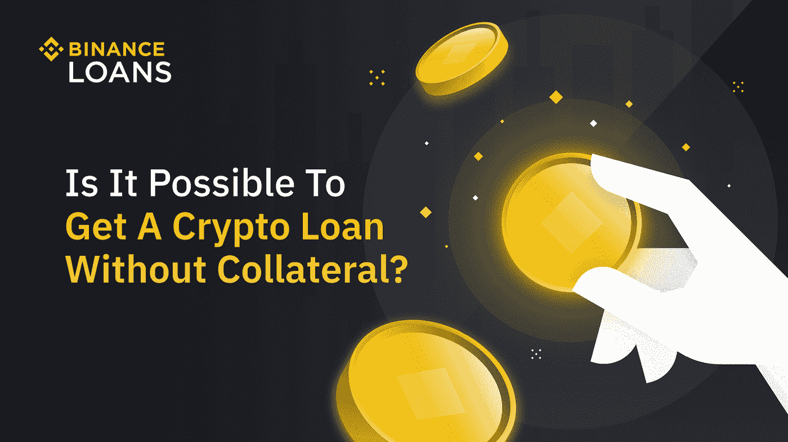
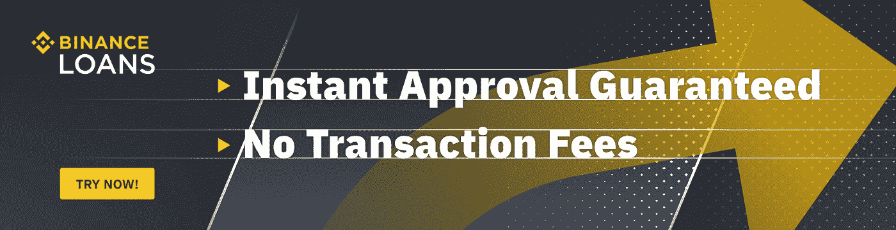

# 我可以在币安获得无抵押的加密贷款吗？

> 原文：<https://medium.com/coinmonks/can-i-get-a-crypto-loan-without-collateral-on-binance-2d75fb71d000?source=collection_archive---------7----------------------->

如果管理得当，债务是好的。输入 [*币安贷款*](https://www.binance.com/en/loan?ref=P10U1GSP) *。*

Photo: Binance

就像有不良信用和良好信用一样。有坏账也有好债。几乎我们所有人都曾在生活中的某个时候遭遇过可怕的(坏的)债务忧郁(在传统银行体系中)，对吗？你猜怎么着？！是时候智取坏账了。是的，没错。这是聪明债务的时代，币安贷款。

你可以通过币安贷款进行现货、保证金或期货交易。或者将借来的资金用于赚取高 APY 可能是你的爱好。由于没有加快还款，这种贷款利用交易也是免费的。很好，不是吗？

注意:

1.  *良好的信用评分并不是获得智能加密货币贷款的先决条件。*
2.  *提前还款没有罚息。*

哇哦。！多酷啊。你可能会想。请继续阅读。启蒙在等着我们。

**密码贷款介绍**

Photo: Binance

[币安贷款](https://www.binance.com/en/loan?ref=P10U1GSP)本质上是在市场动荡或停滞时期为您提供可投资的资金。这种加密货币贷款可以以集中或分散的方式获得。但就传统贷款而言，加密货币贷款确实略有不同。在这里，后者得到不同的解释。这意味着加密货币贷款是针对借款人的抵押加密货币资产发放的。这表明加密货币贷款不依赖于信用评分来衡量借款人的回报偏好。

币安贷款允许用户以他们的抵押品价值为基准借贷高达 65%的资金。更诱人的是，借出的资金可以随意利用。CeFi 借贷平台的核心关注点是它们有一个增强的安全层。此类 CeFi 平台还拥有币安等知名交易所的强大支持。获得 BTC 贷款是即时的。这增强了您的加密货币资产的流动性和可兑换性，允许快速而轻松地资本化市场脉搏。加密货币贷款的利息每小时收取一次。这种贷款的期限通常也较短(7 至 180 天)。

**币安贷款有什么好处？**

各种各样的加密货币资产通过币安贷款提供。币安上有超过 160 种资产可用于借贷，而接受的加密货币资产超过 50 种。用户界面(UI)非常透明。在其中，自动计算还款和利率金额。这让用户可以验证他们的加密货币贷款利率的竞争力。抵押品赌注是币安贷款的另一个令人兴奋的特点。在这种情况下，可以通过加密货币奖励来抵消贷款利息费用。你会很高兴地得知，即使提前还贷也不会受到币安贷款的处罚。在提前还贷中，利息费用是根据你贷款认购的小时数单独计算的。用户可以在整个币安生态系统中自由使用加密货币贷款(例如，交易、支付和取款)。

**为什么加密贷款需要抵押品？**

币安贷款需要抵押品以合理的利率提供贷款。世界上最大的加密货币交易所不考虑信用评分。相反，它持有用户的加密货币资产作为抵押品，以阻止任何潜在的贷款风险。这就是说，这种抵押品被视为保证金，以承担预计的贷款风险。简而言之，如果借款人未能偿还贷款，有问题的抵押品就会被没收。因此，即使几乎没有信用评分(历史)的借款人仍然可以利用加密货币贷款。

抵押品还允许加密货币出借人相应地为借款人定制出借条款。在这里，lending terms 代表付款期、利率和可贷资金的价值。健康的抵押品价值随后会降低贷款人的风险。这就是 LTV ( [贷款价值比](https://www.binance.com/en/blog/loans/calculating-your-loantovalue-ratio-ltv-to-avoid-liquidation-421499824684903575))发挥作用的地方。LTV 比率本质上表示用户贷款相对于其抵押品的价值，允许贷方避免清算。

**无抵押加密贷款有什么风险？**

加密货币贷款需要合适的抵押品来驯服骗局并保持合理的利率。如果这种加密货币贷款是在没有任何抵押品的情况下提供的，贷款人被欺诈的风险就会增加。这种毫无根据的加密货币(贷款)贷款人主要倾向于剥夺你的加密货币资产或身份。所以，重要的是你只能使用可靠的贷款提供商，如币安贷款公司。不要以提供无抵押加密货币贷款为借口，与假冒贷款人分享重要(机密)信息。应不惜一切代价保护账号和密码等详细信息。彻底检查贷款条款和审查贷款人的(诈骗)历史，如果有的话。

**币安贷款的贷款发放流程是怎样的？**

币安贷款的贷款发放过程非常简单。当您创建贷款请求时，抵押品将从现货账户中转出。与此相反，贷款在即期账户中收到。随时可以还款。在偿还时，抵押品被收到现货账户中。

**用低息促销向币安贷款借款**

欢欣鼓舞吧，宾西安同胞们。这是专为你准备的独家[公告](https://www.binance.com/en/support/announcement/6683c6d7f6524583b5475fc18441c433)。币安贷款刚刚推出了一个特殊的利率降低(IRR)促进和 NFT 神秘盒子奖励(NMBR)计划来吸引你。无论您是新的还是现有的币安用户，您仍然有资格参与上述促销活动。

**降息**:

作为一项正在进行的推广活动，IRR 计划将让用户在抵押贷款中享受 0.000573%的利率。

**NFT 神秘盒子奖励计划:**

NFT 神秘盒子奖励计划的推广时间为 2022 年 3 月 22 日上午 00:00 至 2022 年 3 月 21 日下午 11:59(UTC)。在币安贷款活动中至少有 200，000 BUSD 的用户将会得到一个特殊的 NFT 神秘盒子。此外，50 名币安贷款新手用户在推广期间在平台上发起第一笔贷款订单，将被选中每人获得一个额外的 NFT 神秘盒子。这些选择将按照基于币安链哈希值的[奖励选择规则进行。](https://www.binance.com/en/support/faq/fd462f034aed44439ef6c636b9aaf345)

访问[币安贷款常见问题解答](https://www.binance.com/en/support/faq/360041277432)。

新来币安吗？[今天就注册](https://accounts.binance.com/en/register?ref=P10U1GSP)！

**免责声明**:本文仅用于教育目的，不应被理解为投资建议。

> 加入 Coinmonks [电报频道](https://t.me/coincodecap)和 [Youtube 频道](https://www.youtube.com/c/coinmonks/videos)了解加密交易和投资

# 另外，阅读

*   [OKEx vs KuCoin](https://coincodecap.com/okex-kucoin) | [摄氏替代品](https://coincodecap.com/celsius-alternatives) | [如何购买 VeChain](https://coincodecap.com/buy-vechain)
*   [币安期货交易](https://coincodecap.com/binance-futures-trading)|[3 comas vs Mudrex vs eToro](https://coincodecap.com/mudrex-3commas-etoro)
*   [如何购买 Monero](https://coincodecap.com/buy-monero) | [IDEX 评论](https://coincodecap.com/idex-review) | [BitKan 交易机器人](https://coincodecap.com/bitkan-trading-bot)
*   [CoinDCX 评论](/coinmonks/coindcx-review-8444db3621a2) | [加密保证金交易交易所](https://coincodecap.com/crypto-margin-trading-exchanges)
*   [红狗赌场评论](https://coincodecap.com/red-dog-casino-review) | [Swyftx 评论](https://coincodecap.com/swyftx-review) | [CoinGate 评论](https://coincodecap.com/coingate-review)
*   [Bookmap 评论](https://coincodecap.com/bookmap-review-2021-best-trading-software) | [美国 5 大最佳加密交易所](https://coincodecap.com/crypto-exchange-usa)