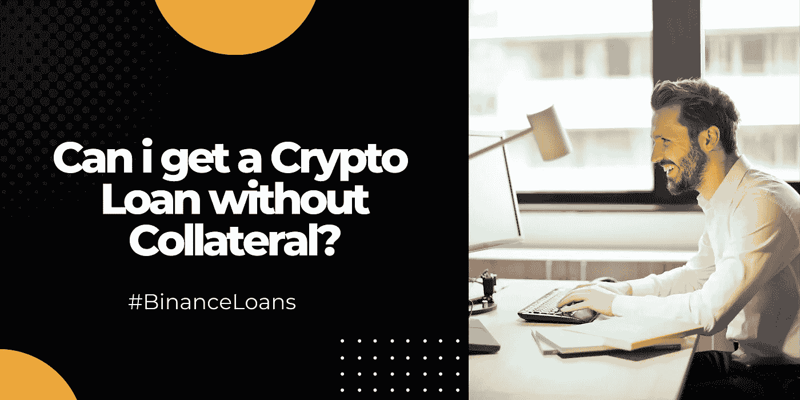

# 我可以在币安获得无抵押的加密贷款吗？

> 原文：<https://medium.com/coinmonks/can-i-get-a-crypto-loan-without-collateral-on-binance-6d1927d997fb?source=collection_archive---------23----------------------->

**目录**

*[***加密贷款简介***](#00be) ***∘***[***为什么加密贷款需要抵押物？***](#94ea) ***∘***[***无抵押物的加密贷款有哪些风险？*T32**](#3650)*

## *加密贷款简介*

*就在你认为密码世界不可能变得更好的时候；他们出现了加密贷款…到底什么是加密贷款？*

*加密贷款是一种贷款，交易者利用他们的加密资产作为担保/抵押品，直到贷款被偿还。与传统机构不同，你的信用评分在获得加密贷款中不起作用。*

*加密贷款按小时而不是按月计息。此外，加密贷款的期限往往比传统贷款短。*

*随着加密货币的波动性，加密贷款在较短的时间范围内工作。使用*币安贷款*，交易者只有 7-180 天的时间范围。*

*加密贷款对于那些不愿意在需要资金时清算资产的交易者来说很方便。交易员在借入加密贷款时，也可以获得资产利息。*

## *为什么加密贷款需要抵押品？*

1.  ****抵押品用作保证金***——传统金融机构使用信用评分来审查贷款资格，而加密贷款只需要抵押品。*

*抵押品用于在一方无法偿还贷款时降低贷方的风险。因此，密码贷款为几乎没有信用记录的用户提供了一个借密码的途径。*

***2*。抵押品用于计算借贷风险-*** 一个加密贷款出借人将主要需要计算他们的借贷风险，抵押品在这方面起着主要作用。抵押品将决定利率、付款期限和可贷资金的数量。*

*从本质上讲，更高的抵押品将转化为贷款人风险的降低。*

*像币安贷款这样的平台使用 LTV *(* ***贷款价值****-贷款价值与其抵押品的比率)*来评估贷款风险，以保护其资产。*

## *没有抵押物的加密贷款有什么风险？*

1.  ****容易上当受骗****

*没有抵押品的加密贷款很难获得，当你这样做时，一定要寻找危险信号。*

*正如他们所说，当交易太划算时，要三思而行。*

*虽然他们可能不需要抵押品，但您可能需要提供将被用来对付您的重要信息。*

*保持警惕，做你的研究。为什么监管机构会愿意给你一个非抵押加密贷款？*

*有可能有些东西你需要放弃，在大多数情况下，这些场景最终都是骗局。*

***2*。极高利率****

*在非抵押加密贷款不是骗局的特殊情况下，用户将承受极高的利率。*

*这一因素的出现是因为无抵押加密贷款使贷方非常脆弱，而高利率补偿了所涉及的风险。*

*对于希望通过杠杆交易增加头寸规模的交易员；这种类型的加密贷款并不理想，因为交易员获利和支付高利率的窗口期较短。*

****币安贷款推出降息****

***推广期:直至另行通知***

**亲爱的 Binancian* ，现在是充分利用币安贷款的时候了，因为他们刚刚推出了一个优惠活动，当以币安贷款为抵押借款时，每小时利率低至 0.000573%。*

**如果您错过了 NFT 神秘盒子奖励计划提供的币安贷款，那太糟糕了，因为该优惠已于 2022 年 3 月 21 日 11:59 PM (UTC)到期**

*[***币安贷款入门> >***](https://www.binance.com/en/loan?ref=431277160)*

*[***还不是个 Binancian？跟风> >***](https://accounts.binance.com/en/register?ref=431277160)*

****关联披露:*** *本帖包含关联链接。如果您使用这些链接购买一些东西，我们可能会赚取佣金，对您没有额外的费用。感谢*。*