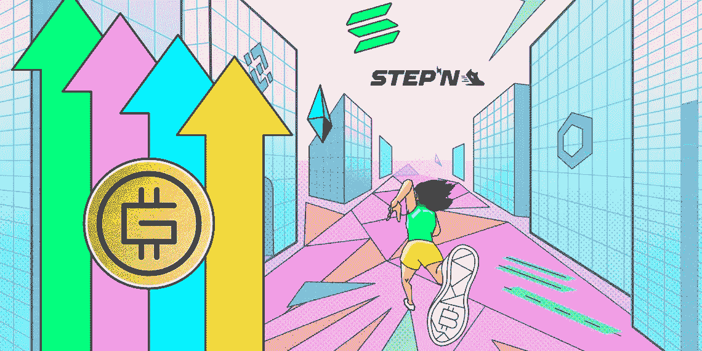
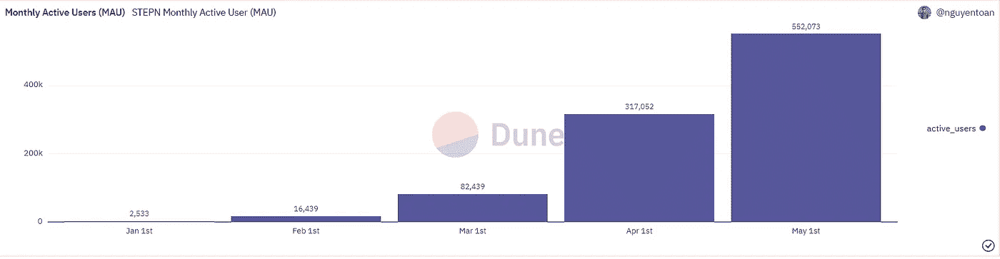
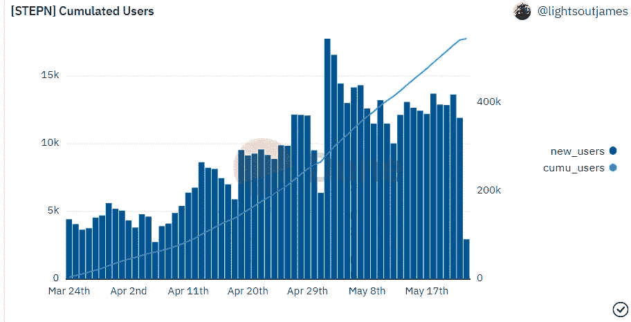
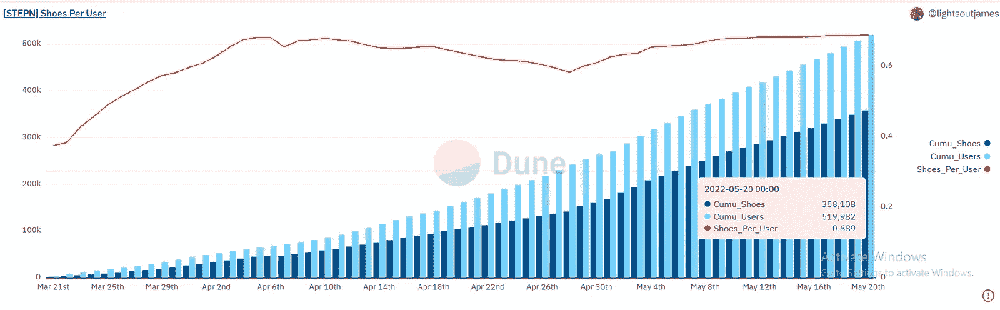
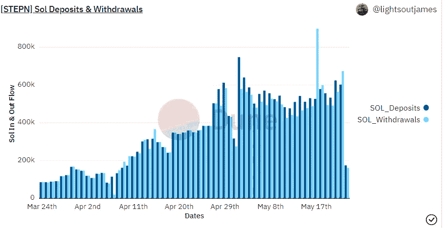
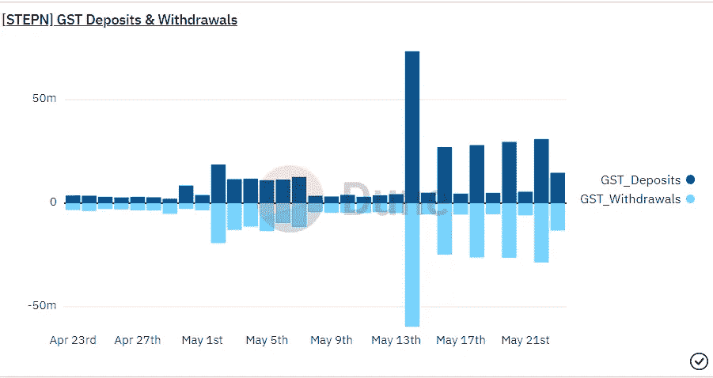

# 现在投资 StepN 能盈利吗？

> 原文：<https://medium.com/coinmonks/can-investing-in-stepn-be-profitable-now-d3ae0af51c32?source=collection_archive---------3----------------------->

一个总是威胁到“玩到赚”和“移动到赚”项目的危险是，它们的代币经济不能正常工作，奖励系统及其燃烧不平衡，使属于该系统的 NFT 和奖励代币变得毫无价值。

对于这类项目，在客户方有两个非常重要的衡量标准。首先是活跃用户的数量，然后是新用户的数量。

目前，该项目的总用户数约为 52 万人，目前活跃用户数约占总用户数的 5%。而它最近七天的活跃用户已经是总用户的 30%左右了。

此外，在显示该项目的新用户的图表中，由于比特币的价格下跌以及随后在加密市场出现的担忧，我们目前正在目睹一个积极的趋势。

在下面的图表中，我们可以看到鞋子与用户数量的比例是 69%，这表明目前有 69%的用户拥有用于行走的鞋子，这个用户总数可以被认为是活跃的。而这个数字是这个项目在让用户参与方面表现优异的标志。

根据上面的统计，到目前为止，StepN 在吸引和保留用户方面有着良好的表现。

与 Axie Infinity 类似，StepN 有两个令牌:治理令牌(GMT)和奖励令牌(GST)。当然，你需要在钱包里放一些索拉纳来买 NFT 鞋。

Solana tokens 在项目中的存取反映了用户的投资动机，也是我们考虑项目收入的指标之一。

项目的 GST 存款和提款显示了活动是如何日常化的，以及它对用户留在项目中的吸引力。

下图中可以看到 Solana 对 StepN 项目的存取款趋势。

这表明，索拉纳存款的趋势已经多次超过其提款，可以得出结论，投资 NFT 鞋的倾向已经超过了资本的退出。

在下图中，您可以看到 GST 对项目的存款和提款趋势。考虑到制鞋政策在最近几天发生了很大的变化，在这些变化中，所需的商品及服务税的数量有所增加。

所以现在有很多用户想要制造鞋子，这对用户来说是有利可图的，这意味着游戏运行良好。

结论:

在我看来，StepN 可以成为一个非常成功的项目。他们应该能够在用户和项目代币经济之间保持平衡。这就是他们一直做得这么好的原因。

根据针对本文标题中的问题所做的研究，我必须回答，是的，StepN 项目目前正在继续其增长道路，并且拥有健康的经济，投资该项目可以盈利。

> 加入 Coinmonks [电报频道](https://t.me/coincodecap)和 [Youtube 频道](https://www.youtube.com/c/coinmonks/videos)了解加密交易和投资

# 另外，阅读

*   [3 商业评论](/coinmonks/3commas-review-an-excellent-crypto-trading-bot-2020-1313a58bec92) | [Pionex 评论](https://coincodecap.com/pionex-review-exchange-with-crypto-trading-bot) | [Coinrule 评论](/coinmonks/coinrule-review-2021-a-beginner-friendly-crypto-trading-bot-daf0504848ba)
*   [莱杰 vs n rave](/coinmonks/ledger-vs-ngrave-zero-7e40f0c1d694)|[莱杰 nano s vs x](/coinmonks/ledger-nano-s-vs-x-battery-hardware-price-storage-59a6663fe3b0) | [币安评论](/coinmonks/binance-review-ee10d3bf3b6e)
*   [Bybit Exchange 审查](/coinmonks/bybit-exchange-review-dbd570019b71) | [Bityard 审查](https://coincodecap.com/bityard-reivew) | [Jet-Bot 审查](https://coincodecap.com/jet-bot-review)
*   [3 commas vs crypto hopper](/coinmonks/3commas-vs-pionex-vs-cryptohopper-best-crypto-bot-6a98d2baa203)|[赚取加密利息](/coinmonks/earn-crypto-interest-b10b810fdda3)
*   最好的比特币[硬件钱包](/coinmonks/hardware-wallets-dfa1211730c6) | [BitBox02 回顾](/coinmonks/bitbox02-review-your-swiss-bitcoin-hardware-wallet-c36c88fff29)
*   [BlockFi vs 摄氏度](/coinmonks/blockfi-vs-celsius-vs-hodlnaut-8a1cc8c26630) | [Hodlnaut 审核](/coinmonks/hodlnaut-review-best-way-to-hodl-is-to-earn-interest-on-your-bitcoin-6658a8c19edf) | [KuCoin 审核](https://coincodecap.com/kucoin-review)