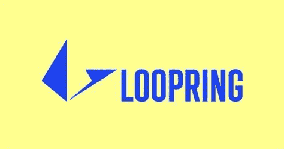

# Loopring 能在未来几年达到 14 美元吗？

> 原文：<https://medium.com/coinmonks/can-loopring-reach-at-14-in-the-next-years-29459a3870d9?source=collection_archive---------28----------------------->

Source photo [loopring price — Bing images](https://www.bing.com/images/search?view=detailV2&ccid=GJujKkaT&id=0840CB652DF2AFD9B2015AFC41F67530105AE636&thid=OIP.GJujKkaTvQ0YMAPkGmJFKQHaD4&mediaurl=https%3a%2f%2fcryptomojo.com%2fwp-content%2fuploads%2f2020%2f04%2fLoopring-1024x536.jpg&cdnurl=https%3a%2f%2fth.bing.com%2fth%2fid%2fR.189ba32a4693bd0d183003e41a624529%3frik%3dNuZaEDB19kH8Wg%26pid%3dImgRaw%26r%3d0&exph=536&expw=1024&q=loopring+price&simid=607995291558628939&FORM=IRPRST&ck=FA87EC32C59887CFD5FB9AFAC954031D&selectedIndex=5&ajaxhist=0&ajaxserp=0)

在过去的两年里，密码世界经历了快速的扩张。Loopring 的发射是由空间环境的不断发展推动的。该平台旨在解决分散和集中交易所存在的许多问题。

该生态系统的主要重点是提供快速、安全和高度透明的解决方案。该平台允许高容量…