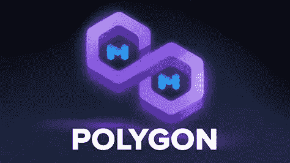

# MATIC 价格能打到 3 美元吗？

> 原文：<https://medium.com/coinmonks/can-matic-price-hit-3-59c1130d3723?source=collection_archive---------67----------------------->

Source photo [matic polygon — Bing images](https://www.bing.com/images/search?view=detailV2&ccid=JtcC4XxB&id=2E8A489A11EF013D8F3C224093795F15A0828416&thid=OIP.JtcC4XxB-yssuK_fBUeGlgHaEK&mediaurl=https%3a%2f%2fth.bing.com%2fth%2fid%2fR.26d702e17c41fb2b2cb8afdf05478696%3frik%3dFoSCoBVfeZNAIg%26riu%3dhttp%253a%252f%252fwhiteboardcrypto.com%252fwp-content%252fuploads%252f2021%252f11%252fPolygon.png%26ehk%3dt92ZCnax%252faAtTYtVzYAGugBV%252f9f3NP4utYsYjy78rRs%253d%26risl%3d%26pid%3dImgRaw%26r%3d0&exph=1080&expw=1920&q=matic+polygon&simid=607997907186680954&FORM=IRPRST&ck=0BAE0C82754B48D62D3AE95E25121A58&selectedIndex=5&ajaxhist=0&ajaxserp=0)

2021 年，大家都在说多边形。在写这篇文章的时候，这个区块链似乎是以太坊的一个可行的替代品。多边形区块链已经被许多加密项目用来运行他们的 Dapps。随着用户的增加，MATIC 的价格从不到 1 美元涨到了 2 美元的历史新高。经过一段时间的稳定后，MATIC 的价格再次具有吸引力。MATIC 定价预计会达到…