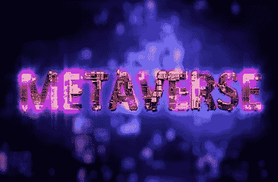
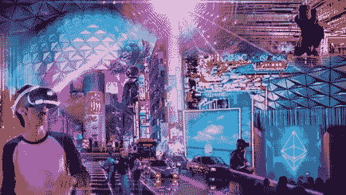
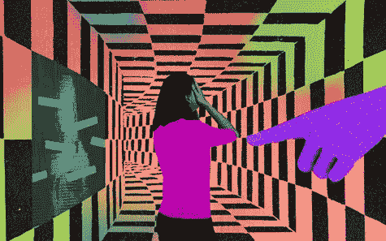

# 元宇宙能成为第二人生吗？

> 原文：<https://medium.com/coinmonks/can-metaverse-become-a-second-life-5ecf85c2d0d?source=collection_archive---------35----------------------->

1992 年，当互联网还是新生事物时，美国小说家尼尔·斯蒂芬森谈到了虚拟现实。在这个虚拟世界里，人们将使用数字化身在线生活、工作和娱乐，我们称之为“元宇宙”，融合了“超越”的元含义和“宇宙”一词的诗句。他说过这样一句话，“元宇宙将是互联网的继承者，是对反乌托邦现实的逃避”。

什么样的反乌托邦现实？全球经济已经崩溃，联邦政府已经失去权力，少数大公司控制着世界，这是他三十年前的预测。今天，大技术公司正致力于建设同一个未来，希望没有反乌托邦。正如我们所说，苹果、微软、谷歌、脸书等科技巨头都在竞相争夺元宇宙，这个虚拟世界将与现实世界共存。脸书甚至将其名称改为“Meta ”,以保持在曲线的顶端，术语元宇宙承诺彻底改变我们的生活，成为物理世界的延伸。

但是，

我们真的需要元宇宙吗？

我们真的需要一个由科技巨头控制的想象世界吗？

互联网真的会让我们的生活变得更美好吗？或者

它会操纵我们对现实的感知吗？

“2022 年应该是元宇宙之年，这是一个基于技术的增强现实空间，可能会永远改变我们的生活和互动方式。把它想象成一个互联网，你不仅在看，而且还生活在你的数字化身中，它将居住在元宇宙，而不是观看或阅读某个主题，你将体验它，与其他想成为你体验一部分的人一起数字化地做那些动作。”

这个概念并不新鲜，视频游戏已经有一段时间了，世界上最大的游戏公司如 ROBLOX、FORTNITE 和 GRAND THEFT AUTO 已经建立了自己的虚拟世界，拥有自己的虚拟经济、虚拟货币、故事情节和角色。元宇宙也可能有一些这样的游戏元素，但它不会是某种视频游戏，它将是现实与想象相遇的网络空间，角色将是真实的人，但他们的世界将完全是虚构的，由虚拟元素组成，与现实生活平行。

根据马克·扎克伯格的说法，元宇宙将会是**“它将会是传送装置中第二好的东西。在元宇宙周围传送就像点击一个链接”。**

这就引出了另一个问题，将会有多少个虚拟世界？会有一个元宇宙还是不同的元诗句？

有不同的虚拟世界，脸书想成为最大的虚拟世界，但它不是唯一的，许多科技巨头都在努力，

例如，苹果公司目前正在开发一种先进的虚拟现实设备，报告称这可能会彻底改变元宇宙的体验。

据说谷歌正在开发一种创新的增强现实设备，据说这将创造一个独立和独特的元宇宙平台。

微软正在创建一个名为 MESH 的数字世界，这将把虚拟体验直接融入微软团队。

迪士尼，显然创造了一个迪士尼主题元宇宙，这将是迪士尼电影和流媒体服务的延伸。

甚至连政府都在押注于此，2021 年元宇宙政府宣布成立全国联盟，将不同的虚拟世界置于一个保护伞之下。在美国，加利福尼亚州圣莫尼卡市与元宇宙公司合作推出了数字版的圣莫尼卡，在这个版本中，玩家可以通过收集隐藏在城市不同位置的物品来赢得奖励。因此，几乎所有地方的一切都在成为元宇宙，它不再仅仅是少数科技极客的实验，它正在成为现实的一种可发明的替代物。

像这样的问题，

元宇宙保证隐私吗？

元宇宙是一个公平的空间吗？

它会有多民主和开源？

我们需要画什么线？

会安全吗？

已经有关于元宇宙犯罪的报道，

2021 年 12 月，旧金山的一名女子戴着 Meta 的 Oculus 耳机玩她最喜欢的射击游戏，当她进入游戏时，她的数字头像被另一名陌生人靠近，该陌生人对她的头像进行了数字分组和骚扰，当被要求停止时，他说“这是元宇宙，我想做什么就做什么”。这不是唯一的一起事件，在一个流行的虚拟现实世界中，每七分钟就会发生一起暴力事件。每一起犯罪都会让人感觉更加真实、更加强烈，一旦元宇宙扩张，这些问题可能会被放大。

科技公司打算如何解决这些问题？

他们计划如何确保数字化身的隐私和安全？

他们说他们不能。

META 的高管 ANDREW BOSWORTH 说**“监管任何有意义规模的用户行为实际上是不可能的”**，这就把我们带回了问题“元宇宙对孩子们来说有多安全？

研究证明，元宇宙教对儿童来说并不安全，已经报告了几起犯罪事件，如儿童接触色情内容、儿童被训练重复种族主义诽谤、儿童接受陌生人的极端观点以及儿童遭受性骚扰。

因此，元宇宙可能会让世界变得更好，但这也超出了它的目的，它可能会成为掠夺者在网上犯罪的工具，并获得一种方式，它可能会成为危险的不健康的现实逃避。元宇宙承诺给人们第二次生命，一个他们可以互动、见面、购物、聚会、盖房子的网络世界。但请记住，这些都不会是真实的，所有这些都让你忘记现实，逃避生活中独特的人类元素，如拥抱孩子，与朋友共进午餐，与你的狗散步，建造你的第一辆汽车，步入新房子，这些都无法在网上复制。全息图像不能代替人际关系，感官体验不能代替真实的情感。 **“元宇宙不能成为第二个生命。”**

博客到此结束，希望这对你有所帮助。

> 加入 Coinmonks [电报频道](https://t.me/coincodecap)和 [Youtube 频道](https://www.youtube.com/c/coinmonks/videos)了解加密交易和投资

# 另外，阅读

*   [3 商业评论](/coinmonks/3commas-review-an-excellent-crypto-trading-bot-2020-1313a58bec92) | [Pionex 评论](https://coincodecap.com/pionex-review-exchange-with-crypto-trading-bot) | [Coinrule 评论](/coinmonks/coinrule-review-2021-a-beginner-friendly-crypto-trading-bot-daf0504848ba)
*   [莱杰 vs n rave](/coinmonks/ledger-vs-ngrave-zero-7e40f0c1d694)|[莱杰 nano s vs x](/coinmonks/ledger-nano-s-vs-x-battery-hardware-price-storage-59a6663fe3b0) | [币安评论](/coinmonks/binance-review-ee10d3bf3b6e)
*   [Bybit Exchange 评论](/coinmonks/bybit-exchange-review-dbd570019b71) | [Bityard 评论](https://coincodecap.com/bityard-reivew) | [Jet-Bot 评论](https://coincodecap.com/jet-bot-review)
*   [3 commas vs crypto hopper](/coinmonks/3commas-vs-pionex-vs-cryptohopper-best-crypto-bot-6a98d2baa203)|[赚取秘密利息](/coinmonks/earn-crypto-interest-b10b810fdda3)
*   最好的比特币[硬件钱包](/coinmonks/hardware-wallets-dfa1211730c6) | [BitBox02 回顾](/coinmonks/bitbox02-review-your-swiss-bitcoin-hardware-wallet-c36c88fff29)
*   [BlockFi vs Celsius](/coinmonks/blockfi-vs-celsius-vs-hodlnaut-8a1cc8c26630)|[Hodlnaut 点评](/coinmonks/hodlnaut-review-best-way-to-hodl-is-to-earn-interest-on-your-bitcoin-6658a8c19edf) | [KuCoin 点评](https://coincodecap.com/kucoin-review)