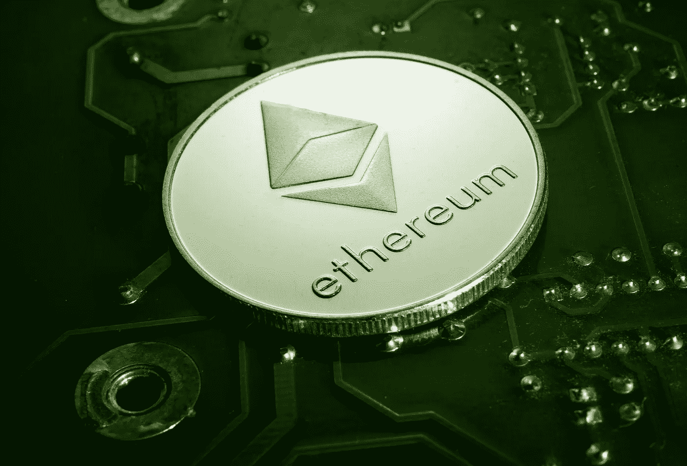

# MetisDAO(道)能从 am 以太坊二层 Rollup 赚钱吗？-—市场疯人院

> 原文：<https://medium.com/coinmonks/can-metisdao-dao-make-money-from-am-ethereum-layer-2-rollup-market-mad-house-f6099ce5a4e5?source=collection_archive---------17----------------------->

MetisDAO (DAO) 是又一个利用以太坊第二层汇总平台来兑现 DAOs、DApps、DeFi、NFTs、零工经济和自由职业的努力。

第二层汇总是他们添加到**以太坊**区块链的额外一层。Metis 是一个[分散自治组织(DAO ),为……构建第 2 层汇总平台](https://www.metis.io/)