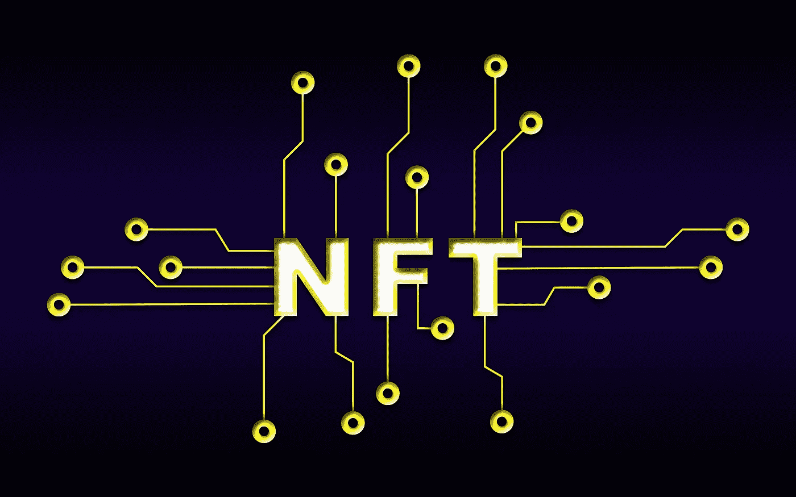

# NFT 能摆脱庞氏骗局的名声吗？

> 原文：<https://medium.com/coinmonks/can-nfts-shed-their-ponzi-reputation-8e1a72c196d5?source=collection_archive---------56----------------------->

为了让公众接受，NFT 需要做些什么改变

不可替代令牌(NFT)迅速成为最新的加密热潮，吸引了加密反对者和公众的负面关注。由于卡通漫画、大量资本流入、快速致富的故事和精心制作的迷因，最初作为我们在 DeFi 和其他地方看到的可替换加密令牌的补充，现在已经拥有了自己的生命。像 Bored Ape Yacht Club、志那都红豆、CryptoPunks 等个人资料图片(PFP)经济的兴起已经成为非功能性交易最常见的关联用例。公众的看法是，鲁莽的赌徒正在像收藏卡一样交易图片，而这些只是时尚，一旦泡沫像豆豆娃和无数其他人一样破灭，这些时尚就会消失。

不幸的是，这是大多数人对 NFTs 技术(非常强大和适应性强)的使用案例，因为对当前许多 PFP NFT 项目的批评是有根据的。当你揭开盖子时，许多当前的 PFP 项目都是现金攫取和庞氏骗局。项目团队赚了很多钱。有影响力的人正在赚大钱。超级用户正在赚大钱。当地毯被拉开时，普通人留下的是一个毫无价值的形象，他们已经失去了一切。

# 一个不幸的例子

让我们玩出典型的 NFT 亲民党计划。*请注意，我在这里只是说明一点，并不意味着牵连任何特定的项目*。

1.  创始人创作艺术品。通常大约有 10，000 张不同特征和稀有标记的图片。
2.  创始人大肆宣传艺术作品和路线图，传统上包括令牌、赌注奖励和一些通过合作伙伴关系的白名单(这允许其他一些骗局使用相同的用户)。有影响力的人在社交媒体上宣传项目(通常会获得报酬)
3.  用户以每张 150 美元的价格创造了 10000 张 NFT。创始人在出售中获利约 150 万美元。创始人还对二次销售设定了售价 5%的版税。
4.  创始人和影响者庆祝造币厂，并开始下一阶段的工作！对社交网站的持续投入意味着更多的销售额和更多的二级市场费用回馈给创始人。用户可以在翻转上赚取利润。
5.  创始人现在推出一个在项目之外没有价值的令牌。创始人发起赌注，以赚取更多的令牌，如果你赌注你的 NFT。用户获得分配的令牌，并开始下注他们的 NFT。这导致二次销售的供应枯竭，抬高了价格，随着用户累积代币，创始人可以获得更多的二次费用。
6.  由于代币在公开市场上没有内在价值，创始人出售他们的代币。价格降至 0.01 美元以下。用户赌注奖励一文不值。NFT 的价格暴跌，现在 NFT 一文不值。

成功。用户拿着毫无价值的 JPEG 文件，而创始人却带着数百万美元离开。那么，我们应该从今天市场上的这个例子中学到什么呢？

## 坏演员正在利用这些 PFP 和图像的投机市场。这并没有减损 NFTs 作为一种技术可以带给世界的效用和好处。

# 兑现 NFTs 的承诺

好吧，所以非功能性测试的名声越来越差。我们能做些什么来解决这个问题？理论上，有两种方法可以真正阻止批评的浪潮:

1.  阻止骗子
2.  通过技术的创新使用重新定义 NFTs

虽然我们都喜欢走英雄路线，从 crypto 中清除骗子，但这在短期内不太可能。这意味着，我们消除非功能性技术相关社会污名的最佳机会，是让我们的领导者利用这种技术来解决现实世界中的问题。

从本质上来说，NFT 是可以被唯一识别的容器(称为令牌),具有个体特征，并且不能改变它们的基本标识(想想 SSN 或 VIN 号码)。它们能够被唯一识别并具有各自的特征，这使它们成为可替换的令牌(如 ETH 或 BTC ),可以很容易地相互替换，而不会改变价值。虽然 NFT 相对来说是已知的，但是具有特定特征和相关价值的独特容器的概念在我们周围无处不在。从库存管理到用户识别，基于独特性的技术推动着当今世界的许多流程。

将 NFT 技术用于现有用例的挑战在于，它需要广泛的区块链和加密应用才能真正扎根。例如，除非加密钱包被广泛采用，否则票务交易所不太可能使用 NFT 作为音乐会的门票。如果没有高效的区块链网络来管理数据，NFTs 就无法用于跟踪物流中的单个包裹。同样，当有价值的用例有限时，很少有人愿意花钱为 NFTs 构建基础设施。有点先有鸡还是先有蛋的情况。

最合理的成功之路似乎是那些已经拥有强大财务模式的公司和行业将公用事业驱动的非功能性技术整合到他们的运营中。我们今天看到企业跳入 NFTs，但是到目前为止，它们还没有真正集成到商业模型本身中。在此之前，NFTs 将永远是一个受到批评的噱头。我们需要公司将 NFTs 作为一种可行的商业运作机制，以便让大众了解技术本身的力量。

我经常去的一个例子是忠诚度计划。忠诚计划奏效了。他们已经工作多年了。人们希望感觉到他们的业务得到了回报，忠诚津贴就赢了。信用卡、航空公司和酒店是这场游戏的最大赢家，但今天即使是小企业也在利用某种形式的这种优势。如果我现在运行一个忠诚度程序，我会将该程序迁移到 NFTs(或向其中添加 NFTs)。传统的忠诚度计划给你:会员 ID(唯一 ID)，一些跟踪你的进展的应用程序和一些“登录”使用这些奖励的方法。

NFTs 可以提供所有这些东西**和**当今人们喜爱的 PFPs 社区参与:

*   新用户会收到代表其成员资格的 NFT。这款 NFT 在所有主要连锁店(或一家)都有售
*   NFT 是代表品牌本身的某种形式的内容。图像、视频剪辑、音频、头像——无论哪种都可以将用户与品牌联系起来。
*   随着会员资格的使用，NFT 可以发展/改变。花了更多的钱？更多的特质，新的内容，升级的能力，当然还有更多的奖励。
*   NFT 可以保存奖励、销售等的元数据。因此，它都存储在链上，并带有这个特定的 NFT
*   用户可以通过加密钱包登录您的网站。该网站可以自动读取 NFT 及其元数据，以了解谁登录，他们有什么奖励，等等。您可以根据 NFT 个性化体验，就像用户登录时一样。
*   我还会允许账户和优惠券的二次销售(尽管我知道这是个棘手的问题)。

# 底线

实施像 NFT 的奖励计划这样简单的事情可能是一种简单的方式，表明 NFT 技术可以在 PFP 泡沫之外的现实世界中发挥作用。在现实世界的商业案例中证明这种效用，是 NFT 摆脱污名并开始被认真对待为一种技术的最直接的方式。虽然 PFPs 很有趣，但我们需要密码领域的领导者来支持现有商业案例中的倡议，以推动该技术向前发展并获得广泛采用。

> 加入 Coinmonks [电报频道](https://t.me/coincodecap)和 [Youtube 频道](https://www.youtube.com/c/coinmonks/videos)了解加密交易和投资

# 另外，阅读

*   [如何在加拿大购买加密货币？](https://coincodecap.com/how-to-buy-cryptocurrency-in-canada)
*   [无聊猿游艇俱乐部(BAYC)回顾](https://coincodecap.com/bored-ape-yacht-club-bayc-review) | [拜比特 vs 比特币基地](https://coincodecap.com/bybit-vs-coinbase)
*   [5 款最佳加密交易终端](https://coincodecap.com/crypto-trading-terminals) | [最佳 DeFi 应用](https://coincodecap.com/best-defi-apps)
*   [比特币基地 vs 瓦济克斯](https://coincodecap.com/coinbase-vs-wazirx) | [比特鲁点评](https://coincodecap.com/bitrue-review) | [波洛涅克斯 vs 比特鲁](https://coincodecap.com/poloniex-vs-bittrex)
*   [德国最佳加密交易所](https://coincodecap.com/crypto-exchanges-in-germany) | [Arbitrum:第二层解决方案](https://coincodecap.com/arbitrum)