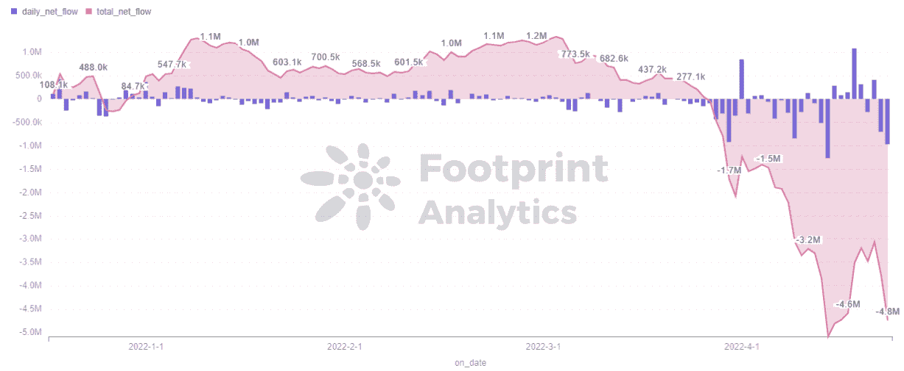

# 星鲨能逃脱死亡螺旋吗？

> 原文：<https://medium.com/coinmonks/can-starsharks-escape-its-death-spiral-edba72665dbe?source=collection_archive---------52----------------------->

StarSharks 在 4 月初进行了更新，但它没有提高代币价格，而是将用户数量推上了悬崖。

2022 年 5 月

数据来源:[足迹分析 StarSharks 仪表盘](https://www.footprint.network/guest/dashboard/Tokenomics-of-(Token)-fp-aa971726-d7a8-4963-8001-a83a4222741e?token_address=0x26193c7fa4354ae49ec53ea2cebc513dc39a10aa&channel=ENG-245)

在 BNB 链的游戏中，StarSharks 从第一名跌至第三名，其中 WAU 从悬崖上跌落了 455%。很明显，T2 BSC T3 的后起之秀 StarSharks 未能保持其强劲的增长。

尽管进行了一系列更新，来自[足迹分析](https://www.footprint.network/?channel=ENG-245)的数据显示，该项目现在发现自己处于一个非常危险的关头，而不是去月球。

# StarSharks 最近的更新

*   StarSharks 附属计划

在 3 月最后一天完成的提案投票中，会员计划的更新获得了批准。该团队为 veSSS 提供了更多的应用场景，以奖励 SSS 的利益相关者，并鼓励外部推广。

此次更新缩小了可以创建邀请链接的玩家的范围，只允许符合条件的 StarSharks 会员。该提案规定，只有那些拥有 10，000+vess 的用户才能创建邀请链接。

*   输出优化

4 月 6 日，通过取消日常任务和老虎机减少了 SEA 的产量。在消耗方面，通过扩大鲨鱼等级的输出差异，增加升级所需的令牌数量。鼓励玩家在升级鲨鱼的同时消耗更多的代币。

[足迹分析](https://www.footprint.network/?channel=ENG-245)数据显示，新用户增长率与代币发行增长率之比大部分时间小于 1，这意味着代币发行数量完全超过新用户进来的速度。这就导致了铺天盖地的人海，代币价格一直在震荡下行。

*Footprint Analytics — The Ratio of News Users Change and Daily Issue Change*

团队也看到了 SEA 的膨胀，并开始控制其产量，但这导致玩家收入减少，日活跃和新用户数量下降。

*Footprint Analytics — Daily Users*

这一更新对鲨鱼 [NFT](https://www.footprint.network/guest/dashboard/nft-dashboard-fp-b374b358-6e2f-4587-a52b-a69ebbb91bfa?days=past30days&name=sushiswap&channel=ENG-245#secret=DA601985B1CD8DCF912829C1188A05AA) 的发行产生了明显的影响，该公司的日发行量已转为负值，发行总量也开始萎缩。控制 NFT 击倒将维持鲨鱼的价格，并允许玩家合成更多的鲨鱼来燃烧更多的海，因此海和 NFT 的价格将需要同时被拉高。

*Footprint Analytics — Daily & Total NFT Supply -StarSharks*

*   奖励索赔限制

4 月 7 日增加索赔海况限制海流通，减缓玩家采卖清空代币价格。增加了 NFT 托管功能，用户可以让平台托管他们的 NFT，通过持有船只赚取 SEA，鼓励玩家持有更多的 NFT 和 SSS。

玩家获得的收入被锁定，使得代币持有者更加不活跃。事实上，玩家可以通过托管赚取收入，而无需花费时间，这使它看起来不像一个游戏，而更像 DeFi，这进一步减少了玩家的活动。

*Footprint Analytics — Token Holders Trend*

*   燃烧大量的海水

4 月 7 日，StarSharks 团队烧掉了为 9143 万海预留的所有收入，期望拉回生产过剩导致的海价下跌。

*StarSharks Twitter*

SEA 的总发行量在烧钱后瞬间从 1.27 亿下降到 3700 万，而且看起来代币的价格并没有起到什么作用，反而一直在下跌。

*Footprint Analytics — Daily Issue vs Token Price*

*   拆除租赁市场

4 月 8 日之后，StarSharks 取消了租赁市场，这造成了巨大的影响。

如[足迹分析](https://www.footprint.network/?channel=ENG-245)所示，StarSharks D1 的留存率之前很高，租赁市场和日常任务的取消对留存率和新用户产生了重大影响。

*Footprint Analytics — Active Users vs D1 Retention*

但是对于星鲨来说，取消租赁市场是必要的。租赁是一把双刃剑，可以降低门槛吸引更多的新玩家，就像 StarSharks 前期迅速上升的用户数量一样。然而，租赁模式也存在隐患。区块链上没有 KYC，这是一个无法区分玩家身份的问题。

淘金是一个名词，指的是在一个游戏公会的组织下，不断玩游戏以获取代币的行为。与普通玩家或投资者不同，他们铸造**NFT 并与它们一起玩游戏以获得本地代币获利。这反过来又会导致价格的剧烈波动。这是由于租赁市场降低了用户进入游戏的门槛。有了租赁市场，金农就可以低成本进入游戏，这就造成了游戏代币被大量铸造并销往市场，使代币价格加速下跌。**

**来自 [Footprint Analytics](https://www.footprint.network/?channel=ENG-245) 的数据显示，在 3 月初，PancakeSwap 上的 SEA-BNB 组合已经倾向于出售 SEA。到三月底，池子的平衡被打破了，池子里储存了越来越多的出售的海水。如此大规模的抛售使得海洋价格持续走低。**

****

***Footprint Analytics — SEA-BNB Buy Sell Pressure***

*   **特殊宝箱更新**

**在代币价格和新用户持续下降后，该团队更新了 4 月 18 日推出特殊宝盒的提案。**

**新百宝箱(B 箱)上线时，旧百宝箱(A 箱)只会铸造 1 星鲨鱼，每日出售数量会动态调整。盒子 B 售价 1000 海，将有机会获得 1 至 6 星鲨鱼、7 星鲨鱼碎片、荣誉积分等物品。**

**新的鲨鱼燃烧机制将给予玩家燃烧相应级别和数量的鲨鱼的盒子 B 和幸运点数，这将鼓励玩家购买盒子。**

**盒子 B 旨在抑制鲨鱼数量方面的海洋通胀，但它刚刚上线，看起来玩家并没有为此付费，仍然没有在最初几天拉动海洋消费，象征性价格持续下跌。**

****

***Footprint Analytics — SEA Daily Mint & Burn***

# **摘要**

**StarSharks 在一系列调整后砍掉了曾让其快速攀升的两大亮点(租赁制度和邀请机制)，之后项目土崩瓦解，代币价格下跌。**

**更新之后，SEA 还是不够烧，已经跌到 0.1 美元了。新玩家看不到盈利的希望，只剩下老玩家苦苦支撑。新盲盒的输出更适合大玩家玩 PVP，新人和零售玩家的生存空间变得更加狭窄。**

**StarSharks 取消租赁市场是为了阻止 gold farmers，但看起来这个团队还没有准备好进行这种规模的重组。该项目仍在努力尝试扭转局面，用户可以直接监控 StarSharks 在未来几天是否能加速海烧，是否能让新用户回来。**

**本文由[足迹分析](https://www.footprint.network/?channel=ENG-245)社区提供。**

**Footprint 社区是一个世界各地的数据和加密爱好者相互帮助了解和获得关于 Web3、元宇宙、DeFi、GameFi 或区块链新兴世界任何其他领域的见解的地方。在这里，你会发现活跃的、不同的声音相互支持，推动着社区向前发展。**