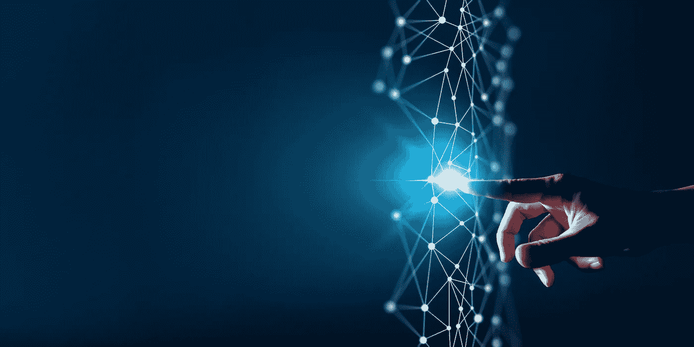

# 没有区块链，元宇宙还能工作和存在吗？

> 原文：<https://medium.com/coinmonks/can-the-metaverse-work-and-exist-without-the-blockchain-8c2d44e6da3a?source=collection_archive---------41----------------------->

元宇宙不需要介绍。它已经被视为互联网之后的下一件大事，或者视情况而定，是互联网的升级。这一立场是基于未来十年元宇宙的互动和互操作性水平。

为了进一步阐明这一立场，我有必要简要介绍一下互联网的发展，以及为什么有人强烈认为元宇宙将是这一发展的下一步。

# 互联网的演变

互联网的发展通常以升级和随之而来的渗透程度为特征。这一演变的第一阶段被认为是 Web 1.0。这一阶段的主要标志是为用户提供内容的孤立的信息中心。它们主要充当搜索引擎，在那里可以挖掘信息供个人消费。这主要是一种直接面向消费者的氛围，谷歌(Google)和维基百科(Wikipedia)等科技公司在其中取得了胜利。

接下来是 Web 2.0 和用户对用户的交互时代。这是我们最熟悉的阶段。它带来了内容经济的出现，用户可以通过社交媒体和其他由脸书、推特、谷歌等全球科技巨头独家拥有和控制的空间进行创作和互动。

尽管 web 2.0 已经带我们走了这么远，但已经有了一个新的进化，它准备进一步增强人类的互动，并消除所有独立的障碍。你可以猜到，这就是 web 3.0。在这种情况下，互联网将进入一个新的领域。它建立在区块链之上，由虚拟现实和增强现实等先进的沉浸式技术塑造而成。正如你已经知道的，元宇宙将成为这个时代的一员。

于是我想到一件事，如果元宇宙是第三代进化，是否意味着它只能在区块链上运行？此外，随着大型科技公司开始涌入这个领域，这是否意味着它们都将采用区块链，或者我们应该期待另一个没有区块链的元宇宙？换句话说，没有区块链，元宇宙还能存在吗？

# 元宇宙有什么好处？

元宇宙是一个沉浸式的世界，虚拟和增强现实对塑造我们的交互至关重要。预计元宇宙将使我们更加接近，因为人类可以使用化身和皮肤来重现现实生活中的约定。这意味着在 VR 头戴设备的帮助下，我们可以沉浸在虚拟世界中。

然而，这种沉浸感将由一种全新的经济来推动，在这种经济中，数字资产将是关键。这种新经济将需要自己的货币，在自己的空间运作，依靠自己的资源运行。

那么这将如何发生呢？

诸如土地、衣服、货币、房地产等工具都将出现在这个虚拟世界中，并且它们将是独一无二的，不会有两个相同的资产是相同的。

这就是区块链发挥作用的地方。众所周知，区块链以不可更改或操纵的方式永久保存和存储数字交易。此外，较新的区块链现在有能力支持不可替换令牌(NFT ),这是一种不能被另一种替代的独特资产。

这些 NFT 将为元宇宙提供动力，使其中包含的所有资产变得独一无二——从化身到土地、建筑等等。元宇宙的土地将被分配和出售用于不同的目的，随着有朝一日预期的互操作性，用户将有可能将资产(肯定不是土地)从一个元宇宙转移到另一个。

随着虚拟经济的发展，区块链将比以往任何时候都更需要记录交易和存储 NFTs 的所有权，因为它从一个用户到另一个用户，从品牌到用户。

目前，顶级品牌如古驰、巴黎世家、麦当劳、星巴克等已经出现在虚拟世界中。这意味着，很快，我们将能够在元宇宙(当然是你的虚拟形象)点早咖啡、买汉堡、穿名牌衣服，而区块链将是你真正拥有这些资产的唯一验证者。

这是一个难题。如果我们把区块链从等式中去掉，会发生什么？答案简单明了——不会有元宇宙或虚拟经济。

# 结果

不变性是使区块链成为元宇宙不可分割的一部分的一个特征。其永久存储交易的能力使其成为虚拟世界的理想选择，在虚拟世界中，没有中央权威机构监管基于技术的活动和交互。

> 加入 Coinmonks [电报频道](https://t.me/coincodecap)和 [Youtube 频道](https://www.youtube.com/c/coinmonks/videos)了解加密交易和投资

# 另外，阅读

*   [Bookmap 点评](https://coincodecap.com/bookmap-review-2021-best-trading-software) | [美国 5 大最佳加密交易所](https://coincodecap.com/crypto-exchange-usa)
*   最佳加密[硬件钱包](/coinmonks/hardware-wallets-dfa1211730c6) | [Bitbns 评论](/coinmonks/bitbns-review-38256a07e161)
*   [新加坡十大最佳加密交易所](https://coincodecap.com/crypto-exchange-in-singapore) | [收购 AXS](https://coincodecap.com/buy-axs-token)
*   [红狗赌场评论](https://coincodecap.com/red-dog-casino-review) | [Swyftx 评论](https://coincodecap.com/swyftx-review) | [CoinGate 评论](https://coincodecap.com/coingate-review)
*   [投资印度的最佳加密软件](https://coincodecap.com/best-crypto-to-invest-in-india-in-2021)|[WazirX P2P](https://coincodecap.com/wazirx-p2p)|[Hi Dollar Review](https://coincodecap.com/hi-dollar-review)
*   [加拿大最佳加密交易机器人](https://coincodecap.com/5-best-crypto-trading-bots-in-canada) | [库币评论](https://coincodecap.com/kucoin-review)
*   [火币的加密交易信号](https://coincodecap.com/huobi-crypto-trading-signals) | [HitBTC 审查](/coinmonks/hitbtc-review-c5143c5d53c2)