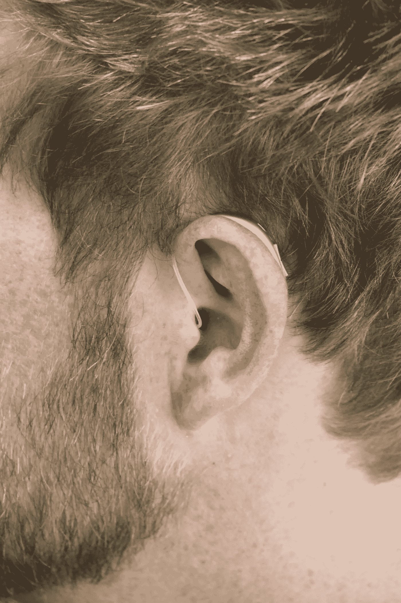

# 感官问题能在元宇宙得到解决吗？

> 原文：<https://medium.com/coinmonks/can-the-senses-problem-be-solved-in-the-metaverse-c7da9f61e2b8?source=collection_archive---------7----------------------->

在脸书更名为 Meta 之前，虚拟现实和区块链领域的事情一直处于保密状态，原因有很多。其中一个原因在于人们不相信虚拟空间的实用性，许多其他问题也由此产生。对虚拟世界和区块链的不可持续的兴趣导致大多数人不去寻找答案。

然而，自从 Meta 的名称改变和组织转移以来，世界已经认识到虚拟世界，以及通过 NFTs 的块链在其中的作用。这些问题中的一些现在又浮现出来了，这篇文章希望能回答其中的一个问题。脑海中的问题是关于元宇宙希望如何解决虚拟空间中的五感问题。

人类有五种以上的感觉，五种基本感觉是:

视力

声音

气味

味道，还有

触控

这些感觉中的大多数已经被转化到虚拟空间，而其余的正在经历持续的创新，并在测试中取得了优异的结果。这是在这些感官上所做工作的纲要。

# 视力

视觉是看的感觉。那么这在虚拟现实/元宇宙中需要什么功能呢？它只需要一个视网膜级别的显示器。如果这是正确的，那么参与者可以在他们的眼前形成一个可见的风景，看起来就像真实的世界。VR 头戴设备安装了两个液晶显示器，投影到每只眼睛上，获得的立体效果给观众带来深度感。这个问题已经解决了。视力已经从名单上划掉了，还有四个感官。

# 声音

随着元宇宙的演变和发展，它将以新的方式挑战音频制作，刺激创新。虚拟现实已经赋予了音频技术新的生命，如环绕声和双耳录音，音频系统以前因缺乏足够的应用而靠边站。在不久的将来，元宇宙用户体验声音的方式将以令人惊讶的方式得到扩展和延伸。我们拥有杜比和立体声已经很久了，越来越多的创新正在到来。所以声音被勾掉了，还有三个。

# **触摸**

对于触觉，目前存在许多技术，其中许多仍在开发中。在 Touch 下，这里的关键词是 haptics。迈克尔·奈瓦克(Michael Naiwak)在 2018 年纽约大学的一次演讲中定义“触觉被广泛定义为通过力、振动和运动再现触觉”，这进而证明了触觉的复杂性，尽管如此，仍有一些著名的作品涵盖了触觉和感觉。

我们有触觉套装，可以模拟全身的触觉。有座位和运动平台、力反馈、手套、非接触触觉、帮助全方位运动的通用跑步机等。老实说，这个领域有很多创新，而且只会越来越好。

是的，触觉正在被处理，还有两种感觉。最后两个更棘手，也更难处理。

# 气味

在所有的感觉中，后两种感觉在元宇宙和虚拟现实空间中是最难复制的。

对于嗅觉来说，不同的创新层出不穷，只是另一个取代了它们的位置。在 60 年代，不同的电影公司试图使用机器将气味融入他们的电影体验，这很有效，只是气味没有散发出来那么快。你可以想象自己仍然能闻到面包和糕点的味道，尤其是当你经过面包店或者正在枪战的时候。很有趣，但这个想法没有经受住时间的考验。一些受欢迎的香料公司当时是嗅觉视觉和 AromaRama。

最近的一项创新和气味解决方案是让参与者在脖子上戴上特殊的释放装置。一家位于洛杉矶的初创公司 RemniScent 已经在从事这项工作。他们正在制造装有基于化学物质的气味过滤器的小型无线模块。电子烟行业也可以利用电信号给化学物质增加一些刺激，其中它们可以有不同的嗅觉。

味觉和嗅觉密切相关，因为它们都涉及到化学物质的刺激。

# **品尝**

世界曾经认为人类有四个感受器，直到鲜味，咸味和肉的味道被加入进来。现在我们有五种味觉。虽然不是最近才加入味觉领域，但在该领域的研究和工作非常少。新加坡的混合现实实验室和马来西亚的幻想工程研究所就是其中的一些前沿研究机构。主任 Adrian Cheok 博士在接受亚洲科学家的采访时说，“这仍然处于研究的早期阶段，但我们已经成功地制造出虚拟的味道，只使用电信号，不使用任何化学物质”

困扰将这一意义翻译成元宇宙的问题在于投入其中的研究很少。随着 Meta、微软和苹果将他们的帽子扔进元宇宙圈，为解决味觉问题的研究和研发提供资金只是时间问题。

随着新的进入者和对该行业的投资，元宇宙问题中的人类感官问题将很快得到解决。然而，一个问题目前困扰着所有已经/正在被开发来解决这些问题的技术。成本问题仍然困扰着这些设备中的大多数，因为它们非常昂贵，所以主流的采用将是有问题的。互联网的成功和广泛采用可以归功于电脑和手机的商业化。互联网从只有网吧才有，到人人都有。Meta verse 公司需要走同样的道路，使这些技术的采用对他们的目标受众来说是可能的和容易的。

随着感官问题的解决，下一个问题是如何在元宇宙中表达情感，这个问题的答案决定了这项技术将有多人性化。

*照片致谢:* [*Unsplash*](https://medium.com/u/2053395ac335?source=post_page-----c7da9f61e2b8--------------------------------)

您可以通过以下平台联系到我

推特: [**Eromplaini**](http://twitter.com/Eromplaini)

邮箱: [**耶利米**](http://johnjeremiah627@gmail.com)

> 加入 Coinmonks [电报频道](https://t.me/coincodecap)和 [Youtube 频道](https://www.youtube.com/c/coinmonks/videos)了解加密交易和投资

# 另外，阅读

*   [最佳期货交易信号](https://coincodecap.com/futures-trading-signals) | [流动性交易所评论](https://coincodecap.com/liquid-exchange-review)
*   [用于 Huobi 的加密交易信号](https://coincodecap.com/huobi-crypto-trading-signals) | [Swapzone 审查](/coinmonks/swapzone-review-crypto-exchange-data-aggregator-e0ad78e55ed7)
*   最佳[密码交易机器人](https://coincodecap.com/best-crypto-trading-bots) | [购买索拉纳](https://coincodecap.com/buy-solana) | [矩阵导出评论](https://coincodecap.com/matrixport-review)
*   [Coldcard 评论](https://coincodecap.com/coldcard-review) | [BOXtradEX 评论](https://coincodecap.com/boxtradex-review)|[uni swap 指南](https://coincodecap.com/uniswap)
*   [比特币基地评论](/coinmonks/coinbase-review-6ef4e0f56064) | [德里比特评论](/coinmonks/deribit-review-options-fees-apis-and-testnet-2ca16c4bbdb2) | [FTX 评论](/coinmonks/ftx-crypto-exchange-review-53664ac1198f)
*   [n 平均零点评审](/coinmonks/ngrave-zero-review-c465cf8307fc) | [Phemex 评审](/coinmonks/phemex-review-4cfba0b49e28) | [PrimeXBT 评审](/coinmonks/primexbt-review-88e0815be858)
*   最佳[区块链分析](https://bitquery.io/blog/best-blockchain-analysis-tools-and-software)工具| [赚比特币](/coinmonks/earn-bitcoin-6e8bd3c592d9)
*   [Cloudbet 赌场评论](https://coincodecap.com/cloudbet-casino-review) | [点火赌场评论](https://coincodecap.com/ignition-casino-review)
*   [加密套利](/coinmonks/crypto-arbitrage-guide-how-to-make-money-as-a-beginner-62bfe5c868f6)指南| [如何做空比特币](/coinmonks/how-to-short-bitcoin-568a2d0b4ae5)