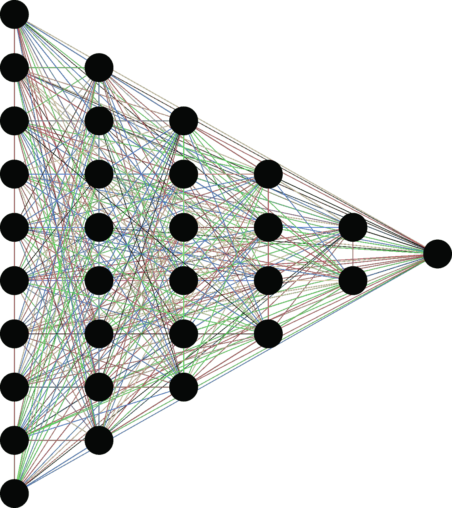
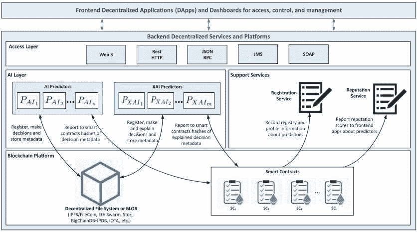
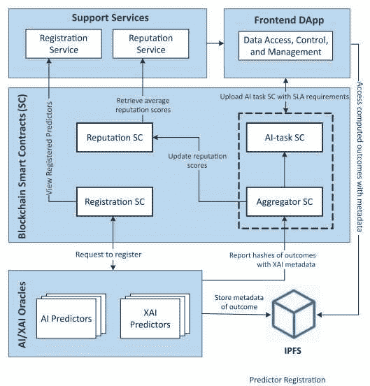
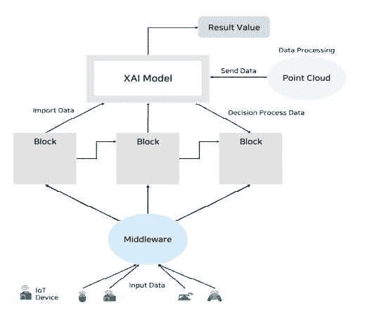

# 可信的人工智能可以用区块链技术开发出来吗？

> 原文：<https://medium.com/coinmonks/can-trustworthy-artificial-intelligence-be-developed-with-blockchain-technology-f85252b25536?source=collection_archive---------19----------------------->

**简介**

尽管在过去的几个世纪里，它见证了成百上千的重大事件，但人们总是会记住引发这些事件的发展。例如，20 世纪见证了两次主要的世界大战，国家、城墙和意识形态的崩溃，以及天文发现，但所有这些发展的导火索是本世纪初发生的工业革命。再说一次，我们所处的这个世纪见证了一个在一开始就杀死并将继续杀死数百万人的疫情，我确信它将见证其他星球上的殖民化，新的世界大战，也许是星球大战，思想、国家和信仰的崩溃，尽管这不会与我已经提到的任何事情一起被提及，引发它们的事情。人们将会记住它的网络革命。21 世纪开始得非常快，突然之间，随着计算机和互联网的出现，我们的生活开始发生变化，这些技术带来了人工智能和区块链技术。我们正在讨论如何通过利用彼此的优点来补充这两种技术的缺点，我们现在称之为革命。在本文中，我将解释我们如何通过使用区块链技术的可靠性、透明性和可解释性特征，即分散式人工智能，来解决人工智能技术的可信任度和可解释性问题。

Pixabay

**区块链技术**

随着计算机技术的广泛使用，数据的概念开始在我们的生活中普及。随着互联网技术的普及以及数据存储和数据安全的概念进入我们的生活，这种普及变成了一个问题。当时还发生了其他事情，2008 年的经济危机摧毁了对央行和金融机构的信任，还发布了白皮书。这份白皮书由中本聪发布，介绍了一种使用区块链技术加密的数字货币。中本聪将 2008 年的这场危机归咎于央行的麻木不仁和金融机构的贪婪。根据 its 的说法，目前的技术已经让我们有机会在没有这些机构的情况下管理我们的资金。中本聪在其发布的白皮书中声称，到目前为止，加密数字货币将解决金融机构和央行的问题，但如何解决呢？我们现在使用的所有法定货币实际上都是数字化的，中本聪提供了什么不同于这种数字化的东西？

在白皮书中，中本聪提出了中央银行和金融机构的问题，并强调了密码学，即作为解决方案的区块链技术，而不是数字货币技术，他是对的。因为如果我们看看最近的历史，大多数经济危机的起因是中央银行印了太多的钱，而金融机构用这些钱填满了他们的口袋。然而，结果，即高通胀和债务利息的螺旋上升给人们带来了大问题。比特币，更确切地说是其背后的技术，提供了有限的供应、分布式管理、挖掘、透明以及不变性。区块链技术允许价值转移，专家们不想在这方面将价值转移定性为信息转移，因为区块链技术提供了以比特币转移价值的机会。数字环境中的信息传输可以非常容易和简单地完成，但是突出区块链技术的分散化和可靠性特征使得这种传输过程不能像数字环境中的信息传输那样快。这些包括系统中的一些组件；数据块、分类帐、哈希、节点、挖掘、共识、PoW(工作证明)、PoS(利益证明)以及使用智能合约的分散式数据存储。

系统，也就是链条，是矿工创造的。比特币矿工每 10 分钟创造一系列数字。当矿工执行采矿操作时，块，以及当在这些块上创建的信息被处理时，分类帐被形成。我们称这个分类帐创建过程为哈希。我们可以将区块链比作杂货店的分类账，矿工每 10 分钟挖掘一页分类账，然后形成块，然后杂货商填充这些页并进行散列，这些填充的页创建分类账。这些记录现在由中央系统中管理该系统的机构保存和控制。目前，银行将客户的交易保存在自己的数据库中，并通过这些数据库管理这些交易。我们可以说，比特币的情况也是如此，我们可以称之为数据库的块，通过在其上记录数据形成的分类账，以及由这些分类账形成的区块链，在这个数据库中记录的数据，我们将其描述为价值，即加密货币，构成了这个数据库，管理它的是人，而不是持有它的人，这是中本聪提供的解决方案。目前，货币体系掌握在中央银行和金融机构手中，中央银行垄断了这些分类账的管理，金融机构将数据处理为分类账，也就是说，掌握在一个特定的中央集权的单一机构手中。加密货币的情况不同。因为系统不是由单个庞大的数据库组成的，而是由成千上万个分散的数据库组成的链条，也就是有哈希运算的块，通过加密一个接一个的连接起来。这个链条上有分散在世界各地的矿工，他们为这个系统涂上珐琅。矿工通过采矿过程创建链，将值输入分类账并执行哈希运算，换句话说，他们在不止一个矿工的批准下管理这一管理过程，并在进行这些操作时控制链。换句话说，不是数据库，而是将值处理到该数据库中的挖掘器和管理这些值的管理机制，如在中央系统中，以分散方式创建和管理的多个块，以及具有多个副本的链，其中这些块被链接到永不改变，是分散的、不可改变的，并且由于比特币区块链技术，它提供了可靠的系统。

Pixabay

这项技术并没有像比特币白皮书中公布的那样保持不变的形式。那天，中本聪用那份白皮书点燃了火花，其他所有的企业家都为之点燃了火花，今天出现了区块链和 web 3 趋势，我们或许可以称之为一场革命。Vitalik Buterin 在 2010 年后推出了以太坊加密货币。让这种加密货币脱颖而出的是将这种技术融入我们生活的智能合同，而不是区块链技术。尽管中本聪吹嘘加密数字货币比特币的加密和去中心化的一面，但这种货币也有数字化的一面，需要融入我们的生活。Buterin 在他的以太坊白皮书中通过将 Nick Szabo 的智能合同方法分散到区块链技术解决了这个问题。Nick Szabo 将智能合约定义为既非智能也非合约。它是一种软件，其最简单的形式是咖啡自动售货机，在此基础上，合同双方的要求由软件代码执行。Vitalik Buterin 发展了这项技术，将分散的应用程序集成到链中。我想举一个例子让你坐在你的脑海里；你有一块土地，你想把它卖掉换成以太坊加密货币，首先，你把这块土地转换成一个不可替换的代币，你铸造以太坊链，你的买家应该是以太坊的所有者，并且想用手中的以太坊购买一块土地。得益于一个去中心化的应用和它的智能合约，你在出售时拥有买方的以太坊，买方拥有令牌化的土地，也就是估价的土地，所有权是在出售时通过哈希链完成的，智能合约执行整个哈希过程。智能合约成为加密货币、比特币或以太坊与现实生活之间的桥梁，是管理链条与现实生活之间交易的桥梁。这项技术将成为管理人工智能、分散式应用程序和用于分散式人工智能的区块链之间的事务的参与者，这也是本文的主题。

Pixabay

那一天，中本聪点燃了火花，像他这样的企业家和聪明人无意停止。Web 2 革命发生后，数据成为我们生活的中心，存储和管理数据成为一个大问题。随着云技术的普及，存储问题似乎不再是个人的问题，但这一次，安全已经成为企业和个人的一个大问题。数据、数据访问、数据安全和管理对于一个团队来说也是一个大问题。这群人工智能开发者，我会在下面讲解人工智能技术的同时详细讲一下这个。那么什么是数据呢？今天，仅仅是几组需要几秒钟才能传输的数字，还是构成加密货币的数值？如果保存、存储和管理数据对我们今天如此重要，那么所谓的数据不仅仅是一组 1 和 0 的数字。所以，我们为什么不求助于区块链技术来管理、存储或保护它呢？我们确实这么做了。虽然有新的创业公司，但疯狂的企业家们把木头扔进了 web 3 革命的火中，他们通过使用区块链技术找到了解决这个问题的方法。它使用分布式数据库、智能合同协议和透明、分布式、可靠和加密的管理模型(得益于区块链技术)来提供分散式数据存储服务。分布式数据存储是分布式人工智能的另一个不可或缺的组成部分，就像智能合同一样。

**人工智能技术**

把人所具有的属于人类的、证明智能存在的特征，比如决策、感知、解决问题等，用人工智能、机器学习、深度学习的方法带到机器上。其实我们可以说，机器应该是智能化的，或者说是进化的。通过用两种语言教授所有的单词、规则和模式，你可以让机器在两种语言之间进行翻译，或者你可以教授迄今为止经历的所有肺癌形式，你可以让软件从放射图像中诊断肺癌。事实上，问题的本质是，我们可以通过使用我们迄今为止已知和存档的数据，并使用两种方法，即机器学习和深度学习方法一起或单独使用，将机器转化为像我们一样的智能生物。不应该忽视的是，他们可能是像我们一样的智慧生物，而不是更好或不同种类的智慧生物，因为我们通过展示我们迄今为止所经历的数据来教他们变得聪明。事实上，这是人工智能的主要原因，也是我写这篇文章的目的，以及对我们构成危险的问题。问题不在于人工智能或他们的工作方法，问题在于我们，我们把我们迄今经历过的和未来将要经历的错误教给他们，由于学习方法的复杂性，我们无法预见和预防错误。

Pexels

我想详细说明一下我上面提到的问题，假设我们正在编写一个人工智能支持的智能面部识别系统算法，从大约数百万人身上获取的生物数据将用于执行机器和该算法的深度学习。然而，这些数据的提取是一个自 20 世纪 50 年代以来持续了大约 70 年的过程。我们提取了这个数据，更准确的说，是几个世纪以来歧视黑人和女性的人类。将用所有这些数据教授的人工智能将识别一个白皮肤的男性有 99%的成功率，识别一个白皮肤的女性有 95%的成功率，但这个比率会随着肤色变暗而降低。它甚至可能没有描述一个肯尼亚妇女，而且有一个歧视的例子。因为我们多年来一直歧视黑人 phylon 和女性，我们曾经剥夺了他们连一个人应有的基本权利，而在这个时期创造的或者在这个时期影响下创造的数据必然会包含那种歧视，那种歧视就好像我们把它编码成了我们在镜子里的映像。会出现在人工智能算法中。人工智能技术首次进入我们的生活是在电影中，后来在简单的研究中，当我们在电影中看到它时，我们为这项技术的技能感到兴奋，但它进入我们的生活，却没有认识到我们是人，也没有将我们定义为猴子，这引起了失望，这只是一个开始。人们第一次见面就对人工智能产生了信任的问题，但是这怎么解决呢？人工智能能像本文题目中问的那样可靠、可解释、透明吗？随着疫情的到来，我们已经离开工作和学校将近四分之一年了。在英国，学生必须继续他们的半学期教育并参加考试，以便能够在大学定居，但这是不可能的，因为疫情和英国政府遵循不同的道路。根据他们的说法，一种人工智能算法可以利用学生以前的考试成绩和其他参数计算出最公平的分数，当分数公布的那一天到来时，学生们感到震惊。该算法降低了生活在贫民窟并在这些地区上学的学生的分数，因为该算法将做深度学习和研究的数据包括生活在这些地区的学生将失败的歧视，从而导致歧视性的学习和研究。

人工智能的学习方法、工作方法、判别原因，我们或多或少都有所了解。如果该数据包含歧视，则该算法学习偏见并处理歧视。让我们在解决方案之前再多关注一点原因，学习和工作涉及歧视的原因。我也在题目开头写过学习方法；机器学习和深度学习。机器学习是一种不太复杂的方法，在这种学习方法中可以控制歧视，但深度学习不是这样。它是一种学习形式，用深度神经网络来工作和学习深度学习方法。学习后的歧视发生在这些网络中。我们将深度神经网络和这里发生的算法定义为黑盒，因为在这个过程中，输入和输出无法协调，输出的结果与输入不匹配。在发表的学术文章中，黑盒和透明性被定义为与深度学习一起发生的学习中的两个相反的概念。下面我分享一个深度神经网络模型，供大家更好的理解。

Pixabay

在模型中可以看到，在深度神经网络，也就是深度学习的学习过程中，在学习部分或输出后，很难预测在获得的数据中出现的问题。迄今为止收集的使人工智能具有智能的数据和学习模型都在人工智能的输出中引起了许多问题，并且在当前的模型中可解释性、解释和透明性非常困难。那么，我们将如何确保透明度，我将在下面解释去中心化人工智能问题的同时详细解释。

**分散式人工智能**

在文章的开始，我声称我们可以用一种技术的优点来掩盖另一种技术的缺点。人工智能的学习方法由于该方法中使用的数据以及在与人工智能一起工作时存在许多问题，但由于其当前的流行，它在本文中经历了歧视。那么，在去中心化和分散的模型中学习、工作、数据存储、收集和管理所有这些工作的人工智能可能会导致像现在这样多的问题吗？那么完全去中心化人工智能能解决这些问题吗？

*Mohamed Nassar, Khaled Salah, Muhammad Habib ur Rehman, Davor Svetinovic/ Blockchain for explainable and trustworthy artificial intelligence/ Wiley interdisciplinary reviews: data mining and knowledge discovery 10/ 2020*

上图是采用区块链技术的去中心化人工智能学习和工作方案。让我们先看一下原理图的组成部分。首先是正面 DApps。由于前端 DApps，不同的用户、感兴趣的人和各方将能够支持配置人工智能的训练和工作过程、各种参数化、数据可访问性、输出决策、开发和记录过程以及解释的过程。第二层是接入层。由于有了链路层，可以使用多种数据传输协议。例如，由于 Web3 接口，可以在 DApps 和区块链之间建立连接。或者，使用 JSON-RPC API，可以在联网平台和以太坊区块链网络之间建立连接。多亏了 Rest HTTP，在云数据中心和区块链之间建立连接将成为可能。第三是 AI 层。这一层是执行人工智能过程的层，这一层包含两种类型的人工智能模型或者更确切地说是预测器。其中一个是正常的人工智能预测器，另一个是 XAI，它在黑盒上工作，这是一个人工智能预测器，它将以更可预测、更可解释的方式工作。两种类型的预测节点与服务器前端 DApps 协同工作。其中一个人工智能服务器处理原始数据，而另一个管理不太有趣的操作，如数据清理，噪声消除，离群点提取或特征提取，或困境缓解。或者服务器直接在处理过的数据上使用学习模型并得出结论。人工智能预测器通过传统的黑盒算法处理数据，而 XAI，即可解释的人工智能预测器，通过不同的机制来解释研究结果，并在此过程中与正常的人工智能进行通信。另一部分是支持服务。这个板块由两个部分组成，一个是注册服务，一个是信誉服务，也就是评分服务。注册表记录控制着生态系统中的参与者和成员。另一方面，评分服务通过加密货币评估人工智能预测器的分数，并相应地给予奖励和惩罚。当然，所有这些管理过程都是通过智能合同进行的。最后一部分是区块链平台、智能合约、去中心化数据存储系统。这个单元的存在是为了存储数据和管理整个生态系统，智能合约单独管理所有服务和单元，所有这些都在它们自己内部。该模型包括 4 种类型的智能合同，管理支持单元的信誉和注册合同，管理人工智能研究的 AI-task 合同，以及最后作为层间桥梁的聚合器合同。

*Mohamed Nassar, Khaled Salah, Muhammad Habib ur Rehman, Davor Svetinovic/ Blockchain for explainable and trustworthy artificial intelligence/ Wiley interdisciplinary reviews: data mining and knowledge discovery 10/ 2020*

在第一张图中，我们了解了系统的层次和参与者。在这个图表中，我们将检查这些参与者如何相互合作，作为这项研究的结果，我们将检查是否可以创建一个透明、可解释和可靠的人工智能，以回答我在文章标题中提出的问题。分散的应用程序依赖于后台运行的支持服务和分散的平台，即智能合同，以及由于连接层而产生的分散的数据备份系统。得益于这些应用，感兴趣的各方和各方具有配置、配置各种参数、选择预测器类型和数量、访问数据、执行评分和记录操作以及解释它们的能力。分散式应用程序能够选择已注册的预测器，并定义将管理系统的 SLA(服务级别协议)。此外，分散的应用程序将 AI-Task 和聚合器智能合同上传到系统，系统将执行系统管理操作，如管理 SLA 协议、提供数据流、选择预测器。在所有这些过程中，通信发生在区块链网络上，因此由于区块链的可解释、不变和透明的特性，该系统变得可靠。如果预测器接受来自分散式应用的 SLA 协议或 AI 预测协议，则聚合器使用智能合约执行协议的转移。*“这种转账可能是一种加密汇款”(Salah and Hasan 2018。)*它实际上是一种存款，如果过程没有完成就会消失，但如果继续成功，回报就像是一种收益，会随着加密货币不断增加。因为当来自预测器的正面和负面结果和预测被发送到智能合约时，加密货币将被发送以换取转移的过程将继续。

有预测器的层实际上是这样一个层，其中有不止一个传统的人工智能和有针对性的可解释的人工智能服务器，并将与可靠的数据库一起工作。由于这些预测器，不同类型的人工智能系统，以及在其基础上的不同类型的学习，相同的数据将出现不同类型的结果，这些结果将到达智能合同和分散的应用程序以及相关的人，并可以被审计，比较和解释。最后，根据去中心化应用的反馈，人工智能系统将继续按照最佳结果工作。由于整个过程，我已经描述了将发生在区块链，这些交易将始终是透明的审计，没有任何哈希，数据或结果在所有阶段被销毁。

*Sunghyuck Hong/ Explainable Artificial Intelligence Study based on Blockchain Using Point Cloud/ Journal of Convergence for Information Technology/ 2021*

Sunghyuck Hong 认为，黑匣子问题可以通过基于区块链的分散数据存储方法来解决。据洪介绍，存储在区块链中的数据可以在进入人工智能算法之前进行检查，如果在退出算法后出现问题，可以再次检查，这要归功于区块链技术的透明性和不变性。根据第一种方法，洪规划了一种更简单的去中心化人工智能。在物联网 IOTs 的帮助下，原始数据将从外部收集，然后将有一个中间服务器来管理这些原始数据，以便这个服务器可以处理这些数据，这要归功于连接层。可以散列到区块链。之后，从区块链提取数据并输入人工智能算法，以及将数据从算法散列到区块链的过程将随时可审计，因为整个过程将在链上。在这个领域工作的专家认为，由于区块链技术，可靠的人工智能可以被创造出来。下面，我将评估由于人工智能技术的缺点而可能受到损害的使用领域，但由于区块链技术，这些损失将被消除。

Pixabay

**结论**

每项新技术从第一天起就有利弊。如果我们用这些优点来弥补其他缺点，我们就创造了一个巨大的互联链，就像区块链科技一样。任何创新都不能仅仅因为有探索性的损害就被抛弃。重要的是让那些发现适应我们的生活，这样我们才能在那些发现中发展。网络 3 巨头把我们从一个中心带到一个大链条中。现在，我的数据被盗，央行制造了通胀，人工智能将我排除在外，这不仅仅是担忧，我的数据在链上是安全的，矿工给了我控制我们的钱对抗通胀的机会，人工智能已经完成了区块链比我们更聪明的进化。

**参考文献**

1.  [Thang N. Dinh，My T. Thai/ AI 和区块链:AI/ 2018 的颠覆性集成/封面功能未来](https://www.researchgate.net/publication/328085550_AI_and_Blockchain_A_Disruptive_Integration)
2.  [sak thi ku maresh 博士，K B Priya Iyer 博士/分散式人工智能支持的区块链网络模型/土耳其计算机和数学教育杂志/ 2021](https://turcomat.org/index.php/turkbilmat/article/download/5074/4252)
3.  亚历杭德罗·巴雷多·阿里埃塔、娜塔莉亚·迪亚斯-罗德里格斯·b、哈维尔·德尔·塞尔、阿德里安·本尼托、西哈姆·塔比格、阿尔韦托·巴尔巴多·h、萨尔瓦多·加西亚·g、塞尔吉奥·吉尔-洛佩兹、丹尼尔·莫利纳、理查德·本杰明斯、拉贾·查蒂拉夫、弗朗西斯科·埃雷拉/可解释的人工智能(XAI):概念、分类学、面向负责任的人工智能的机遇和挑战/信息融合/ 2020 年
4.  [Mark G. Core，H. Chad Lane，Michael van Lent，Dave Gomboc，Steve Solomon 和 Milton Rosenberg/构建可解释的人工智能系统/会议:会议录，第 21 届全国人工智能会议和第 18 届人工智能创新应用会议/ 2006](https://www.researchgate.net/publication/221603805_Building_Explainable_Artificial_Intelligence_Systems)
5.  [Vasco Lopes，Lu s a . Alexandre/区块链与机器人和人工智能集成概述/ 2018](https://www.researchgate.net/publication/328016556_An_Overview_of_Blockchain_Integration_with_Robotics_and_Artificial_Intelligence)
6.  Plamen P，Eduardo A. Soares，Richard Jiang，Nicholas I. Arnold，Peter M. Atkinson/可解释的人工智能:分析综述/ WILEY/ 2021
7.  [Mohamed Nassar，Khaled Salah，Muhammad Habib ur Rehman，Davor Svetinovic/block chain for explaining and trust artificial intelligence/Wiley 跨学科评论:数据挖掘和知识发现 10/ 2020](https://www.researchgate.net/publication/336641970_Blockchain_for_explainable_and_trustworthy_artificial_intelligence)
8.  [Sunghyuck Hong/基于使用点云的区块链的可解释人工智能研究/信息技术融合杂志/ 2021](http://203.250.217.22/article/JAKO202124458099065.pdf)
9.  [Erik Karger/结合区块链和人工智能—文献综述和最新发展水平/会议:2020 信息系统国际会议/ 2020](https://www.researchgate.net/publication/350734729_Combining_Blockchain_and_Artificial_Intelligence_-_Literature_Review_and_State_of_the_Art)
10.  [比特币开采的能源消耗/剑桥经济学工作论文:1948 年/Sinan kufeo Lu，Mahmut oz kuran/24 mays 2019](https://econpapers.repec.org/paper/camcamdae/1948.htm)
11.  [区块链技术的最新发展及其对能源消耗的影响/ Johannes Sedlmeir、Hans Ulrich Buhl、Gilbert Fridgen、Robert Keller/24 ubat 2021](https://dblp.org/rec/journals/corr/abs-2102-07886.html)
12.  [当前加密货币对比分析/ ICISSP 2018/拉拉·毛里、斯泰尔维奥·西马托、埃内斯托·Damiani](https://www.researchgate.net/publication/322875051_A_Comparative_Analysis_of_Current_Cryptocurrencies)
13.  [加密货币理论、区块链和分布式系统以及环境影响/加密货币和区块链技术应用/p . Mary Jeyanthi/2020 年 5 月 22 日](https://www.semanticscholar.org/paper/THEORIES-OF-CRYPTOCURRENCY%2C-BLOCKCHAIN-AND-SYSTEMS-Jeyanthi/f35aedf0052ef21603e327e9973c8f3c563d31a7)

> *加入 Coinmonks* [*电报频道*](https://t.me/coincodecap) *和* [*Youtube 频道*](https://www.youtube.com/c/coinmonks/videos) *了解加密交易和投资*

# 另外，阅读

*   [Bookmap 点评](https://coincodecap.com/bookmap-review-2021-best-trading-software) | [美国 5 大最佳加密交易所](https://coincodecap.com/crypto-exchange-usa)
*   最佳加密[硬件钱包](/coinmonks/hardware-wallets-dfa1211730c6) | [Bitbns 评论](/coinmonks/bitbns-review-38256a07e161)
*   [新加坡十大最佳加密交易所](https://coincodecap.com/crypto-exchange-in-singapore) | [购买 AXS](https://coincodecap.com/buy-axs-token)
*   [红狗赌场评论](https://coincodecap.com/red-dog-casino-review) | [Swyftx 评论](https://coincodecap.com/swyftx-review) | [CoinGate 评论](https://coincodecap.com/coingate-review)
*   [投资印度的最佳密码](https://coincodecap.com/best-crypto-to-invest-in-india-in-2021)|[WazirX P2P](https://coincodecap.com/wazirx-p2p)|[Hi Dollar Review](https://coincodecap.com/hi-dollar-review)
*   [加拿大最好的加密交易机器人](https://coincodecap.com/5-best-crypto-trading-bots-in-canada) | [库币评论](https://coincodecap.com/kucoin-review)
*   [用于 Huobi 的加密交易信号](https://coincodecap.com/huobi-crypto-trading-signals) | [HitBTC 审核](/coinmonks/hitbtc-review-c5143c5d53c2)