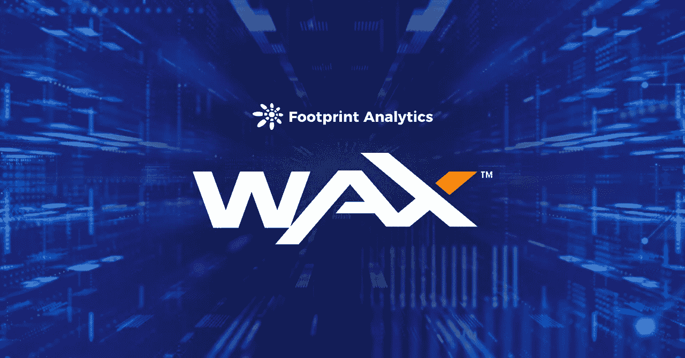
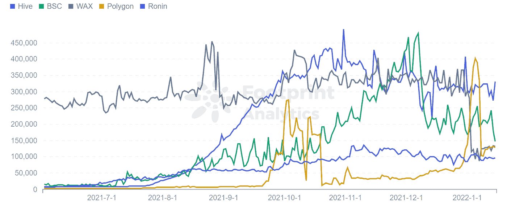
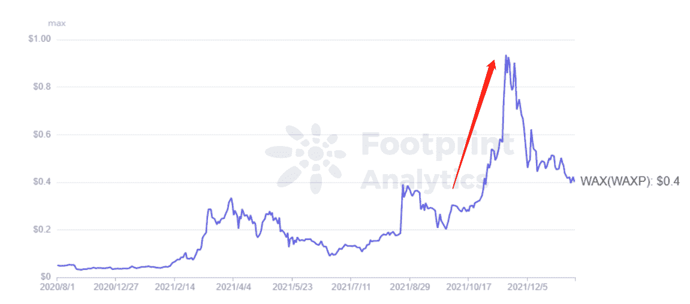
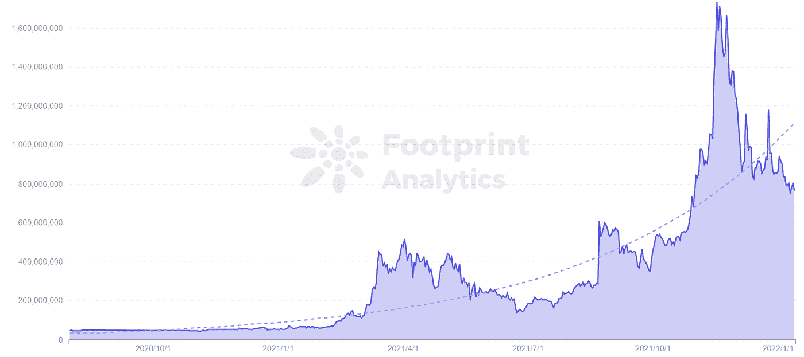
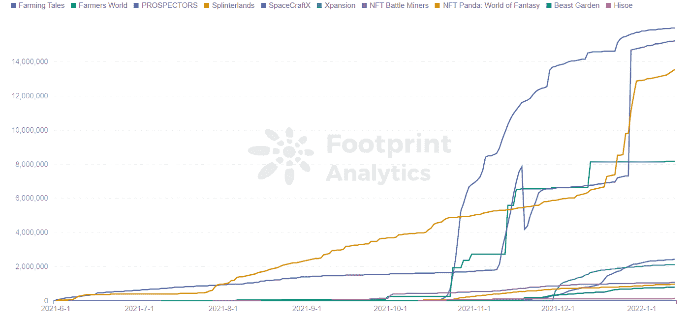

# 2022 年 WAX 还能保持 GameFi 的前列吗？|足迹分析

> 原文：<https://medium.com/coinmonks/can-wax-remain-at-the-forefront-of-gamefi-in-2022-footprint-analytics-b102031c35b3?source=collection_archive---------16----------------------->

WAX 是为 GameFi 和 NFTs 打造的链条，拥有丰富的游戏生态系统。

2022 年 1 月杨永晴@footprint.network

数据来源:足迹分析— [蜡仪表板](https://www.footprint.network/guest/dashboard/wax-dashboard-fp-9927b1df-8f8d-4a6c-b097-3f93e712470a?channel=u-QytebM)

11 月 7 日，农民世界发生了一起硬币失窃事件。可能是游戏“外挂”脚本改变了用户的认捐地址，导致用户无法获取 ram 资源。农民世界是[蜡](https://www.footprint.network/guest/dashboard/wax-dashboard-fp-9927b1df-8f8d-4a6c-b097-3f93e712470a?channel=u-QytebM#secret=0F438D9D4A7925B5CEBFF5929609EDF8)链**上的一款主要游戏，给玩家造成过亿人民币的损失。**

**这是自链以来对 WAX 生态系统的最大攻击，链专注于 2019 年 6 月推出的 [GameFi](https://www.footprint.network/guest/dashboard/game-fi-overview-fp-c358ff97-6bf6-491c-b9fd-645fb8262e3f?channel=u-QytebM) 和 [NFT](https://www.footprint.network/guest/dashboard/nft-dashboard-fp-b374b358-6e2f-4587-a52b-a69ebbb91bfa?channel=u-QytebM#secret=DA601985B1CD8DCF912829C1188A05AA) 项目。**

**然而，当其他连锁店在他们的旗舰项目受到攻击后失去了大量的信任和用户数量时，WAX 仍然是 GameFi 区块链用户的前三名，仅次于 Hive 和 BSC。**

**其独特的优势和极其强大的生态系统意味着 WAX 不太可能去任何地方，至少在这个 GameFi 和元宇宙周期内。在本文中，我们将看看是什么让这个链条与众不同。**

****

***Footprint Analytics — Top 5 Number of GameFi Users Cross-chain***

**甘美菲和 NFT 的蜡**

**WAX 是一家专注于游戏和数字收藏的区块链。mainnet 于 2019 年 6 月上线，基于 EOS 改编，继承了委托利益证明(DPoS)共识机制。所以，它自然配备了高性能和低油费。**

**为了发展其 [NFT](https://www.footprint.network/guest/dashboard/nft-dashboard-fp-b374b358-6e2f-4587-a52b-a69ebbb91bfa?channel=u-QytebM#secret=DA601985B1CD8DCF912829C1188A05AA) 生态系统，WAX 积极与游戏公司、艺术家和电影特许经营商合作，创建和发行 NFT，包括 Topps、Capcom、Deadmau5、Weezer 和 SAW，使其成为领先的 NFT 娱乐生态系统。**

**在游戏方面，WAX 的稳定基础层已经使几十个项目蓬勃发展，包括农民世界，夹板地，外星人世界和农业故事。**

# **蜡的优点**

*   **与 BSC 相比，WAX 不仅支持高频率的事务，而且每秒可以处理多达 8，000 个事务，以实现快速处理。**
*   **当发送和制作 NFT 时，交易基本上是即时和免费的。**
*   **蜡市场是巨大的，使用简单的交易工具让玩家进入全球市场，允许交易者在一个分散的平台上建立自己的虚拟商店。**

**这些优势吸引了大量的游戏开发者和用户。**

# **令牌 WAXP**

**用户可以使用 WAXP，WAX 的令牌，来:**

*   **木桩。当 WAXP 被搁置时，它增加了令牌的稀缺性，(因为它被搁置和存储，直到用户收回它。)**
*   **投票。下注代币的蜡像用户也获得了为区块制作人投票的权利，并获得投票奖励。**
*   **买 NFTs。WAXP 可用于通过任何区块链中最大的 NFT 生态系统购买 NFT，包括来自 30，000 多个 DApps 和 NFT 项目的 6，000 多万 NFT 资产。**

**根据 Footprint Analytics 的数据，WAXP 的价格截至 1 月 13 日为 0.40 美元，此前两个月由于蜡像游戏的爆发而上涨。它的最高纪录是 11 月 17 日的 0.94 美元，当时 Farmer's World 宣布的 IDO 活动引起了玩家的狂热。**

****

***Footprint Analytics — Token Price Trend of WAXP***

**2021 年 11 月，WAX 的市值也增长到了 17 亿美元的 ATH。**

****

***Footprint Analytics — Token Market Cap Trend of META***

**然而，在过去的两个月里，由于以下原因，蜡的象征性价格和市场价值一直在下降。**

*   **WAX 上的农民世界游戏没有像 11 月宣布的那样推出 IDO，因此降低了用户对农民世界游戏的信心。**
*   **11 月初，不少用户反馈，由于超过最大速率，导致蜡钱包创建频繁受阻，被禁止注册。**
*   **价格由市场决定。当 WXAP 暴涨的时候，玩家材料价格就回滚了。当材料价格越低，差距越小时，新玩家获得的收益越多。**

# **WAX 的游戏生态系统**

**目前在蜡生态系统中有 52 个 DApps。**

**从排名前十的游戏项目来看，截至 1 月 13 日，WAX 上交易量最大的是 Farming Tales(1598 万美元)，其次是 Farming World(1524 万美元)，第三是 PROSPECTORS(1354 万美元)。**

****

***Footprint Analytics — Top 10 Game Protocols Trading Volume***

****蜡像最受关注的游戏之二****

*   **农业故事**

**一款农场管理游戏，Farming Tales 已经上线 3 个月左右，将 NFTs 与线下实体经济相结合。玩家可以选择耕种资源或拥有各种植物、树木，甚至一些产蜜蜜蜂的实际权利。**

**例如，拥有一个蜂箱将生产真正的蜂蜜，你可以选择拥有它。玩家也可以选择在市场上出售产品，并收到蜡作为回报。**

*   **探矿者**

**勘探者是一个大型多人在线实时经济策略游戏，基于 WAX 和 EOS 区块链。**

**游戏以 19 世纪的西部荒野为背景，地图显示了土地瓷砖和地上资源，如木材和石头。地下也隐藏着必须寻找的资源，如煤、粘土和黄金。玩家有机会通过发现新的土地和资源获得数字黄金。**

# **摘要**

**WAX 丰富的生态系统使其保持在 GameFi 和数字收藏品的最前沿，为其新兴游戏提供了大量的用户基础。**

**此外，WAX 利用支持游戏所需的高吞吐量吸引连锁游戏开发商，使用简单的工具将玩家带入全球市场。**

****什么是足迹分析****

**足迹分析是一个一体化的分析平台，用于可视化区块链数据和发现见解。它清理和整合链上数据，因此任何经验水平的用户都可以快速开始研究令牌，项目和协议。凭借一千多个仪表板模板和一个拖放界面，任何人都可以在几分钟内构建自己的定制图表。发掘区块链数据，利用足迹进行更明智的投资。**

***足迹网址:*[*https://www . Footprint . network*](https://www.footprint.network/)**

***不和:*[*https://discord.gg/3HYaR6USM7*](https://discord.gg/3HYaR6USM7)**

***推特:*[*https://twitter.com/Footprint_DeFi*](https://twitter.com/Footprint_DeFi)**

***电报:*[*https://t.me/joinchat/4-ocuURAr2thODFh*](https://t.me/joinchat/4-ocuURAr2thODFh)**

***Youtube:*[*https://www.youtube.com/channel/UCKwZbKyuhWveetGhZcNtSTg*](https://www.youtube.com/channel/UCKwZbKyuhWveetGhZcNtSTg)**

> **加入 Coinmonks [电报频道](https://t.me/coincodecap)和 [Youtube 频道](https://www.youtube.com/c/coinmonks/videos)了解加密交易和投资**

## **也阅读**

** [## 杠杆代币[多头代币]终极指南

### 杠杆化令牌是具有杠杆化风险敞口的 ERC20 令牌，不考虑保证金、要求、管理…

medium.com](/coinmonks/leveraged-token-3f5257808b22)  [## 40 个最佳电报频道，用于加密、电影、表演和演讲| CoinCodeCap

### 免费下载所有电影。德国免费加密信号。下载讲座。CoinCodeCap 经典，网飞电影等。是……

coincodecap.com](https://coincodecap.com/best-telegram-channels)  [## Keevo 钱包点评:是最安全的硬件钱包吗？2022 | CoinCodeCap

### 在这篇 Keevo Wallet 评论中，我们将讨论他们如何改变我们看待硬件钱包的方式。基沃是…

coincodecap.com](https://coincodecap.com/keevo-wallet-review)  [## 2022 年 5 大最佳社交交易平台

### 5 个最佳社交交易平台阅读加密产品评论和比较，了解比特币交易和…

coincodecap.com](https://coincodecap.com/best-social-trading-platforms)  [## BlockFi 评论:2022 年的利弊和利率

### 今天，我们提出了一个全面的 BlockFi 评论，这是一个成立于 2017 年的加密贷款平台，拥有其…

coincodecap.com](https://coincodecap.com/blockfi-review)  [## 如何在印度购买比特币？2021 年购买比特币的 7 款最佳应用[手机版]

### 如何使用移动应用程序购买比特币印度

medium.com](/coinmonks/buy-bitcoin-in-india-feb50ddfef94)  [## 加密税务软件——五大最佳比特币税务计算器[2021]

### 不管你是刚接触加密还是已经在这个领域呆了一段时间，你都需要交税。

medium.com](/coinmonks/best-crypto-tax-tool-for-my-money-72d4b430816b)  [## 9 个 2022 年最值得购买的密码| CoinCodeCap

### 9 个 2022 年最值得购买的加密产品阅读加密产品评论和比较，了解比特币交易和…

coincodecap.com](https://coincodecap.com/crypto-to-buy-in-2022)  [## 存储比特币的最佳加密硬件钱包 2022 | CoinCodeCap

### 硬件钱包是我们存储加密资产的唯一可靠选择。在本文中，我们将讨论 8 个…

coincodecap.com](https://coincodecap.com/best-hardware-wallet-bitcoin)  [## Pionex 评论 2021 |免费加密交易机器人和交换

### Pionex 是为交易自动化提供工具的后起之秀。Pionex 上提供了 9 个加密交易机器人…

medium.com](/coinmonks/pionex-review-exchange-with-crypto-trading-bot-1e459d0191ea)  [## 2022 年密码交易员的三大电报渠道

### 加密信号是来自专业交易者的交易想法，以特定的价格或价格买卖特定的加密货币

medium.com](/coinmonks/top-3-telegram-channels-for-crypto-traders-in-2021-8385f4411ff4)  [## 2022 年 5 个最佳免费加密投资组合追踪器

### 在这篇文章中，我们将带你通过一些最好的免费加密投资组合追踪器，让你选择最好的…

coincodecap.com](https://coincodecap.com/free-crypto-portfolio-trackers)**