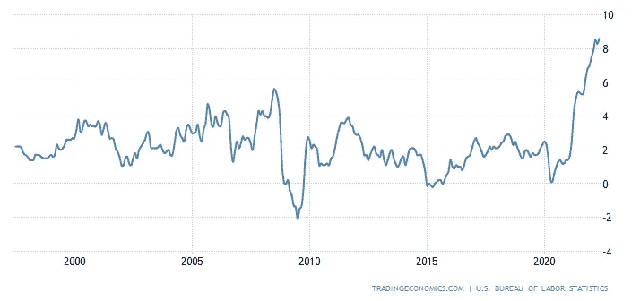
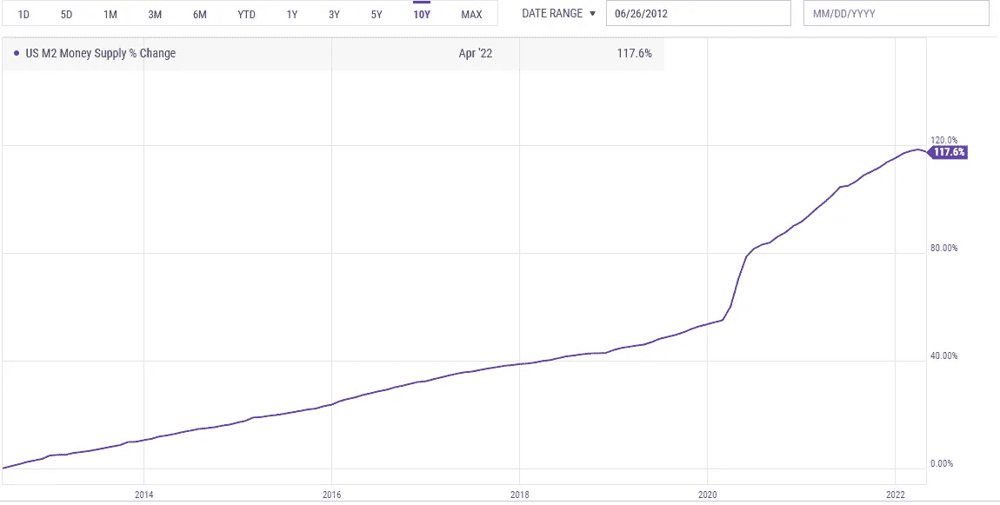
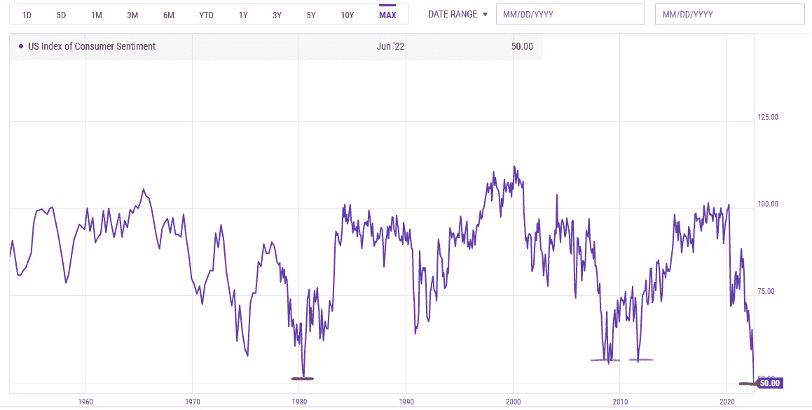
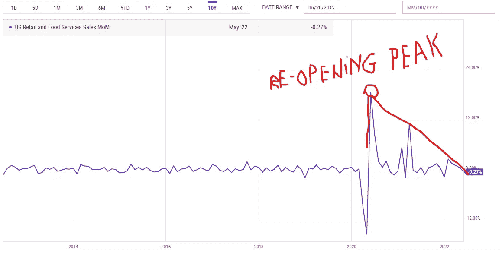

# 我们能避免衰退吗？经济衰退期间，加密技术会发生什么？

> 原文：<https://medium.com/coinmonks/can-we-avoid-a-recession-what-could-happen-to-crypto-during-a-recession-88e72def47f6?source=collection_archive---------20----------------------->

我们能避免衰退吗？这是亿万富翁、分析师和金融机构争论的问题之一。有些人说是的，有些人警告即将到来的衰退的严重性，而有些人说我们已经陷入衰退了。我肯定不知道正确的答案，我能做的就是看一些数据，美联储的策略是什么，让我的直觉得出结论，因为没有人真正知道。我主要谈论美联储，因为美国市场对加密市场有一些最大的影响(向机构问好)，并且仍然是世界上的超级大国之一。

令许多人不安的问题是 8.6 %的通胀率，当最新数据公布时，这确实令许多人感到意外。

25 years inflation chart

我们可以在图表上清楚地看到，目前的通胀水平是过去 25 年来从未有过的，实际上，我们必须追溯到 40 年前的 1982 年，当时的通胀水平如此之高。

造成这种通胀水平的因素有很多，例如 2007-2008 年全球金融危机后过去十年的量化宽松，在此期间流通中的货币供应量增加了一倍多(见下图)，比新冠肺炎封锁还要多——更多的印刷和财政刺激，以及今天仍然存在的供应链问题，现在我们有了乌克兰-俄罗斯战争，这给食品价格、石油和天然气带来了进一步的压力。

Money supply grew with a staggering 117% in the last decade

8.6%的通胀率并没有向我们展示残酷的现实，以及我们赚的钱因为 CPI 数字的操纵行为而失去购买力的速度有多快。例如，[肉/禽/鱼/蛋这一篮子价格上涨了 14.2%，](https://www.ers.usda.gov/data-products/food-price-outlook/summary-findings/#:~:text=Poultry%20prices%20are%20now%20predicted,percent%20above%20May%202021%20prices.)房价上涨了 16%，[汽油上涨了 48.7%，](https://www.usinflationcalculator.com/inflation/gasoline-inflation-in-the-united-states/)。通胀是 8.6 %吗？问得好，正式回答是。

密歇根大学在 2022 年 6 月进行的全国调查的另一个重要指标消费者情绪创下历史新低。该数据集可以追溯到 70 年前，现在的情绪甚至比 2008 年金融危机期间还要低。我猜这里有什么东西坏掉了..我们的消费者信心达到了历史最低点，我们甚至还没有正式进入衰退。消费者信心与 70 年代末和 80 年代初的滞胀危机一样低迷。

Consumer sentiment index- Touching the lows from the early 1980’s, lower than 2007–2008 crisis

零售支出是经济活动同比负增长的另一个指标。许多零售商报告了 2022 年令人失望的结果。当每个人都疯狂购物、旅游等时，从封锁放松到重新开业，零售支出迅速下降。我猜是呆在室内的监禁期后的一种压力释放形式。

与人们对连续两个季度 GDP 负增长的衰退的定义相反，美国- NBER-国家经济研究局(一个私人非营利组织)宣布衰退的组织对衰退的定义有所不同——“衰退是指经济活动在整个经济中蔓延并持续几个月以上的显著下降。”如上所示，在图表中我们可以注意到经济活动的下降——零售和消费者情绪，两个重要的指标。今年第一季度，美国国内生产总值增长为负 1.4%，预测下一次读数为 0%。我们已经深陷衰退之中，只是在等待确认。

下一步是什么？尽管美联储旨在通过加息来破坏需求以对抗通胀的货币政策可能不会取得良好效果，但因此，软着陆将难以实现，经济衰退极有可能发生，失业率将大幅上升，通胀仍将持续，如上所述，食品、石油和天然气价格可能会抵制加息。例如，破坏需求不会影响石油/天然气价格，也不会解决全球供应链问题，尽管失业率将会上升，但高通胀仍会给价格带来压力。这一结果将对普通美国人(欧洲、英国)产生一些相当糟糕的后果，如果不是最坏的，也不会有更好的结果..因为欧洲仍在继续他们的 QE)

为了得出我关于衰退的结论，我认为以目前美联储对抗通胀的策略，我们无法避免衰退，在最坏的情况下，我们甚至无法对抗来自石油、天然气和食品价格的巨大通胀压力。

**密码将会怎样？**

加密货币被大多数人视为一种高风险资产类别，由于美联储收缩资产负债表，利率高，市场流动性低。通常情况下，我们不会有积极的价格行动，可能会比当前价格低得多，或者价格行动起伏不定。

然而，我有两个关于加密的理论。老实说，我希望他们发挥出来，因为我在这个领域投入了大量资金。

我的理论可以追溯到过去十年货币供应量的增加，增加了一倍多，加密市场的总市值不到 1 万亿美元，与黄金、债券、股票、货币市场等其他资产类别相比，这只是很小的一部分。因此，随着资本仍在该空间流动，现有的资金量，随着大量人才从传统市场转移到这一新兴资产类别(DEFI/元宇宙/ NFTs ),下一个大型创新/公司很可能将从该空间出现，因此，该行业将走出衰退，并在未来 5 年内比任何其他资产类别增长得更快，总市值目前不到 1 万亿美元，至少将达到惊人的 5-10 万亿美元。许多项目将在接下来的一段时间内夭折，所以对你计划投资的任何项目都要极度谨慎和尽职调查。我的预测是针对整个行业，而不是某个特定的项目。

我的第二个理论是，美联储将在今年晚些时候或明年初调整其战略，而不是按计划加息，甚至再次降息，这可能会导致我们在股票和密码方面再次出现**暂时性**抛物线运行，然而，这只会恶化未来的前景，让我们面临更复杂的情况。

我希望你喜欢这篇文章，并对我们的未来有一个更清晰的认识。祝你晚上愉快！

**免责声明**:我必须警告你，有些观点可能是我个人的偏见，但是，我会尽我所能为你提供关于特定主题的客观观点。我不是理财顾问，所有文章只会有严格的教育目的。

> 加入 Coinmonks [电报频道](https://t.me/coincodecap)和 [Youtube 频道](https://www.youtube.com/c/coinmonks/videos)了解加密交易和投资

# 另外，阅读

*   [西班牙 5 大最佳文案交易平台](https://coincodecap.com/copy-trading-spain)
*   [Pionex 双重投资](https://coincodecap.com/pionex-dual-investment) | [AdvCash 审查](https://coincodecap.com/advcash-review) | [支持审查](https://coincodecap.com/uphold-review)
*   [面向开发者的 8 个最佳加密货币 API](https://coincodecap.com/best-cryptocurrency-apis)
*   [7 个最佳零费用加密交易平台](https://coincodecap.com/zero-fee-crypto-exchanges)
*   [最佳网上赌场](https://coincodecap.com/best-online-casinos) | [期货交易机器人](/coinmonks/futures-trading-bots-5a282ccee3f5)
*   [分散交易所](https://coincodecap.com/what-are-decentralized-exchanges) | [比特 FIP](https://coincodecap.com/bitbns-fip)