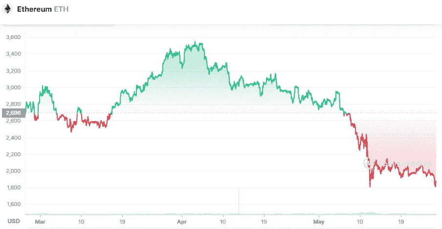

# 我们能期待以太坊的价格降到 1000 美元吗？

> 原文：<https://medium.com/coinmonks/can-we-expect-an-ethereum-price-drop-to-1-000-ac212b195278?source=collection_archive---------7----------------------->

Source photo [Ethereum price today, ETH to USD live, marketcap and chart | CoinMarketCap](https://coinmarketcap.com/currencies/ethereum/)

## 以太坊加密货币是什么？

2015 年，以太坊网络上线。此后，它成为世界上第二重要的区块链。第一个产生智能合同的网络是以太坊。因此，ETH 可以作为分散式应用程序(dApps)的基础。