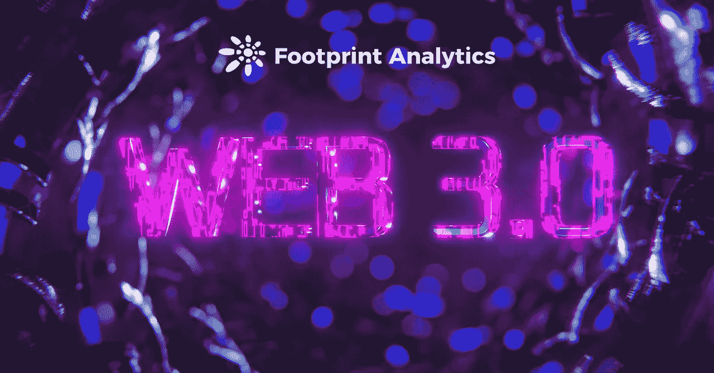
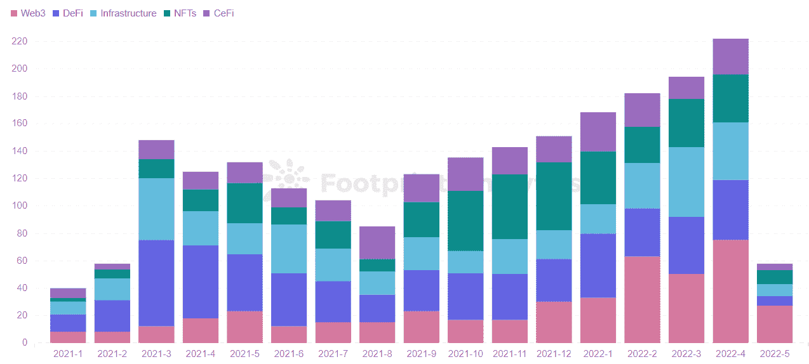
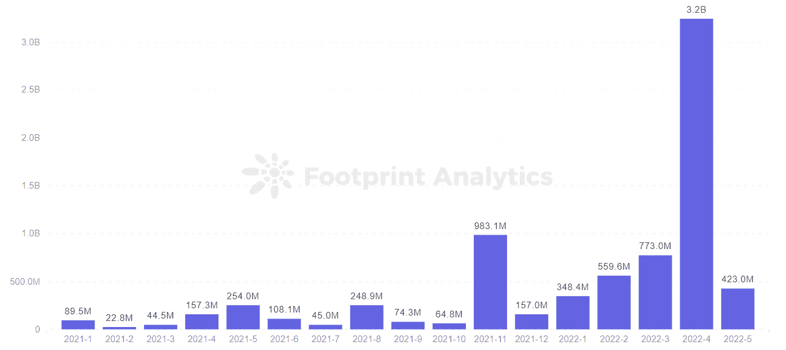
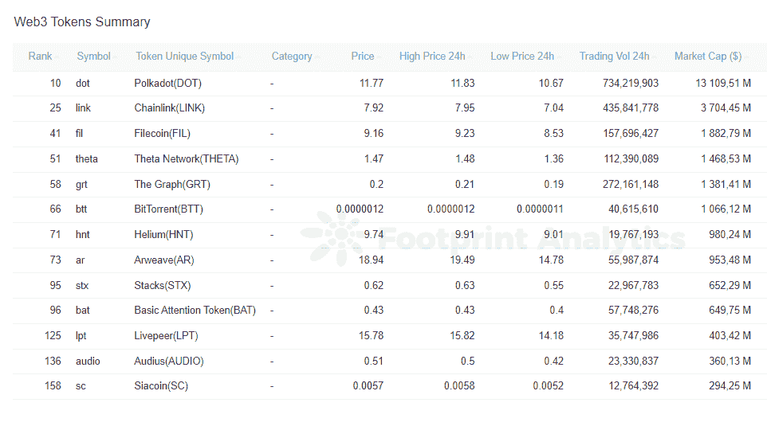

# Web3 能否将用户从垄断中解放出来成为中心？

> 原文：<https://medium.com/coinmonks/can-web3-free-users-from-monopoly-to-become-the-center-c744be559259?source=collection_archive---------55----------------------->

五月。2022

数据来源:足迹分析— [Web3 仪表盘](https://www.footprint.network/@Pierre/Web3-Tokens-Dashboard?channel=EN-255)

根据[足迹分析](https://www.footprint.network/@DamonSalvatore/Fundraising-Dashboard?channel=EN-255)的投资数据，区块链行业的 [Web3](https://cryptoslate.com/silicon-valley-employees-go-away-from-large-companies-to-web3-what-is-the-future-of-the-internet/) 部门——指的是将实现未来网络的核心技术，即区块链基础设施——在 2022 年获得的投资比 [GameFi](https://www.footprint.network/@Bond/GameFi-Overview?channel=EN-255) 和 DeFi 的 54.88 亿美元的投资总和多 94.63 亿美元。

这表明，Web3 在下一轮牛市中有望成为突破板块。但是 Web3 到底是什么，它与 Web2 有什么不同？

这篇文章将概述 Web3 是什么，以及它将如何改变人们与互联网的关系。

# Web3 是 Web2 的发展

Web2 有两个主要特点:

*   基于用户生成的内容。
*   平台垄断数据流量。

Web2 本质上是对 Web1 时代的改进，但 Web2 时代的用户数据沉淀在不同的应用中，用户无法自由控制和使用。这构成了 Web2 的痛点。

Web3 的特点是去中心化，通过将数据和资产的控制权交还给用户自己来改善 Web2 的痛点。理论上，Web3 给了用户第一次上网的机会。

# Web3 在区块链去中心化中的体现

Web3 技术处于早期阶段，正在被区块链权力下放的所有部门采用，根据足迹分析，Web3 正逐渐获得比 DeFi 和 NFTs 等部门更多的投资。

在所有行业中，4 月份对 Web3 的投资金额最大，总投资额为 32.4 亿美元。Web3 的快速增长会是 Google Cloud 进入 Web3 以技术支持夺取市场份额的原因吗？

*Footprint Analytics —* [*Funding Number of Monthly Investment by Category*](https://www.footprint.network/chart/Funding-Number-of-Monthly-Investment-by-Category-fp-19933?channel=EN-255)

*Footprint Analytics —* [*Web3 Monthly Fundraising Amount*](https://www.footprint.network/chart/Web3-Monthly-Fundraising-Amount-fp-20057?channel=EN-255)

Web3 正在崛起，尤其是在 GameFi 和 Mateverse 等领域。毕竟 Web3 是去中心化的，用户的数据基本都存储在链上。用户拥有其数据的所有权，并可以使用其数据来创造和获取价值。

## Web2 游戏模式与 Web3 游戏模式

Web2 游戏是 F2P，其核心是出售虚拟物品，如设备。在这种模式下，游戏公司控制着游戏的发展方向，它旨在从游戏设计中赚更多的钱。玩家实际上并不拥有他们在游戏中购买或获得的物品，也不能在二级市场上出售。

Web3 游戏体现在 P2E 或 M2E 模式中，其核心是让玩家成为游戏中物品的真正主人。在 P2E 或 M2E 中，玩家成为游戏的主要参与者，获得的游戏 NFT 可以在一级或二级市场上买卖。

# Web3 带来的变化

除了上面提到的用户数据和资产所有权，Web3 在去中心化的基础设施层和应用程序层带来了许多变化。比如在应用层，有最基本的隐私保护，数据存储和 DAO 治理。在应用层面，有 GameFi 游戏项目，社交娱乐等。

*Footprint Analytics — Top Web3 Tokens by Market Capitalization*

*   [Polkadot](https://cryptoslate.com/how-polkadot-dot-could-become-blockchain-3-0/) 是 Web3 基础设施的代表，解决不同特性的区块链之间的数据交互问题，形成 Web3 跨链解决方案，为链上项目带来更多便利。
*   相比传统的集中存储数据平台，非常容易被集中操作删除。分散存储平台 [Arweave](https://cryptoslate.com/intro-to-arweave-a-blockchain-cloud-storage-platform-footprint-analytics/) 解决了数据长期存储的问题，防止数据过大被删除。
*   [STEPN](https://coinrivet.com/what-is-stepn/) 通过其游戏化的运动鞋升级系统，激励了数百万用户变得更加健康。

# 摘要

虽然 Web3 技术给用户带来了新的变化和创新。基于区块链的去中心化本质，真的能做到完全的用户平等，打破平台垄断吗？

Web3 技术仍处于早期阶段，难以实现真正的去中心化，Footprint Analytics 认为，Web2 的集中式应用和平台模式将与 Web3 的去中心化应用和分发模式长期共存。在 Web2 和 Web3 中，用户身份、价值体系和用户组织都将重叠。

这篇文章由[足迹分析](https://www.footprint.network/)社区贡献。

Footprint 社区是一个世界各地的数据和加密爱好者相互帮助了解和获得关于 Web3、元宇宙、DeFi、GameFi 或区块链新兴世界任何其他领域的见解的地方。在这里，你会发现活跃的、不同的声音相互支持，推动着社区向前发展。

> 加入 Coinmonks [电报频道](https://t.me/coincodecap)和 [Youtube 频道](https://www.youtube.com/c/coinmonks/videos)了解加密交易和投资

# 另外，阅读

*   [最佳以太坊钱包](https://coincodecap.com/best-ethereum-wallets) | [电报上的加密货币机器人](https://coincodecap.com/telegram-crypto-bots)
*   [交易杠杆代币的最佳交易所](https://coincodecap.com/leveraged-token-exchanges) | [购买 Floki](https://coincodecap.com/buy-floki-inu-token)
*   [3 commas vs . Pionex vs . crypto hopper](https://coincodecap.com/3commas-vs-pionex-vs-cryptohopper)|[Bingbon Review](https://coincodecap.com/bingbon-review)
*   [加密复制交易平台](/coinmonks/top-10-crypto-copy-trading-platforms-for-beginners-d0c37c7d698c) | [如何在 WazirX 上购买比特币](/coinmonks/buy-bitcoin-on-wazirx-2d12b7989af1)
*   [CoinLoan 评论【Crypto.com】|](https://coincodecap.com/coinloan-review)[评论](/coinmonks/crypto-com-review-f143dca1f74c)