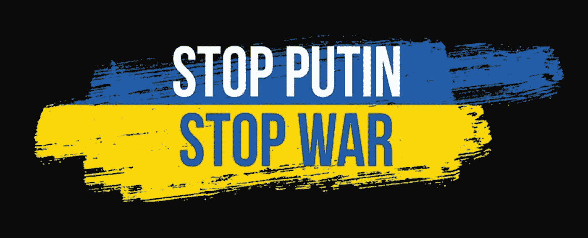

# Web3 能把俄罗斯公民从宣传中拯救出来吗？

> 原文：<https://medium.com/coinmonks/can-web3-save-russian-citizens-from-propaganda-b73528e22d81?source=collection_archive---------40----------------------->

# 一旦出现 AWS / Google 等，俄罗斯公民将如何被切断新闻来源。离开

西方公司对俄罗斯发起了令人难以置信的有效制裁，通过撤回他们的商品和服务来回应他们对乌克兰的战争。AWS 和谷歌等科技巨头也采取了类似的措施，根据对该国的制裁，他们正在取消对俄罗斯企业的访问。

移除 IT 基础设施和服务可能会给俄罗斯人民带来意想不到的负面影响。没有西方的信息技术，俄罗斯将变得更加依赖国内公司，这些公司更容易受到俄罗斯政府的审查和胁迫，而这些政府有意推动官方叙事。科技公司的这种离开可能会让俄罗斯公民坐在一个被墙隔开的黑暗房间里，没有公正的外部信息来源。让我们看看问题会变得多糟糕，以及是否有办法通过 Web3 解决这个问题。

# 随着西方科技巨头离开俄罗斯，谁将取代他们的位置？

云计算占俄罗斯国内所有 IT 支出的 5%。微软在俄罗斯云计算市场份额最大，为 17%，其次是亚马逊的云计算部门，为 14%，IBM 为 10%。所有这些公司最近都宣布，他们要么停止接受新的俄罗斯客户，要么立即停止在那里的运营，以应对战争:

*   [亚马逊网络服务阻止来自俄罗斯和白俄罗斯的新注册用户](https://www.nytimes.com/2022/03/08/technology/amazon-web-services-russia.html)
*   [谷歌云停止在俄接受新客户](https://thehill.com/policy/technology/597739-google-cloud-to-stop-accepting-new-customers-in-russia/)
*   [微软暂停在俄新品销售](https://blogs.microsoft.com/on-the-issues/2022/03/04/microsoft-suspends-russia-sales-ukraine-conflict/\)
*   [IBM 联合甲骨文、VMware 和 Salesforce 等科技公司，已经停止了在俄罗斯的所有业务](https://www.channelfutures.com/cloud-2/all-major-u-s-cloud-providers-have-stepped-back-from-business-in-russia)

It 基础设施成为制裁目标是可以理解的。如果各种银行、电信和运输业务无法获得软件更新，或者必须用不太可靠的替代方案替换其云基础设施，它们将会受到阻碍。这些 IT 制裁将对整个俄罗斯经济造成重大拖累。西方技术基础设施和软件的突然撤离被认为是长期的:

> “几乎没有人预计制裁会在任何时候(很快)取消，”驻莫斯科的 IT 高管奥列格·阿克谢诺夫(Oleg Aksenov)说，他有 15 年的经验，最近在俄罗斯最大的银行俄罗斯储蓄银行(Sberbank)担任部门首席技术官，也是俄罗斯数字领导者非营利组织的主要成员之一。“大多数人都只是把这当成，这是一个新的现实。我们会去适应它。这将像苏联时代一样，”他说。
> 
> ***来源***:[https://www . wsj . com/articles/Russian-tech-spending-declines-as-sanction-take-toll-11649410200](https://www.wsj.com/articles/russian-tech-spending-declines-as-sanctions-take-toll-11649410200)

# 真相:战争制裁的意外受害者

这些技术基础设施制裁将造成互联网基础设施的损失，使俄罗斯公民更难获得未经审查的新闻来源。俄罗斯公民获取可靠、真实信息的能力对于反击克里姆林宫向其公民传播的战争宣传版本至关重要。如果俄罗斯政府可以控制互联网基础设施，他们就可以继续塑造影响俄罗斯公民对乌克兰战争的想法和感受的故事。

认为最有可能从西方科技巨头撤出俄罗斯中获得市场份额的公司是 Yandex，它目前在俄罗斯云基础设施市场份额中排名第四。Yandex 已经被指控积极与克里姆林宫合作，限制有关乌克兰战争的信息，让俄罗斯政府看起来更有利:

> 欧盟援引 Yandex 新闻业务前负责人 Lev Gershenzon 的指控，强调了 Yandex 新闻在传播克里姆林宫宣传方面发挥的作用……Yandex 前新闻负责人指责该公司是向俄罗斯人隐瞒乌克兰战争信息的关键因素。
> 
> ***来源***:[https://techcrunch.com/2022/03/16/russia-yandex-news-vk/](https://techcrunch.com/2022/03/16/russia-yandex-news-vk/)

乌克兰官员也呼吁取消俄罗斯公民进入脸书的权利，因为他们担心西方社交网络上的宣传会蔓延。但脸书也被反战抗议者用作组织反战和分享被俄罗斯国家媒体审查的报道的工具。

许多民间团体警告总统乔·拜登不要切断俄罗斯的互联网接入:

> “对俄罗斯人民访问互联网的过度广泛限制将进一步孤立四面楚歌的亲民主和反战活动人士，并阻碍俄罗斯境内外的非政府组织、人权团体、记者和律师向公民提供有关当前事态和他们权利的重要信息，”这些团体写道。“这些行动将在无意中加速克里姆林宫通过其‘主权互联网’工具实现的目标——对俄罗斯境内信息空间的完全和全面控制。”

# Web3 如何有所作为

我们正处于西方 IT 基础设施撤离留下的真空的开始阶段，留给俄罗斯的是可审查的俄罗斯国内 IT 替代品。在这个场景中，TEA 项目可以提供不受审查的分布式计算基础设施。TEA 项目使用其挖掘节点来创建一个替代 AWS 和谷歌云的 IT 基础设施。市民可以通过部署茶叶开采节点作为信标，通过备用网络传输未经审查的数据和应用程序，来对抗他们的互联网日益封闭的性质和随之而来的宣传。我们的第一个应用程序，茶党，是一个社交网络应用程序，在战争时期非常有用。

如果您想挖掘或了解更多关于茶叶项目的信息，我们欢迎您加入我们的电报组:【https://t.me/teaprojectorg

> 加入 Coinmonks [电报频道](https://t.me/coincodecap)和 [Youtube 频道](https://www.youtube.com/c/coinmonks/videos)了解加密交易和投资

# 另外，阅读

*   [用于 Huobi 的加密交易信号](https://coincodecap.com/huobi-crypto-trading-signals) | [HitBTC 审查](/coinmonks/hitbtc-review-c5143c5d53c2)
*   [如何在 FTX 交易所交易期货](https://coincodecap.com/ftx-futures-trading) | [OKEx vs 币安](https://coincodecap.com/okex-vs-binance)
*   [OKEx vs KuCoin](https://coincodecap.com/okex-kucoin) | [摄氏替代品](https://coincodecap.com/celsius-alternatives) | [如何购买 VeChain](https://coincodecap.com/buy-vechain)
*   [ProfitFarmers 回顾](https://coincodecap.com/profitfarmers-review) | [如何使用 Cornix 交易机器人](https://coincodecap.com/cornix-trading-bot)
*   [如何匿名购买比特币](https://coincodecap.com/buy-bitcoin-anonymously) | [比特币现金钱包](https://coincodecap.com/bitcoin-cash-wallets)