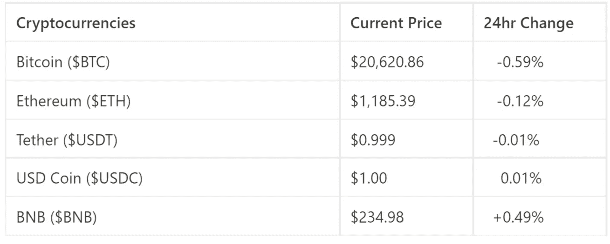

# 你能在同一天买卖密码吗？

> 原文：<https://medium.com/coinmonks/can-you-buy-and-sell-crypto-same-day-6af9c4ff962b?source=collection_archive---------11----------------------->

欢迎来到最新一期的 CapitalRollup Digest！今天的文摘是 6 月 28 日的，大约需要 5 分钟。我们马上开始。

*   今天的市场看起来怎么样？(前 5/10 大流行加密货币)

Market Price Update

# 你能在同一天买卖密码吗？

比特币在 2017 年经历了约 2 万美元的最高市场价格，自那以来，由于未来的增长潜力，越来越多的人投资了比特币和其他替代货币。

公众问得最多的问题是这样的:加密货币可以在同一天买卖吗？

您可能知道交易者购买加密资产是为了最终以更高的价格出售它们，但是您是否想过是否有可能在短时间内(例如一天)进行买卖？虽然许多人更喜欢对他们的加密货币使用买入并持有策略，但也有可能在同一天买入和卖出它们，而且不仅仅是比特币！你也可以在同一天买卖所有可供交易的代用币。

**让我们来看看买入并持有的策略。**

这种策略包括购买一种加密货币，并持有几个月或几年。这是一种从加密货币中赚钱的简单方法，因为你只需等待硬币的价值随着你的持有而增长。

硬币的价值会增长到比你购买时的价格高得多的程度，然后你可以卖掉它来获利。这个策略对于那些没有时间监控每日图表的人来说非常有用。

与此相反，有一种在单日内买卖硬币的策略，称为日内交易。使用这种策略，所有交易必须在上述 24 小时内进行，这导致交易者在压力下完成交易并获利

# 什么是日内交易？

它是一种主动交易的形式，交易者必须全天观察市场，才能在当天买卖加密货币。日内交易包括利用技术分析在同一天买卖加密货币。

日交易者通过利用加密货币市场的波动性赚取利润。这种波动性导致市场价格上下波动，形成可能每小时都在变化的上升和下降趋势。一旦交易者确定了趋势，他们就可以使用成熟的策略“低买高卖”。

日内交易比长期投资风险更大，因为价格下滑或大幅下跌会导致亏损。由于市场不稳定，日内交易者可以获利，但另一方面他们也可能损失很多钱

交易者必须有必要的知识和技能来完善日内交易的艺术。在进行实际交易之前，需要许多小时的练习和纸上交易。尽管有难度，但还是可以盈利的。

# 当天交易时要考虑的因素

由于加密货币市场的 24 小时性质，日间交易发生在整个 24 小时期间。交易者应该研究图表的移动，价格的变化，趋势，模式，和硬币的数量，来决定什么时候买卖硬币。

# 价格行为

价格行为指的是硬币在一天中不同时间的特定价格，特别是一天中价格变动的范围。

请注意，在白天投资一个极度不稳定的硬币可能不是最好的主意，因为其运动的不可预测性增加了每次交易的风险。

交易者通常用技术指标跟踪价格，比如布林线。

# 趋势

硬币市场趋势在一天内形成是很常见的，通常在几个小时内测量。一般来说，交易者会在一个硬币处于上升趋势时买入，当硬币的价值高于他们买入的价格时卖出。分析趋势的关键是要有足够的纪律性，知道什么时候卖出，因为大多数交易者都会犯等太久才卖出的错误。

加密货币市场的上升趋势非常诱人。然而，如果你等得太久，趋势可能会下滑，导致价格下跌，你的利润消失。

# 硬币体积

硬币量是指一段时间内交易的硬币数量。这一数量证实了市场趋势。一枚成交量很大或价格波动很大的硬币的价格波动或价格行为被认为更可靠。

或者，如果硬币量低，这可能意味着硬币交易不频繁，并且硬币经历的任何价格变动都不可靠。交易量将使日内交易者能够确定一天中何时买入或卖出某个硬币。

现在，我们看到了在同一天出售加密货币的可能性。日内交易是加密市场中最常见的策略之一。虽然日内交易比买入和持有更复杂，但如果你运用正确的策略，仔细监控价格、交易量和趋势的每一个动作，日内交易会有很高的回报。

# 琐事🤔

谁是真正的中本聪？

A.埃隆·马斯克

B.维塔利克·布特林

C.哈里王子

D.没人知道。

在下一期的 CapitalRollup Digest 中找到答案。😉

# 每日一词！

💡**树篱**

对冲是一种投资或交易，旨在降低你现有的风险敞口。通过投资降低风险的过程被称为“对冲”。

**该术语用在一句话中:**
*—顾名思义，本基金试图* ***对冲*** *投资者资金面对市场波动的风险。*

# **·社区更新📢**

我们将很快与 5 个行业领导者组织一个 Twitter 空间会议，在那里我们将讨论加密市场和 web3 上的一切。你可以期待它😎

# 我们今天在读什么📰

什么是加密日交易？初学者指南。 [***阅读更多***](https://economictimes.indiatimes.com/industry/banking/finance/what-is-crypto-day-trading-beginners-guide/articleshow/90377862.cms)

**从比特币中获利的十大加密交易策略&更多。** [***阅读更多***](https://www.goodreturns.in/classroom/top-10-crypto-trading-strategies-to-earn-profit-from-bitcoin-more-1253478.html)

**与朋友一起学习和投资加密💰**

当您邀请您的朋友开始使用 CapitalRollup 进行有利可图的投资时，您将获得独特的奖励。

💬对 CapitalRollup Digest 有什么反馈吗？ [**告诉我们！**](mailto:hi@capitalrollup.com)

> 加入 Coinmonks [电报频道](https://t.me/coincodecap)和 [Youtube 频道](https://www.youtube.com/c/coinmonks/videos)了解加密交易和投资

# 另外，阅读

*   [最佳比特币保证金交易](/coinmonks/bitcoin-margin-trading-exchange-bcbfcbf7b8e3) | [萝莉点评](/coinmonks/lolli-review-e6ddc7895ad8) | [比特币保证金交易](https://coincodecap.com/bityard-margin-trading)
*   [创造并出售你的第一个 NFT](https://coincodecap.com/create-nft) | [密码交易机器人](/coinmonks/crypto-trading-bot-c2ffce8acb2a)
*   [如何在 CoinDCX 上购买柴犬(SHIB)币？](https://coincodecap.com/buy-shiba-coindcx)
*   [CBET 评论](https://coincodecap.com/cbet-casino-review) | [库科恩 vs 比特币基地](https://coincodecap.com/kucoin-vs-coinbase) | [拜比特 vs 比特币基地](https://coincodecap.com/bybit-vs-coinbase)
*   [折叠 App 回顾](https://coincodecap.com/fold-app-review) | [本地比特币回顾](/coinmonks/localbitcoins-review-6cc001c6ed56) | [Bybit vs 币安](https://coincodecap.com/bybit-binance-moonxbt)
*   [加密保证金交易交易所](/coinmonks/crypto-margin-trading-exchanges-428b1f7ad108) | [赚取比特币](/coinmonks/earn-bitcoin-6e8bd3c592d9) | [Mudrex 投资](https://coincodecap.com/mudrex-invest-review-the-best-way-to-invest-in-crypto)