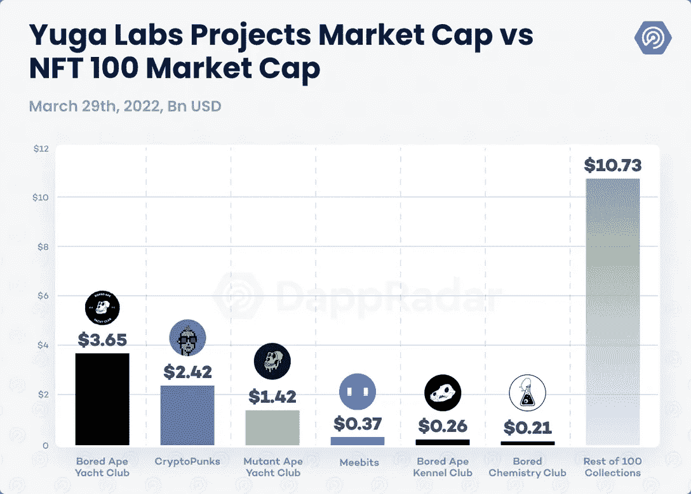

# 你能说出宇迦实验室拥有的所有 NFT 吗？

> 原文：<https://medium.com/coinmonks/can-you-name-all-the-nfts-that-yuga-labs-own-26287f25a8ab?source=collection_archive---------25----------------------->

Yuga Labs has cornered the NFT market.

以下是宇迦拥有的 6 个 NFT 品牌:

1.  无聊猿游艇俱乐部
2.  密码朋克
3.  变异猿游艇俱乐部
4.  无聊猿养狗俱乐部
5.  无聊猿化学俱乐部
6.  米比特

如果你将宇迦的 6 个非功能性测试与前 100 个非功能性测试中的其他测试进行比较:

宇迦实验室的六个 NFT 收藏占以太坊 NFT 市值的 43%。

这相当于近 190 亿美元市场中的 81 亿美元。

那是纯粹的支配。

此外，他们的 ApeCoin 市值为 23 亿美元。

您可以使用 ApeCoin 在他们即将推出的元宇宙和 BAYC 生态系统中购物。

“BAYC 背后的团队将依靠更多的资金继续建设 other side——其雄心勃勃的互操作元宇宙项目。Otherside 预计将涉及到游戏赚钱、时尚计划和媒体平台。

他们还以 3 . 2 亿美元的价格出售了其他地契(在元宇宙另一边拥有土地的地契)。

他们还获得了密码朋克和密比特的 IP 来完成统治。

按照目前的轨迹，在 web3 世界中，没有人能接近他们纯粹的经济规模、社区建设和社会影响力。

宇迦实验室融资 4.5 亿美元，估值 40 亿美元。

他们的 6 种 NFT 以超过 81 亿美元的价格主导了整个市场

他们的 ApeCoin 市值为 23 亿美元

他们仅推出 OtherDeeds 就赚了 3.2 亿美元。

未来还会有更多，他们可以不断发布新的 NFT 来获得更多收入。

Yuga Labs is a tour de force in the NFT sector!

仅仅是 BAYC 一家，他们就从最初的销售中获得了 100 万美元的 2M，并将永久收取其他每笔交易 2.5%的版税。

“宇迦实验室在 2021 年创造了 1.38 亿美元的收入，净利润为 1.27 亿美元，利润率为 92%。”

我不知道还有哪家公司的利润率如此之高。

2022 年 1 月，他们有 11 名员工。

现在可能更多了。

你能想象 2022 年对他们来说会是什么样子吗？所有的元宇宙 NFT 和令人难以置信的宣传已经建成了。

让我们做一些公共数学(违背我更好的直觉，如果我不准确，你已经被警告)。

让我们假设他们的版税固定在 2.5%，6 家非专利技术公司的市值为 81 亿美元。

那就是 2.025 亿美元

更可怕的是，分析师表示，预计他们的收入将是 2021 年的三倍。

对于那些想知道 NFT 是否真实的人来说，这里有一家公司可能从中赚到数十亿美元。

还怀疑？

-

你认为 NFT 市场会变得更大吗？

-

# startups # business # startupx # growth # success # social media # culture # entrepreneur # strategy # eth #比特币#加密货币# bayc # NFT # getrich # airdrop # branding # master card # line # revolution # web 3

> 加入 Coinmonks [电报频道](https://t.me/coincodecap)和 [Youtube 频道](https://www.youtube.com/c/coinmonks/videos)了解加密交易和投资

# 另外，阅读

*   [Capital.com 审查](https://coincodecap.com/capital-com-review) | [港加密借贷平台](https://coincodecap.com/crypto-lending-hong-kong)
*   [如何在 Uniswap 上交换加密？](https://coincodecap.com/swap-crypto-on-uniswap) | [A-Ads 审核](https://coincodecap.com/a-ads-review)
*   [WazirX vs coin dcx vs bit bns](/coinmonks/wazirx-vs-coindcx-vs-bitbns-149f4f19a2f1)|[block fi vs coin loan vs Nexo](/coinmonks/blockfi-vs-coinloan-vs-nexo-cb624635230d)
*   [本地比特币审核](/coinmonks/localbitcoins-review-6cc001c6ed56) | [加密货币储蓄账户](https://coincodecap.com/cryptocurrency-savings-accounts)
*   [什么是保证金交易](https://coincodecap.com/margin-trading) | [美元成本平均法](https://coincodecap.com/dca)
*   [支持卡审核](https://coincodecap.com/uphold-card-review) | [信任钱包 vs MetaMask](https://coincodecap.com/trust-wallet-vs-metamask)
*   [Exness 回顾](https://coincodecap.com/exness-review)|[moon xbt Vs bit get Vs Bingbon](https://coincodecap.com/bingbon-vs-bitget-vs-moonxbt)