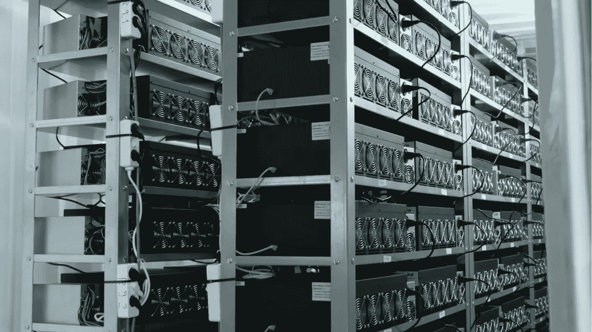

# 加拿大公司 Bitfarms 开始出售其持有的股份

> 原文：<https://medium.com/coinmonks/canada-based-company-bitfarm-to-start-selling-its-holdings-59f53c44f04?source=collection_archive---------69----------------------->

根据新闻稿，总部位于加拿大的全球比特币自挖掘公司 Bitfarms 目前正在“调整其 HODL 战略”，以增加更多流动性，加强其资产负债表。

该公司以 20，600 美元的均价售出了 3，000 辆 BTC，售价约为 6，200 万美元。这一行动背后的主要原因是该公司无力提供资金来购买设备。

交易完成后，该公司的比特币总持有量仍为 3349 个比特币，每天增加 14 个 BTC。此外，加拿大比特币矿业公司将着手将 BTC 支持的银河数字有限责任公司的信贷额度从 6600 万美元降至 3800 万美元。

但尽管 Galaxy Digital 之前就有债务，资产负债表缺乏流动性，但该操作背后的主要原因是加密货币市场的极高波动性，导致比特币跌至 2017 年 19，000 美元的历史高点以下。

从现在开始，该公司将不再每天生产 HODL 资产，这意味着 Bitfarms 很可能会对市场造成持续的抛售压力，通过增加投资组合中稳定硬币或法定货币的比例，为其资产负债表提供更多流动性。

但是，尽管出售了数字黄金，该公司表示，它仍然看好 BTC 的长期价格，战略变化并没有改变 Bitfarm 对提供“世界级”比特币采矿解决方案和准备改善加密经济学的关注。

截至 2022 年夏季，该公司持有 4200 万美元的现金或替代流动资产，资产负债表上有超过 3000 BTC。

点击这里关注我们了解更多故事[。](http://t.me/etellworld)

> 加入 Coinmonks [电报频道](https://t.me/coincodecap)和 [Youtube 频道](https://www.youtube.com/c/coinmonks/videos)了解加密交易和投资

# 另外，阅读

*   [Bookmap 评论](https://coincodecap.com/bookmap-review-2021-best-trading-software) | [美国 5 大最佳加密交易所](https://coincodecap.com/crypto-exchange-usa)
*   最佳加密[硬件钱包](/coinmonks/hardware-wallets-dfa1211730c6) | [Bitbns 评论](/coinmonks/bitbns-review-38256a07e161)
*   [新加坡十大最佳加密交易所](https://coincodecap.com/crypto-exchange-in-singapore) | [购买 AXS](https://coincodecap.com/buy-axs-token)
*   [红狗赌场评论](https://coincodecap.com/red-dog-casino-review) | [Swyftx 评论](https://coincodecap.com/swyftx-review) | [造币厂评论](https://coincodecap.com/coingate-review)
*   [投资印度的最佳密码](https://coincodecap.com/best-crypto-to-invest-in-india-in-2021)|[WazirX P2P](https://coincodecap.com/wazirx-p2p)|[Hi Dollar Review](https://coincodecap.com/hi-dollar-review)
*   [加拿大最佳加密交易机器人](https://coincodecap.com/5-best-crypto-trading-bots-in-canada) | [库币评论](https://coincodecap.com/kucoin-review)