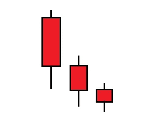
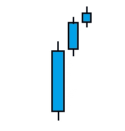
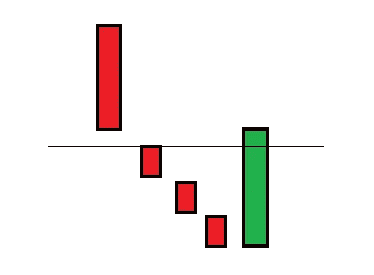
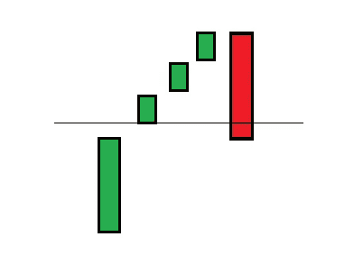
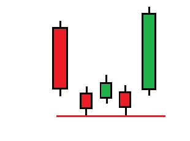
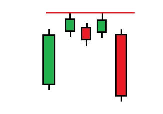

# 交易密码和股票的烛台模式第 3 部分

> 原文：<https://medium.com/coinmonks/candlestick-patterns-for-trading-cryptos-stocks-part-3-aa9e513a3b36?source=collection_archive---------6----------------------->

## 交易不是火箭科学。

Photo by [Sophie Backes](https://unsplash.com/@sophili?utm_source=unsplash&utm_medium=referral&utm_content=creditCopyText) on [Unsplash](https://unsplash.com/s/photos/wallstreet?utm_source=unsplash&utm_medium=referral&utm_content=creditCopyText)

# 南方的三颗星

By me

这是一个**看涨反转**形态，包括三根看跌蜡烛线。注意身体逐渐变小。这种模式的逻辑解释是，每根蜡烛的主体比前一根蜡烛小，这表明反转可能即将发生，因为这一事实表明买入压力越来越大，卖出压力越来越小。

这种模式发生在价格下跌的时候，表明价格很有可能反转。

这三根蜡烛的范围可能并不总是像图片一样。每根蜡烛线可能覆盖前一根蜡烛线的一部分范围，在这种情况下，这种模式会更看涨。

# 前进档

这是一个**熊市反转**模式，包括三根看涨蜡烛线。注意身体越来越大。对这种模式的逻辑解释是，每根蜡烛线的主体比前一根蜡烛线小，这表明反转可能即将来临，卖出压力越来越大，买入压力越来越小。

这种模式发生在价格上涨的时候，表明价格很有可能反转。

这三根蜡烛的范围可能并不总是像图片一样。每根蜡烛线可能覆盖前一根蜡烛线的一部分范围，在这种情况下，形态会更加看跌。

By me

# 看涨脱离

四根红色蜡烛的下降趋势之前是一根绿色蜡烛，所以这个图案总共包括四个烛台。这是一个看涨反转形态。第一支蜡烛比较大。蜡烛一，二，三是小的。第四根蜡烛是绿色的，比较大，**收在第二根蜡烛的开盘价之上。**蜡烛可以有尾巴，但我没有在这张图片中画出来。

By me

# 看跌突破

这是多头突破的镜像，预示着下行趋势可能逆转。蜡烛可以有尾巴，但我没有在这个图像中绘制。

第四根蜡烛是红色的，比较大，**收在第二根蜡烛**的开盘价下

By me

# 塔底

是看涨反转形态。

By me

第二根蜡烛体尺寸的减小表示卖出压力的减小。图形中的第三根蜡烛线是一根小的看涨蜡烛线，以向上的缺口打开，这意味着突然的买入压力。这里重要的是，在第三根蜡烛线后突然出现了购买压力，卖方试图克服这一点，但没有成功，因为第四根蜡烛线是看涨的。

当价格下跌时，塔底出现，这是向上反转的信号。

# 塔顶

这是一个熊市反转模式。

By me

好了，我们终于完成了反转模式。

在下一部分，我将介绍延续模式。

您可以关注并订阅以了解最新信息。

> 加入 Coinmonks [电报频道](https://t.me/coincodecap)和 [Youtube 频道](https://www.youtube.com/c/coinmonks/videos)了解加密交易和投资

## 也阅读

 [## BlockFi 评论:2022 年的利弊和利率

### 今天，我们提出了一个全面的 BlockFi 评论，这是一个成立于 2017 年的加密贷款平台，拥有其…

coincodecap.com](https://coincodecap.com/blockfi-review)  [## 如何在印度购买比特币？2021 年购买比特币的 7 款最佳应用[手机版]

### 如何使用移动应用程序购买比特币印度

medium.com](/coinmonks/buy-bitcoin-in-india-feb50ddfef94)  [## 加密税务软件——五大最佳比特币税务计算器[2021]

### 不管你是刚接触加密还是已经在这个领域呆了一段时间，你都需要交税。

medium.com](/coinmonks/best-crypto-tax-tool-for-my-money-72d4b430816b)  [## 9 个 2022 年最值得购买的密码| CoinCodeCap

### 9 个 2022 年最值得购买的加密产品阅读加密产品评论和比较，了解比特币交易和…

coincodecap.com](https://coincodecap.com/crypto-to-buy-in-2022)  [## 存储比特币的最佳加密硬件钱包 2022 | CoinCodeCap

### 硬件钱包是我们存储加密资产的唯一可靠选择。在本文中，我们将讨论 8 个…

coincodecap.com](https://coincodecap.com/best-hardware-wallet-bitcoin)  [## Pionex 评论 2021 |免费加密交易机器人和交换

### Pionex 是为交易自动化提供工具的后起之秀。Pionex 上提供了 9 个加密交易机器人…

medium.com](/coinmonks/pionex-review-exchange-with-crypto-trading-bot-1e459d0191ea)  [## 2022 年密码交易员的三大电报渠道

### 加密信号是来自专业交易者的交易想法，以特定的价格或价格买卖特定的加密货币

medium.com](/coinmonks/top-3-telegram-channels-for-crypto-traders-in-2021-8385f4411ff4)  [## 2022 年 5 个最佳免费加密投资组合追踪器

### 在这篇文章中，我们将带你通过一些最好的免费加密投资组合追踪器，让你选择最好的…

coincodecap.com](https://coincodecap.com/free-crypto-portfolio-trackers)