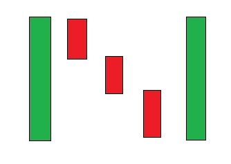

# 交易密码和股票的烛台模式第四部分延续模式

> 原文：<https://medium.com/coinmonks/candlestick-patterns-for-trading-cryptos-stocks-part-4-contunuiation-patterns-fa8115afec35?source=collection_archive---------25----------------------->

Photo by [Kanchanara](https://unsplash.com/@kanchanara?utm_source=unsplash&utm_medium=referral&utm_content=creditCopyText) on [Unsplash](https://unsplash.com/s/photos/trading?utm_source=unsplash&utm_medium=referral&utm_content=creditCopyText)

如果上涨或下跌继续，连续图形会发出信号。

非常重要的是要记住，交易不是一门精确的科学。使用到目前为止提到的烛台模式和这一部分中提到的模式是不够的，应该结合其他交易技术。

使用这些模式而不考虑更大的市场背景可能是危险的。

# 上坡月沟

By me

这种模式预示着已经上涨的价格可能会继续上涨。**在涨价过程中会出现**，表示价格会继续上涨。蜡烛可以有尾巴，但我没有把它们包括在图片中。

两个小烛台可能不完全对齐，一个可能比另一个高或低。

该模式包括一个足够大的绿色蜡烛，然后是一个小的绿色蜡烛出现的间隙，然后是一个几乎相同大小的红色蜡烛。

**需要注意的是，如果这种形态出现在上升趋势中，它就被转化为看涨延续形态。**

**注意红蜡烛没有填满前两根绿蜡烛之间的空隙。**

# 下行月沟

By me

这种模式预示着已经下跌的价格可能会继续下跌。**它会在下跌过程中出现**，意味着价格会继续下跌。蜡烛可以有尾巴，但我没有把它们包括在图片中。

两个小烛台可能不完全对齐，一个可能比另一个高或低。

该模式包括一个足够大的红色蜡烛，然后是一个小红色蜡烛出现的缺口，然后是一个几乎相同大小的绿色蜡烛。

**需要注意的是，如果该形态出现在下跌趋势中，则被视为熊市延续形态。**

**注意绿蜡烛没有填满前两根红蜡烛之间的空隙。**

# 看涨三线罢工

By me

它发生在价格上涨的时候，预示着继续上涨。

三个连续的看涨烛台(小型到中型)，然后是一个大型看跌烛台，**在一个模式中的第一根蜡烛打开的地方或多或少地关闭。**

通常，这种模式中的第四根蜡烛线几乎在第一根蜡烛线打开的地方关闭。在图像中，这并没有完全发生。

这听起来可能违反直觉，但当这种模式出现在上升趋势中时，这是一种看涨模式，预示着上升趋势的继续。

**击烛(第四根)**始于或高于第三根蜡烛。

# 看跌三线罢工

By me

它发生在价格上涨的时候，预示着继续上涨。

三根连续看跌的蜡烛线(小型到中型)后面跟着一根大型看涨蜡烛线，**在一个模式中第一根蜡烛线收盘的地方收盘。**

通常，这种模式中的第四根蜡烛线几乎在第一根蜡烛线收盘的地方收盘。在图像中，这并没有完全发生。

这听起来可能违反直觉，但当这种模式出现在下降趋势中时，这是一种看涨模式，预示着下降趋势的继续。

**报时蜡烛(第四根)在第三根蜡烛结束时或低于第三根蜡烛结束时打开。**

# 上升三法

By me

它发生在价格上涨的时候，预示着继续上涨。

# 看涨垫持有

By me

它发生在价格上涨的时候，预示着继续上涨。

# 下落三法

By me

它发生在价格下跌时，预示着下跌的延续。

# 熊市垫持有

By me

它发生在价格下跌时，预示着下跌的延续。

感谢阅读。你可以跟进以保持更新。为了获取新鲜的内容，不要错过好的内容，你可以通过电子邮件订阅。

> 加入 Coinmonks [电报频道](https://t.me/coincodecap)和 [Youtube 频道](https://www.youtube.com/c/coinmonks/videos)了解加密交易和投资

## 另外，阅读

*   [3 商业评论](/coinmonks/3commas-review-an-excellent-crypto-trading-bot-2020-1313a58bec92) | [Pionex 评论](https://coincodecap.com/pionex-review-exchange-with-crypto-trading-bot) | [Coinrule 评论](/coinmonks/coinrule-review-2021-a-beginner-friendly-crypto-trading-bot-daf0504848ba)
*   [莱杰 vs n rave](/coinmonks/ledger-vs-ngrave-zero-7e40f0c1d694)|[莱杰 nano s vs x](/coinmonks/ledger-nano-s-vs-x-battery-hardware-price-storage-59a6663fe3b0) | [币安评论](/coinmonks/binance-review-ee10d3bf3b6e)
*   [Bybit Exchange 评论](/coinmonks/bybit-exchange-review-dbd570019b71) | [Bityard 评论](https://coincodecap.com/bityard-reivew) | [Jet-Bot 评论](https://coincodecap.com/jet-bot-review)
*   [3 commas vs crypto hopper](/coinmonks/3commas-vs-pionex-vs-cryptohopper-best-crypto-bot-6a98d2baa203)|[赚取秘密利息](/coinmonks/earn-crypto-interest-b10b810fdda3)
*   最好的比特币[硬件钱包](/coinmonks/hardware-wallets-dfa1211730c6) | [BitBox02 回顾](/coinmonks/bitbox02-review-your-swiss-bitcoin-hardware-wallet-c36c88fff29)
*   [BlockFi vs 摄氏](/coinmonks/blockfi-vs-celsius-vs-hodlnaut-8a1cc8c26630) | [Hodlnaut 点评](/coinmonks/hodlnaut-review-best-way-to-hodl-is-to-earn-interest-on-your-bitcoin-6658a8c19edf) | [KuCoin 点评](https://coincodecap.com/kucoin-review)
*   [Bitsgap 审查](/coinmonks/bitsgap-review-a-crypto-trading-bot-that-makes-easy-money-a5d88a336df2) | [Quadency 审查](/coinmonks/quadency-review-a-crypto-trading-automation-platform-3068eaa374e1) | [Bitbns 审查](/coinmonks/bitbns-review-38256a07e161)
*   [密码本交易平台](/coinmonks/top-10-crypto-copy-trading-platforms-for-beginners-d0c37c7d698c) | [Coinmama 审核](/coinmonks/coinmama-review-ace5641bde6e)
*   [印度的加密交易所](/coinmonks/bitcoin-exchange-in-india-7f1fe79715c9) | [比特币储蓄账户](/coinmonks/bitcoin-savings-account-e65b13f92451)
*   [OKEx vs KuCoin](https://coincodecap.com/okex-kucoin) | [摄氏替代品](https://coincodecap.com/celsius-alternatives) | [如何购买 VeChain](https://coincodecap.com/buy-vechain)
*   [币安期货交易](https://coincodecap.com/binance-futures-trading)|[3 commas vs Mudrex vs eToro](https://coincodecap.com/mudrex-3commas-etoro)
*   [如何购买 Monero](https://coincodecap.com/buy-monero) | [IDEX 评论](https://coincodecap.com/idex-review) | [BitKan 交易机器人](https://coincodecap.com/bitkan-trading-bot)