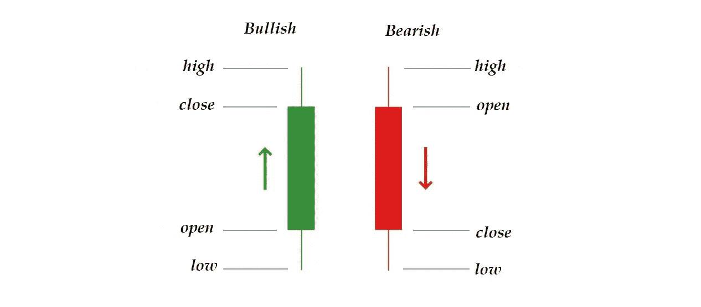
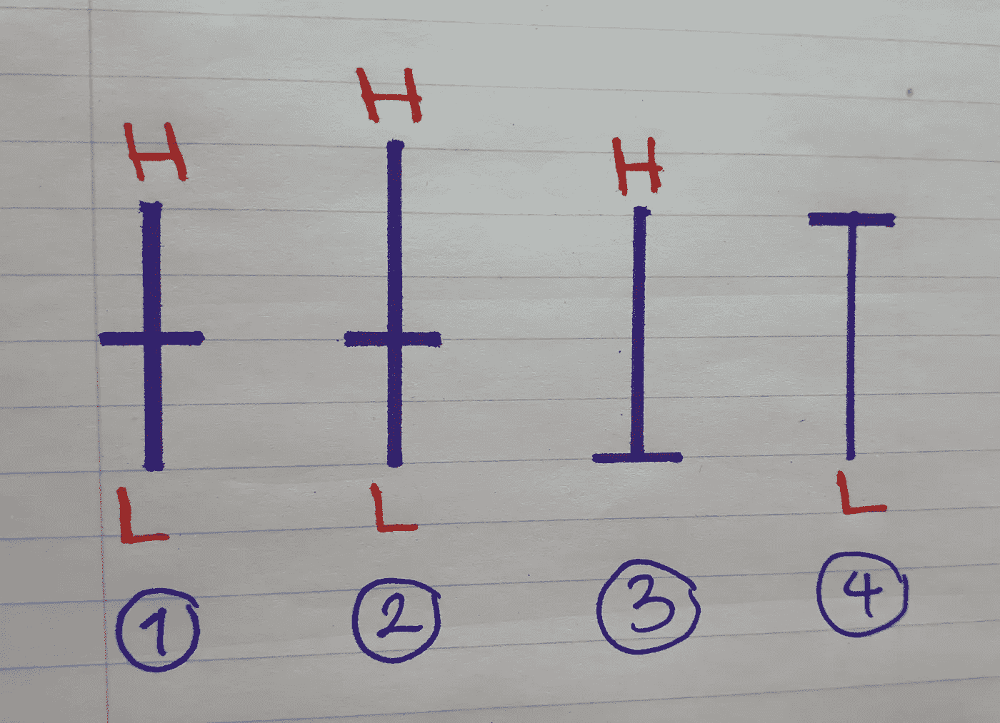
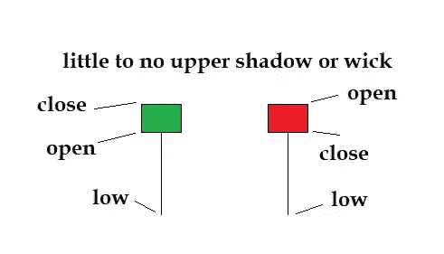

# 交易股票和密码的烛台模式第 1 部分

> 原文：<https://medium.com/coinmonks/candlestick-patterns-for-trading-stocks-cryptos-part-1-fae6d1c35f59?source=collection_archive---------9----------------------->

Photo by [m.](https://unsplash.com/@m_____me?utm_source=medium&utm_medium=referral) on [Unsplash](https://unsplash.com?utm_source=medium&utm_medium=referral)

首先，我们来学习一下什么是烛台并不难。

日本大米交易商 Munehisa Homma 被认为是 18 世纪烛台图表的开发者。**史蒂夫·尼森**在他的书**日本烛台制图技术**中把它们介绍给了西方世界，这本书被认为是最好的交易书籍之一。

下图信息丰富。矩形被称为主体，线条被称为烛台的尾部。图表中的每个蜡烛线显示特定时期的价格数据。例如，在 1 分钟图表中，每个蜡烛线代表 1 分钟内的价格变动。

在一个看涨的烛台(绿色)，收盘价高于开盘价，这就是为什么身体的上侧显示收盘价，而下侧显示开盘价。

Me

在看跌的烛台(红色)中，收盘价低于开盘价，所以主体的上侧显示开盘价，而下侧显示收盘价。

身体上的垂直线是尾巴、阴影或楔形。**注意，在这两种类型的**烛台中，上尾显示最高价格，下尾显示最低价格。

## 多奇蜡烛

当开盘价和收盘价相同或非常接近时，这种蜡烛被称为**多奇烛台**。

Me

在上图中，我们可以看到不同的多奇烛台。在示例 3 中，收盘价和开盘价与最低价相同，因此没有较低的尾部。

排名第一的被称为多奇明星或者仅仅是多奇。如果多奇星的尾巴很长，那么我们称它为长腿多奇。

3 号和 4 号分别被称为墓碑多奇和蝴蝶多奇。

如果烛台上的四种价格都相同或非常接近，那么它就变成了一条水平线，称为**四价多奇。**

多奇是市场犹豫不决或潜在反转的标志，因为在蜡烛线代表的时间段内，多头和空头都无法获得控制权。

## 锤子和绞刑者

下面的烛台根据出现的地方可以有两种含义。

sepehr vafaei

下阴影的长度应该至少是真实身体长度的两倍。

如果它们出现在下降趋势中，它们被称为锤子，被认为是**看涨反转指标。**

如果他们出现在上升趋势中，他们被称为悬挂者，被认为是一个**熊市反转指标。**

铁锤和吊人可以很少甚至没有上影。

在下一部分中，我们将探索包含多个烛台的图案。

感谢阅读。您可以关注并订阅以了解最新信息。

> 加入 Coinmonks [电报频道](https://t.me/coincodecap)和 [Youtube 频道](https://www.youtube.com/c/coinmonks/videos)了解加密交易和投资

## 另外，阅读

*   [3 商业评论](/coinmonks/3commas-review-an-excellent-crypto-trading-bot-2020-1313a58bec92) | [Pionex 评论](https://blog.coincodecap.com/pionex-review-exchange-with-crypto-trading-bot) | [Coinrule 评论](/coinmonks/coinrule-review-2021-a-beginner-friendly-crypto-trading-bot-daf0504848ba)
*   [莱杰 vs n rave](/coinmonks/ledger-vs-ngrave-zero-7e40f0c1d694)|[莱杰 nano s vs x](/coinmonks/ledger-nano-s-vs-x-battery-hardware-price-storage-59a6663fe3b0) | [币安评论](/coinmonks/binance-review-ee10d3bf3b6e)
*   [币安 vs FTX](https://blog.coincodecap.com/binance-vs-ftx) | [最佳(SOL)索拉纳钱包](https://blog.coincodecap.com/solana-wallets)
*   [比诺莫评论](https://blog.coincodecap.com/binomo-review) | [斯多葛派 vs 3Commas vs TradeSanta](https://blog.coincodecap.com/stoic-vs-3commas-vs-tradesanta)
*   [Capital.com 评论](https://blog.coincodecap.com/capital-com-review) | [香港的加密借贷平台](https://blog.coincodecap.com/crypto-lending-hong-kong)
*   如何在 Uniswap 上交换加密？ | [A-Ads 评论](https://blog.coincodecap.com/a-ads-review)
*   [WazirX vs coin dcx vs bit bns](/coinmonks/wazirx-vs-coindcx-vs-bitbns-149f4f19a2f1)|[block fi vs coin loan vs Nexo](/coinmonks/blockfi-vs-coinloan-vs-nexo-cb624635230d)
*   [本地比特币审核](/coinmonks/localbitcoins-review-6cc001c6ed56) | [加密货币储蓄账户](https://blog.coincodecap.com/cryptocurrency-savings-accounts)
*   [什么是融资融券交易](https://blog.coincodecap.com/margin-trading) | [美元成本平均法](https://blog.coincodecap.com/dca)
*   [拥护卡审核](https://blog.coincodecap.com/uphold-card-review) | [信任钱包 vs MetaMask](https://blog.coincodecap.com/trust-wallet-vs-metamask)
*   [Exness 评测](https://blog.coincodecap.com/exness-review)|[moon xbt Vs bit get Vs Bingbon](https://blog.coincodecap.com/bingbon-vs-bitget-vs-moonxbt)
*   [如何开始通过加密贷款赚取被动收入](https://blog.coincodecap.com/passive-income-crypto-lending)
*   [BigONE 交易所评论](/coinmonks/bigone-exchange-review-64705d85a1d4) | [电网交易机器人](https://blog.coincodecap.com/grid-trading)