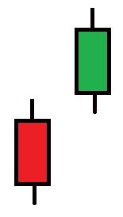
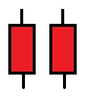

# 交易股票和密码的烛台模式第 2 部分

> 原文：<https://medium.com/coinmonks/candlestick-patterns-for-trading-stocks-cryptos-part-2-6cbeec6ba754?source=collection_archive---------7----------------------->

## 交易不是火箭科学。

Photo by [Austin Distel](https://unsplash.com/@austindistel?utm_source=unsplash&utm_medium=referral&utm_content=creditCopyText) on [Unsplash](https://unsplash.com/s/photos/trading?utm_source=unsplash&utm_medium=referral&utm_content=creditCopyText)

有三种类型的模式:

*   延续:目前的趋势还在延续。
*   反转:方向会反转。
*   中立:没有重大事件发生。

本部分讨论的所有模式都是反转模式。

# 看涨吞没

当一支绿蜡烛追上一支红蜡烛，吞没了它的范围。

Bullish Engulfing

# 熊市吞没

牛市吞噬的反面发生了。

Bearish Engulfing

当检测反转形态时，看涨和看跌吞没和其他因素一起使用。反转形态表明趋势可能发生变化。

看涨反转形态表明上升趋势的开始。熊市模式表明下降趋势的开始。

看涨形态表明买家要么在控制，要么在接受。

看跌模式表明卖家要么在控制，要么在控制。

# 看涨哈拉米

哈拉米在日语里是怀孕的意思。是看涨反转形态。

Bullish Harami

# 看跌的哈拉米

这是一个熊市反转模式。

Bearish Harami

# 看涨哈拉米十字

是看涨反转形态。这种形态标志着上升趋势的开始。他的模式中的第二个烛台是一个多奇十字架，它本身不被认为是看涨的，但也是看跌的烛台。

Bullish Harami Cross

# 看跌哈拉米十字

前一模式的镜像。这标志着下跌趋势的开始。

Bearish Harami Cross

# 看涨踢

一个红色烛台后面跟着一个绿色烛台，中间有一个缺口。

Bullish Kicking

# 看跌踢

一个绿色烛台后面跟着一个红色烛台，中间有一个缺口。

Bearish Kicking

# 看好两个士兵

两个连续的绿色烛台，通常都很小。这是一个上升趋势可能开始的强烈信号。

Bullish Two Soldiers

# 看淡两只乌鸦

两个连续的红色小烛台。这是一个强烈的信号，表明下跌趋势可能已经开始。

这部分的其余图案由三个烛台组成。

Bearish Two Crows

# 晨星

一个红色烛台后面跟着两个绿色烛台，如图所示。第三根蜡烛覆盖第一根蜡烛的至少%50。

Morning Star

# 晚星

一个绿色烛台后面跟着两个红色烛台，如图所示。第三根蜡烛覆盖第一根蜡烛的至少%50。

Evening Star

# 多奇明星晨报

像晨星，但第二个烛台是多奇。它被认为是比晨星图案更弱的信号。

Morning Doji Star

# 多奇明星晚报

像启明星，但第二个烛台是多奇。它被认为是比晚星模式更弱的信号。

Evening Doji Star

# 三个白人士兵

是看涨反转形态。三根连续的绿色蜡烛。每支蜡烛通常都有一个小的主体。通常，在这个图案之后有一个大的绿色蜡烛。通常，这种模式发生在价格下跌但反转开始的时候。

Three White Soldiers

# 三只黑乌鸦

这是一个熊市反转模式。三根连续的红蜡烛。每支蜡烛通常都有一个小的主体。通常，在这个图案之后有一个大红烛。通常，这种模式发生在价格上涨但反转开始的时候。

Three Black Crows

感谢阅读。您可以关注并订阅以了解最新信息。