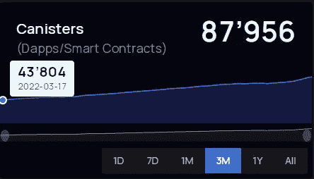

# 罐子 ICP 上的超级智能合约

> 原文：<https://medium.com/coinmonks/canisters-the-super-powered-smartcontracts-on-icp-823e99f0b52?source=collection_archive---------8----------------------->

作为一名技术的非技术用户，有时感觉创造了许多技术术语，使其难以理解，特别是当涉及到常用术语时，如“cookies”、“云”、“防火墙”。随着时间的推移，它们变得很常见，然而设法理解浏览器中的“cookies”是需要时间的。在区块链世界，像“智能合同”和“DeFi”这样的全新术语正在被创造出来，这可能是一个理解的挑战。

下面我们来谈谈一个新名词 ***【茶叶罐】*****[**【互联网计算机(IC)**](https://internetcomputer.org/) **。** IC 是世界上第一个网速、互联网规模的公共区块链，它将改变互联网的工作方式，使我们所知的各种应用程序由分散的&用户控制。这是由一种叫做*罐*智能合约的东西实现的。**

**快速浏览一下什么是"[智能合约](https://www.linkedin.com/pulse/what-smart-contracts-timeline-till-now-whats-future-shruti-sutwala/?trackingId=3DcszMLJQ1e91F9MLDHtmA%3D%3D)":**

> **智能合同就像真实世界中买卖双方之间的合同，然而，它们不是一个授权合同的中介，而是用代码编写的自动执行合同，在区块链网络上分布和分散**

## **什么是滤毒罐？**

**一个罐子是一个超级强大的智能契约，可以做更多的事情，它们是由代码和数据组成的计算单元。可以将罐部署在互联网计算机上，并通过互联网进行访问。在技术语言中，*它是 IC 应用的状态、存储和内存*。为了便于可视化，它就像一个真正的容器，容纳了运行可伸缩 web3 应用程序所需的所有元素。**

****

## **它与传统的智能合约有何不同？**

**与智能合同相比，容器具有的性能特征使得使用它们来构建可扩展的软件服务成为可能。部署在互联网计算机上的智能合约和部署在传统区块链上的智能合约之间的一个关键区别是如何验证来自智能合约的数据。互联网计算机由 [**链密钥加密**](/dfinity/chain-key-technology-one-public-key-for-the-internet-computer-6a3644901e28) 驱动，允许智能合同在“子网”上验证，这使其与在传统区块链上运行的智能合同相比具有明显的可扩展性优势，在传统上，需要来自 Genesis 的整个区块链来验证当前事务状态。**

## **罐子——不仅仅是智能合同**

**[**正如 DFINITY**](/dfinity/software-canisters-an-evolution-of-smart-contracts-internet-computer-f1f92f1bfffb)**——**工程总监 Johan Granströ所解释的那样，根据你如何看待它们，有几种与罐子的类比，因此它们的应用超越了智能合同。**

****

## **作为存储单元的罐**

**罐子是 ICP 的基础构件。[数据直接存储](https://www.publish0x.com/moses-on-chain/exploring-file-storing-and-memory-capacity-in-internet-compu-xozlmen)并从罐中读取。这与程序运行时数据驻留在本地计算机内存中的方式非常相似，可以用完全相同的方式来考虑。可以使用一个或多个可以轻松相互交流的罐来构建任何存储设置。**

> **一些使用罐作为存储单元的链上基础设施 dApps 是 [Fleek](https://fleek.co/) & [IC 驱动](https://rglue-kyaaa-aaaah-qakca-cai.ic0.app/)**

## ****作为链上工艺的废料罐****

**Linux、MacOS 或 Windows 等操作系统上的进程本质上执行诸如支付、管理权限等功能。罐很像区块链上的操作系统中的进程，以允许诸如支付、创建和管理罐、管理许可等的进程直接在区块链上执行，这使得它们是分布式的，从而与传统的进程不同，它们是抗崩溃的。**

> **像[Infinity Swap](https://app.infinityswap.one/)&[Content Fly](https://contentfly.app/)这样的 Defi & Utility dApps 正在利用这个特性来允许链上无桥交易**

## **罐作为“演员”发送和接收信息**

**除此之外，滤毒罐还具有与其他滤毒罐通信的能力&创造新的滤毒罐。罐能够发送和接收双向消息，即请求和响应。结合互联网计算机在毫秒内并行执行大量罐的事实，这有助于克服智能合约的性能限制。**

> **像[dscvr](https://dscvr.one/)&[Openchat](https://6hsbt-vqaaa-aaaaf-aaafq-cai.ic0.app/)这样的社交媒体应用程序使用它来扩大他们的社交媒体平台，这些平台能够以[的网速](/@talkingweb3/how-fast-can-a-blockchain-be-webspeed-says-the-internet-computer-30a07df33acf)运行**

## **罐可以用任何 web 汇编语言编码**

**可以用任何可以编译成 WebAssembly 的语言(比如 Motoko，Rust)编写罐，用不同语言编写的罐完全可以互操作。这使得开发人员可以轻松地在不同的环境中构建 IC。**

> **利用这种能力， [Demergent Labs 正在开发工具](https://github.com/demergent-labs),为互联网计算机开发 TypeScript、GraphQL 和 Python**

## **罐作为身份和认证**

**滤毒罐在网络电脑上有明确的注册身份。Internet 计算机对用户进行身份验证，并将主体 id 传递给容器，容器可以根据主体选择实现它想要的任何授权策略。**

> **这使得使用[互联网身份](https://identity.ic0.app/)在 IC 上进行无密码身份认证成为可能(II)然后使用相同的 II 来授权钱包，如[Plug](https://plugwallet.ooo/)&[Stoic](https://www.stoicwallet.com/)。**

**一方面，互联网计算机极大地简化了编写和部署代码的体验，并且提供了真正的去中心化的可能性，这种可能性可以因为容器而扩大。[开始使用&点击此处，使用罐在互联网计算机上构建。](https://medium.com/r?url=https%3A%2F%2Fsdk.dfinity.org%2Fdocs%2Findex.html)**

**要查看部署在互联网计算机上的罐数量的实时活动，请查看 [IC 仪表板](https://dashboard.internetcomputer.org/)。该活动每天都在增加，截至 2022 年 5 月的过去三个月中翻了一番。**

****

**[https://dashboard.internetcomputer.org/](https://dashboard.internetcomputer.org/)**

**因此，当一个人可以释放超级智能合约的力量时，为什么要生活在传统智能合约的有限可能性的世界中呢！这也是 100%的链条。**

> **加入 Coinmonks [电报频道](https://t.me/coincodecap)和 [Youtube 频道](https://www.youtube.com/c/coinmonks/videos)了解加密交易和投资**

# **另外，阅读**

*   **[最佳网上赌场](https://coincodecap.com/best-online-casinos) | [币安评论](/coinmonks/binance-review-ee10d3bf3b6e) | [BitMEX 评论](https://coincodecap.com/bitmex-review)**
*   **[麻雀交换评论](https://coincodecap.com/sparrow-exchange-review) | [纳什交换评论](https://coincodecap.com/nash-exchange-review)**
*   **[美国最佳加密交易机器人](https://coincodecap.com/crypto-trading-bots-in-the-us) | [经常性回顾](https://coincodecap.com/changelly-review)**
*   **[在印度利用加密套利赚取被动收入](https://coincodecap.com/crypto-arbitrage-in-india)**
*   **[Godex.io 审核](/coinmonks/godex-io-review-7366086519fb) | [邀请审核](/coinmonks/invity-review-70f3030c0502) | [BitForex 审核](https://coincodecap.com/bitforex-review)**
*   **[5 款最佳免费加密货币制图工具](https://coincodecap.com/crypto-charting-tools)**