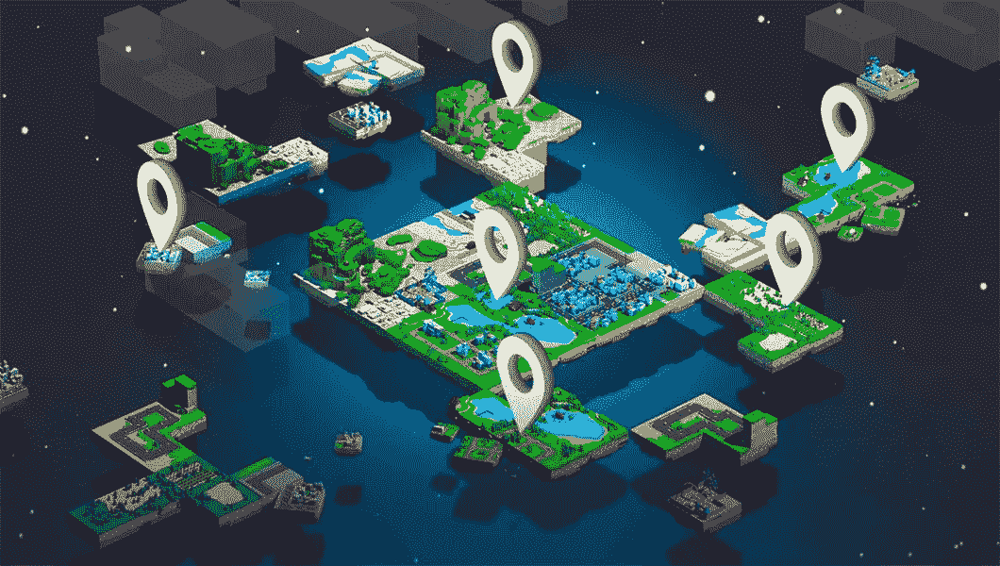

# 买不起真正的房子？买个数码的！每年 1000%的回报。

> 原文：<https://medium.com/coinmonks/cant-afford-a-real-house-buy-a-digital-one-1000-return-per-year-aa20f3e9a504?source=collection_archive---------15----------------------->

房地产投资回报率最高？

Photo from The Digital Speaker

众所周知，房地产一直是(现在仍然是)你能做的最好的投资之一。虽然在 20 世纪初，一个普通的员工可以在 7-8 年内买下一栋两层楼的房子，但现在，除非你有非常高的薪水，否则几乎不可能做到这一点。