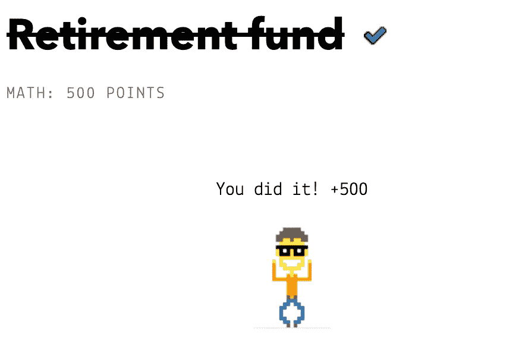

# 捕捉以太:退休基金

> 原文：<https://medium.com/coinmonks/capture-the-ether-retirement-fund-f56f7bb2e4de?source=collection_archive---------9----------------------->

这个挑战的解决方案非常直接:等到部署者绝望到在 10 年过去之前撤回他们的资金，将其中的 10%留给我们，或者等待这 10 年并希望他们记住所有这一切。

太好了！在下一篇文章中，我们将解决——只是开个玩笑。一定有别的方法不用等那么久就能赢得挑战，对吧？

让我们看看合同:

一开始我有点搞不清楚谁是第`beneficiary`和第`msg.sender`。澄清一下，虽然我们是*部署*这个契约实例的人，但前者实际上是我们自己(用来部署契约的 *EOA* )，而后者是*捕获以太的*团队中的其他人(或任何人，但不是我们)。我们可以在 T21 的以太网上查找我们的合同。

好了，现在我们已经清楚了这一点，让我们开始挑战吧。

有三个*可调用(即具有公共可见性)*函数:

*   `isComplete()`:返回一个*布尔值，如果合同余额为 0 则返回*T3，否则返回`false`。当我们用构造函数发送`1 ether`时，默认值是`false`，我们需要通过某种方式耗尽它的余额来改变它。
*   `withdraw()`:只能被`owner`调用，正如我们所见，那不是我们。所以我们可以忘记这个，我很确定`owner`也会忘记它，也不会调用它。
*   `collectPenalty()`:只能由我们调用然后做简单计算:`uint256 withdrawn = startBalance — address(this).balance`。

让我们把重点放在最后一个功能上，看看有哪些可能性。

这里的两个变量是`startBalance`和`address(this).balance`，因此，基本的情况是…

A.10 年过去了，带走了`0.9 ether`，离开了我们`0.1 ether`。在这种情况下`startBalance = 1` & `address(this).balance = 0`如此`withdrawn = 1`。在*要求语句*下，该功能不会恢复，但没有要传输的内容*。*

B.`owner`呼唤`withdraw`*10 年过去了，带走了`1 ether`，什么也没留给我们。在这种情况下`startBalance = 1` & `address(this).balance = 0`所以`withdrawn = 1`。该功能不会回复到*要求语句*上，但是没有要传输的内容*。**

C.`owner`根本不调用`withdraw`。在这种情况下`startBalance = 1` & `address(this).balance = 1`所以`withdrawn = 0`。该功能回复到*要求语句。*

还有其他选择吗？`startBalance`或者`address(this).balance`能是别的吗？如果我们在合同中加入更多乙醚，使价格更高，会怎么样？

在这种情况下，假设`owner`永远不会调用`withdraw()`，如选项 *C-* 所示，局部变量`withdrawn`将*下溢*并最终成为一个巨大的 [78 位数的数字](/coinmonks/eli5-uint256-in-solidity-a16f22942166)，通过 *require 语句*并向我们发送契约的余额，到那时将是`1 ether`。

听起来不错，但是有一个问题:没有直接的方法向这个契约发送以太网，因为它没有 *fallback/receive 或 payable* 函数。我们可以尝试低等级的`call`、a `transfer`或`send`，但是它们都会因为这个原因而恢复。可以试试。

不过，有几种方法可以让一个人把乙醚强制送到合同中。

我们将用来解决我们的挑战的一个与*自毁*功能&操作码有关，我们可以在[文档](https://docs.soliditylang.org/en/develop/units-and-global-variables.html#contract-related)中读到:

> 销毁当前合同，将其资金发送到给定的[地址](https://docs.soliditylang.org/en/develop/types.html#address)并结束执行。注意`selfdestruct`有一些继承自 EVM 的特性:
> 
> 不执行接收合同的接收功能。
> 
> 合同只有在交易结束时才真正被销毁，而`revert` s 可能会“撤销”销毁。

在这个报价中特别重要的是这样一行内容，即合同的 receive 函数没有执行。这意味着它甚至不需要一个添加乙醚到它的平衡。

除此之外，由于这个事务中使用的操作码`SELFDESTRUCT`在 EVM 级别上工作，任何用于停止它的可靠性函数都不起作用，而*以太*无论如何都会通过。

*你可以在这里阅读两种以太传力方式[。](https://consensys.github.io/smart-contract-best-practices/attacks/force-feeding/)

让我们继续并将它应用到挑战中:我们在这里需要做的是用一些以太( *1 维*就足够了)和一个`selfdestruct`函数创建一个带有挑战地址的契约，这样当我们调用它时，*天平*就会转到它那里，使它成为`> 1 ether`。一旦完成，我们可以调用`collectPenalty()`，我们将为自己获得整个*余额*。

这是我写的`Attacker contract`,我尽量保持简单:

现在我们知道了这个漏洞，我们需要记住的重要事情是，我们必须永远不要认为合同的余额是或将是零。包括 `*address(this).balance == 0*` *在内的任何情况都应该避免，因为以太随时都可能被强制送到它那里。*

在下一篇文章中，我们将解决*映射*挑战。

> 加入 Coinmonks [电报频道](https://t.me/coincodecap)和 [Youtube 频道](https://www.youtube.com/c/coinmonks/videos)了解加密交易和投资

# 另外，阅读

*   [AscendEx Staking](https://coincodecap.com/ascendex-staking)|[Bot Ocean Review](https://coincodecap.com/bot-ocean-review)|[最佳比特币钱包](https://coincodecap.com/bitcoin-wallets-india)
*   [霍比审核](https://coincodecap.com/huobi-review) | [OKEx 保证金交易](https://coincodecap.com/okex-margin-trading) | [期货交易](https://coincodecap.com/futures-trading)
*   [网格交易机器人](https://coincodecap.com/grid-trading) | [Cryptohopper 审查](/coinmonks/cryptohopper-review-a388ff5bae88) | [Bexplus 审查](https://coincodecap.com/bexplus-review)
*   [7 个最佳零费用加密交易平台](https://coincodecap.com/zero-fee-crypto-exchanges)
*   [氹欞侊贸易评论](https://coincodecap.com/anny-trade-review) | [霍比保证金交易](/coinmonks/huobi-margin-trading-b3b06cdc1519)
*   [分散交易所](https://coincodecap.com/what-are-decentralized-exchanges) | [比特 FIP](https://coincodecap.com/bitbns-fip) | [Pionex 评论](https://coincodecap.com/pionex-review-exchange-with-crypto-trading-bot)
*   [用信用卡购买密码的 10 个最佳地点](https://coincodecap.com/buy-crypto-with-credit-card)