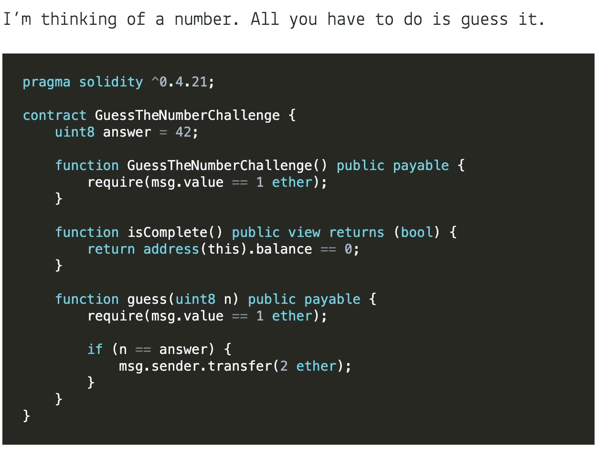
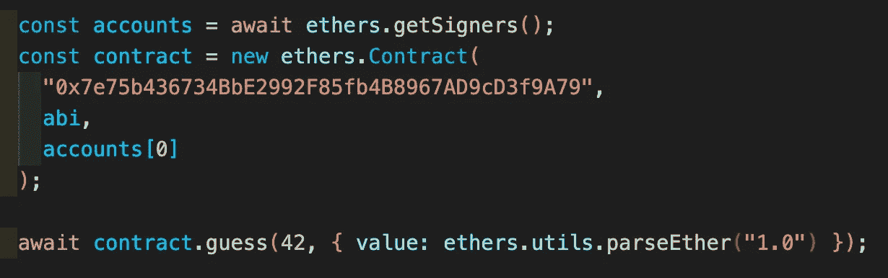
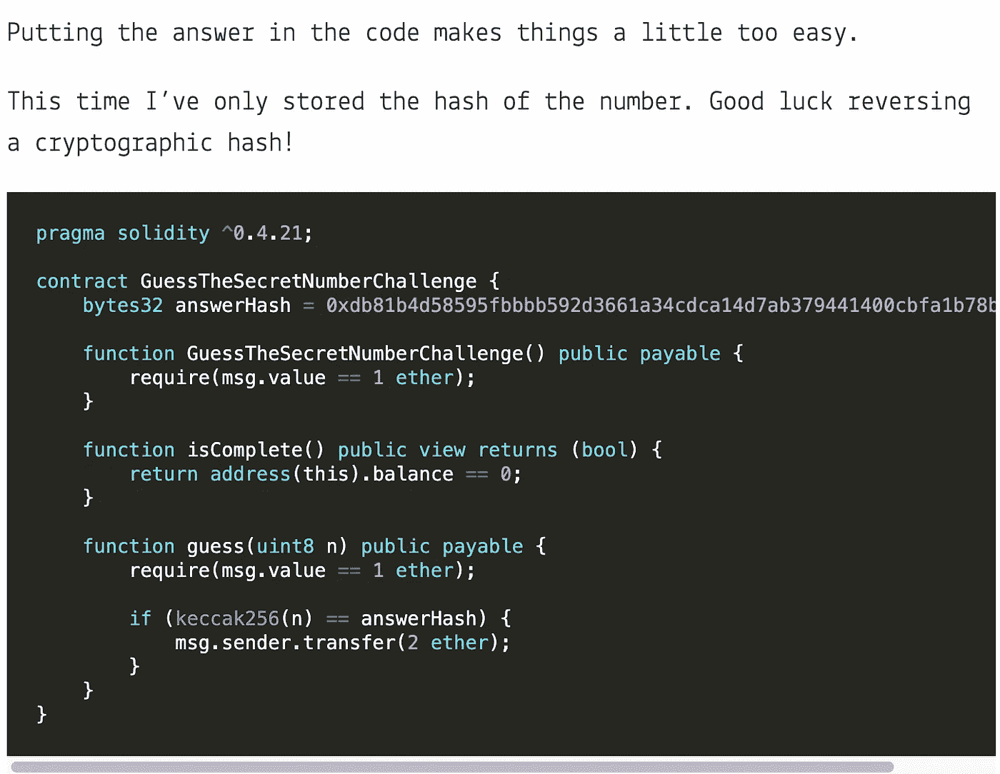
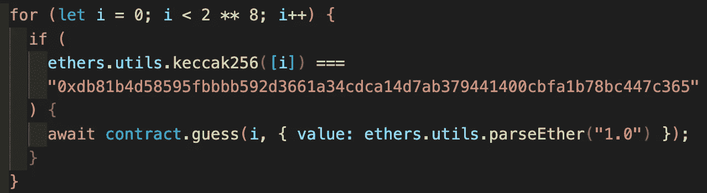
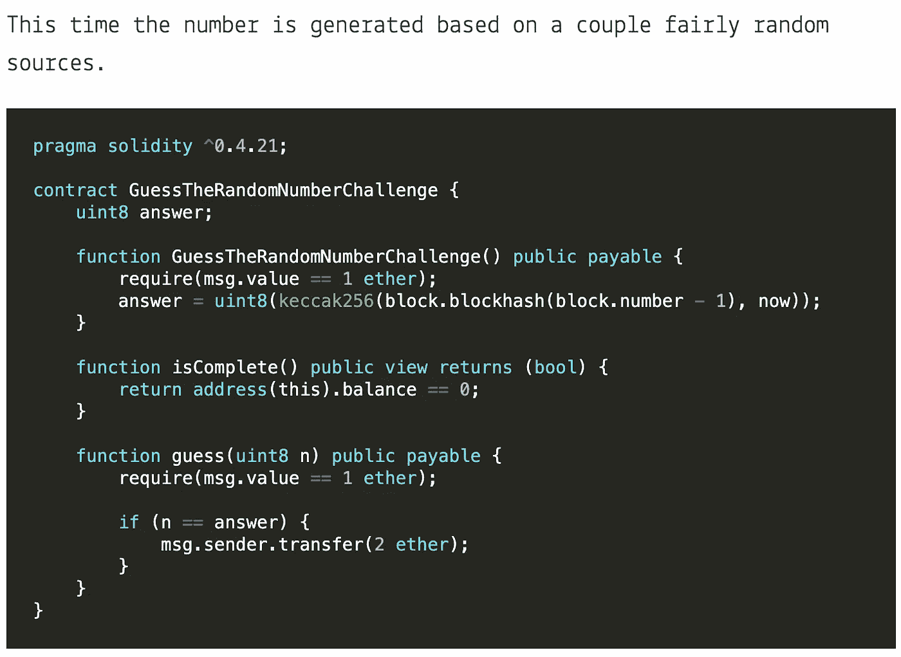
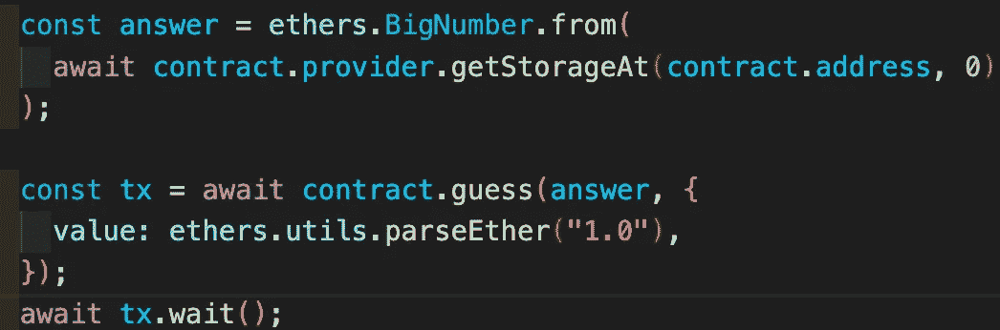

# 捕捉以太记录(第二部分)

> 原文：<https://medium.com/coinmonks/capture-the-ether-writeup-part-2-14c4796fe45b?source=collection_archive---------31----------------------->

去 https://capturetheether.com/玩得开心

1.  猜猜这个数字

问题是

解决办法

2.猜测秘密数字

问题是

解决办法

因为散列是单向函数，所以我们只能强行预测值。

幸运的是，uint8 的搜索空间非常小(2⁸)，所以我们可以这样做

3.猜随机数

问题是

解决办法

答案似乎是私有的，我们不能只调用 answer()来获取它们

但是我们可以读取状态变量，即使它们的布局是私有的

 [## 存储可靠性 0.6.8 文档中状态变量的布局

### 静态大小的变量(除了映射和动态大小的数组类型之外的所有变量)在…

docs.soliditylang.org](https://docs.soliditylang.org/en/v0.6.8/internals/layout_in_storage.html) 

所以我们可以这样做

今天到此为止。

> 加入 Coinmonks [电报频道](https://t.me/coincodecap)和 [Youtube 频道](https://www.youtube.com/c/coinmonks/videos)了解加密交易和投资

# 另外，阅读

*   [MXC 交易所评论](/coinmonks/mxc-exchange-review-3af0ec1cba8c) | [Pionex vs 币安](https://coincodecap.com/pionex-vs-binance) | [Pionex 套利机器人](https://coincodecap.com/pionex-arbitrage-bot)
*   [我的密码交易经验](/coinmonks/my-experience-with-crypto-copy-trading-d6feb2ce3ac5) | [比特币基地评论](/coinmonks/coinbase-review-6ef4e0f56064)
*   [CoinFLEX 评论](https://coincodecap.com/coinflex-review) | [AEX 交易所评论](https://coincodecap.com/aex-exchange-review) | [UPbit 评论](https://coincodecap.com/upbit-review)
*   [AscendEx 保证金交易](https://coincodecap.com/ascendex-margin-trading) | [Bitfinex 赌注](https://coincodecap.com/bitfinex-staking) | [bitFlyer 审核](https://coincodecap.com/bitflyer-review)
*   [麻雀交换评论](https://coincodecap.com/sparrow-exchange-review) | [纳什交换评论](https://coincodecap.com/nash-exchange-review)